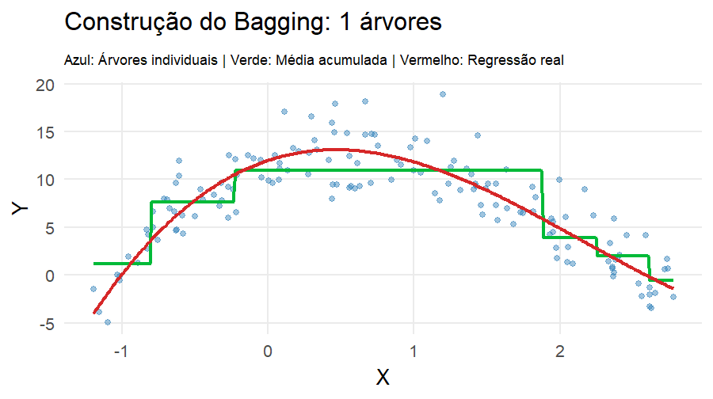
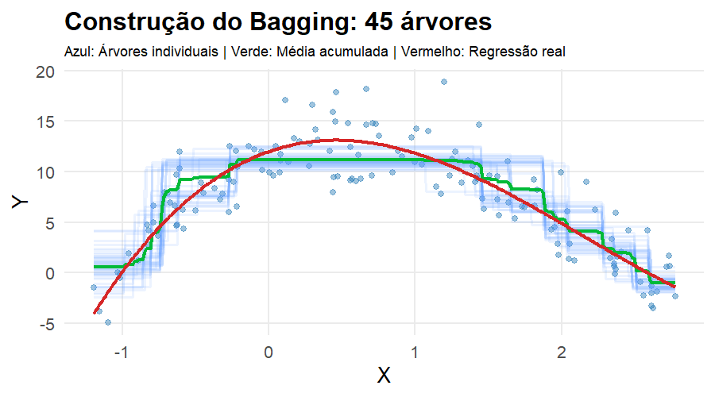
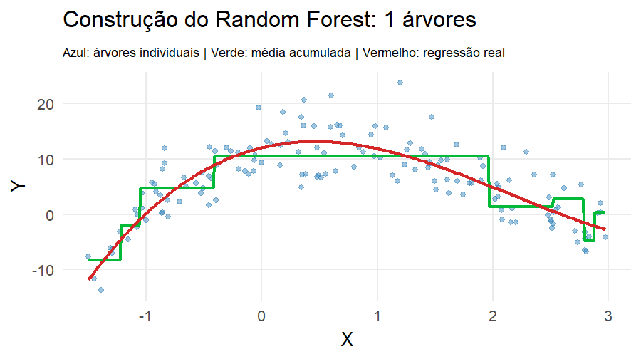
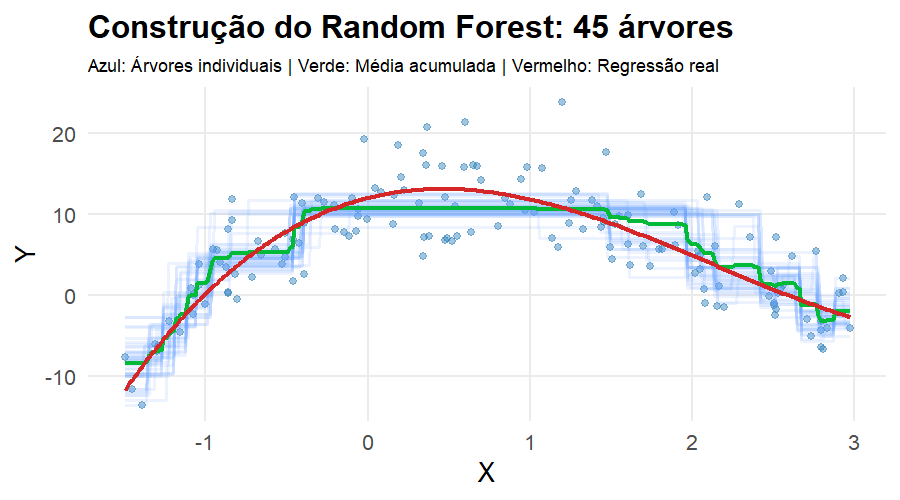
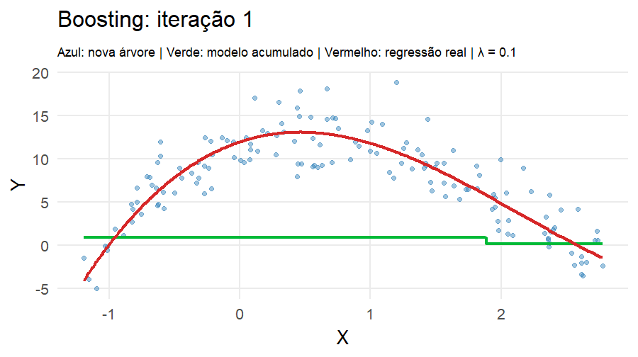
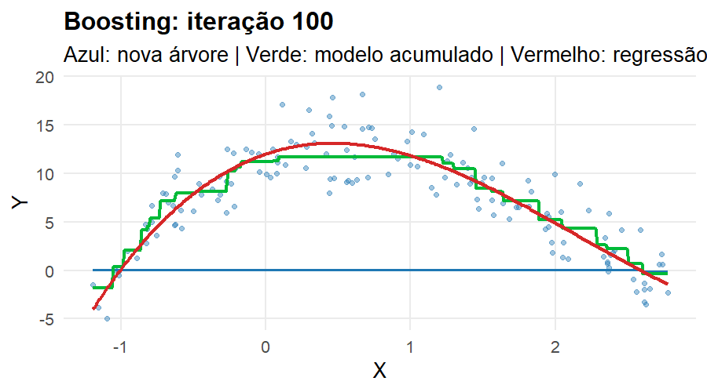
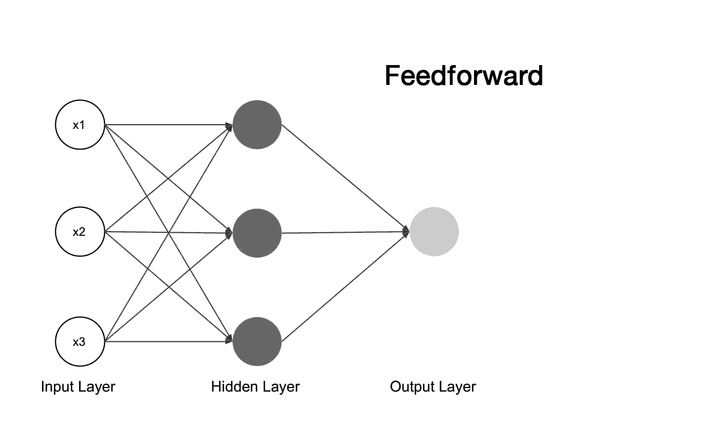
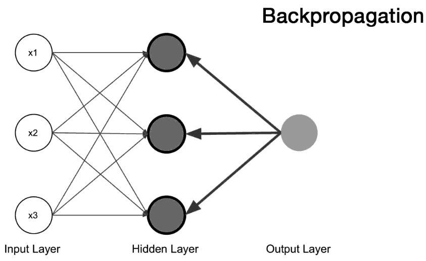
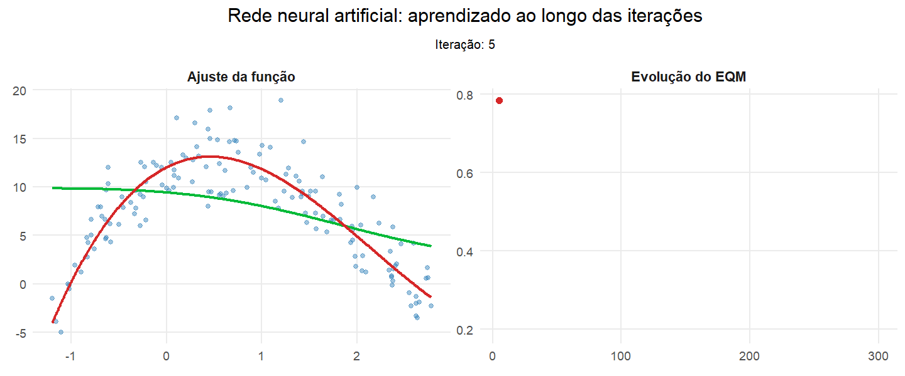
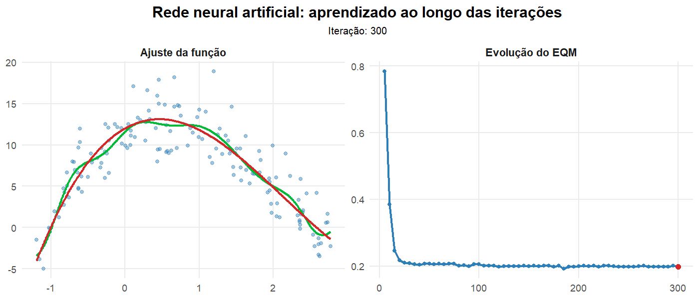

## Introdução

Considere o problema de estimar $f(x) = E(Y \mid X = x)$ a partir de uma amostra de tamanho $n$.

Quando $n$ é pequeno, é comum impor uma estrutura paramétrica para $f$, por exemplo,

$$
f(x) = x^t \beta,
$$

o que reduz o número de parâmetros a serem estimados.

Essa restrição tende a produzir estimadores com **baixa variância**, ainda que à custa de um possível viés.

## Introdução

À medida que o tamanho amostral aumenta, torna-se possível considerar classes de funções mais ricas.

Nesse caso, admite-se um modelo mais flexível para $f$, reduzindo o viés da estimativa, ainda que isso implique um aumento na variância.

Esse comportamento reflete o compromisso fundamental entre viés e variância na estimação.

## Introdução

Motivados por essa observação, consideramos modelos não paramétricos.

Informalmente, um modelo não paramétrico é aquele em que a complexidade cresce com o tamanho da amostra, podendo ser interpretado como um modelo com um número efetivamente infinito de parâmetros.

O objetivo é permitir que os dados determinem a forma da função $f$, evitando restrições estruturais rígidas.

## Problema de regressão

Considere o modelo

$$
Y = f(X) + \varepsilon,
$$

onde assumimos

$$
E(\varepsilon \mid X) = 0, \qquad Var(\varepsilon \mid X) = \sigma^2
$$

Nosso objetivo é estimar a função de regressão

$$
f(x) = E(Y \mid X = x)
$$

Esse problema é intrinsecamente infinito-dimensional, pois $f$ pode ser uma função arbitrária.

------------------------------------------------------------------------

### Redução do problema

Para tornar o problema tratável, restringimos $f$ a uma classe de funções.

Assim, buscamos uma aproximação

$$
f(x) \approx g(x),
$$

onde $g$ pertence a um espaço funcional de dimensão finita, ou seja, a uma classe de funções mais simples.

A escolha dessa classe determina a flexibilidade do modelo.

------------------------------------------------------------------------

### Motivação para construções locais

Se a função $f$ apresenta comportamentos distintos em diferentes regiões do domínio, uma única expressão global pode ser inadequada.

Isso sugere construir $g$ de forma que diferentes regiões do domínio possam ser modeladas de maneira distinta.

------------------------------------------------------------------------

### Aproximação por partes

Para isso, fixamos pontos, chamados de nós (knots)

$$
t_1 < t_2 < \cdots < t_p,
$$

que dividem o domínio em subintervalo e em cada subintervalo $(t_j, t_{j+1})$, aproximamos $f$ por um polinômio de grau $k-1$.

Assim, definimos

$$
g(x) =
\begin{cases}
g_1(x), & x \in (t_1,t_2), \\
\vdots \\
g_p(x), & x \in (t_p,t_{p+1})
\end{cases}
$$

Essa construção permite adaptação local.

------------------------------------------------------------------------

### Continuidade

Para evitar descontinuidades, impomos

$$
g(t_j^-) = g(t_j^+)
$$

Assim, a função permanece contínua em todo o domínio.

------------------------------------------------------------------------

### Forma analítica

Essa construção pode ser escrita como

$$
g(x) = \beta_0 + \beta_1 x + \sum_{j=1}^{p} \gamma_j (x - t_j)_+,
$$

onde

$$
(x - t)_+ = \max(x - t, 0)
$$

------------------------------------------------------------------------

Para $x < t_j$,

$$
(x - t_j)_+ = 0
$$

Para $x > t_j$,

$$
(x - t_j)_+ = x - t_j
$$

Cada termo é ativado apenas após o nó.

------------------------------------------------------------------------

### Interpretação geométrica

Antes do primeiro nó, a função é linear.

Após cada nó, um novo termo entra no modelo, alterando a inclinação da função.

A função permanece contínua, mas sua inclinação muda nos nós.

------------------------------------------------------------------------

### Forma por partes

Assim, para nós $t_1, t_2, t_3$, a função pode ser escrita como

$$
g(x) =
\begin{cases}
\beta_0 + \beta_1 x, & x \le t_1 \\
\beta_0 + \beta_1 x + \gamma_1(x - t_1), & t_1 < x \le t_2 \\
\beta_0 + \beta_1 x + \gamma_1(x - t_1) + \gamma_2(x - t_2), & t_2 < x \le t_3 \\
\beta_0 + \beta_1 x + \sum_{j=1}^3 \gamma_j(x - t_j), & x > t_3
\end{cases}
$$

------------------------------------------------------------------------

### Estimação dos coeficientes

Dado $(x_i,y_i)$, estimamos

$$
\hat{\beta} = \arg\min \sum_{i=1}^n (y_i - g(x_i))^2
$$

O problema reduz-se a mínimos quadrados.

------------------------------------------------------------------------

### Papel dos nós

O número de nós $p$ controla a complexidade do modelo.

Mais nós permitem maior adaptação local.

Menos nós produzem funções mais rígidas.

------------------------------------------------------------------------

### Exemplo

Considere splines lineares com:

-   dois nós\
-   três nós

O aumento do número de nós introduz novas mudanças de inclinação na função estimada.

------------------------------------------------------------------------

```{r}
library(ggplot2)

set.seed(123)

# -----------------------------
# Dados: função linear por partes
# -----------------------------
x <- sort(runif(120, 0, 10))

f_true <- ifelse(
  x <= 3,
  0.5 + 0.4 * x,
  ifelse(
    x <= 6,
    1.7 - 0.5 * (x - 3),
    ifelse(
      x <= 8,
      0.2 + 0.6 * (x - 6),
      1.4 - 0.7 * (x - 8)
    )
  )
)

y <- f_true + rnorm(120, 0, 0.15)

df <- data.frame(x, y)

# -----------------------------
# Spline com 2 nós
# -----------------------------
knots_2 <- c(3, 7)

df2 <- data.frame(
  x = x,
  y = y,
  h1 = pmax(x - knots_2[1], 0),
  h2 = pmax(x - knots_2[2], 0)
)

fit2 <- lm(y ~ x + h1 + h2, data = df2)

# -----------------------------
# Spline com 3 nós
# -----------------------------
knots_3 <- c(3, 6, 8)

df3 <- data.frame(
  x = x,
  y = y,
  h1 = pmax(x - knots_3[1], 0),
  h2 = pmax(x - knots_3[2], 0),
  h3 = pmax(x - knots_3[3], 0)
)

fit3 <- lm(y ~ x + h1 + h2 + h3, data = df3)

# -----------------------------
# Predição
# -----------------------------
xg <- seq(0, 10, length = 400)

pred2 <- data.frame(
  x = xg,
  h1 = pmax(xg - knots_2[1], 0),
  h2 = pmax(xg - knots_2[2], 0)
)
pred2$y_hat <- predict(fit2, newdata = pred2)

pred3 <- data.frame(
  x = xg,
  h1 = pmax(xg - knots_3[1], 0),
  h2 = pmax(xg - knots_3[2], 0),
  h3 = pmax(xg - knots_3[3], 0)
)
pred3$y_hat <- predict(fit3, newdata = pred3)

# -----------------------------
# Gráfico
# -----------------------------
ggplot(df, aes(x, y)) +
  geom_point(alpha = 0.55, color = "black") +
  
  # spline 2 nós
  geom_line(data = pred2, aes(x, y_hat), color = "blue", linewidth = 1.2) +
  
  # spline 3 nós
  geom_line(data = pred3, aes(x, y_hat), color = "red", linewidth = 1.2) +
  
  # nós
  geom_vline(xintercept = knots_2, linetype = "dashed", color = "blue") +
  geom_vline(xintercept = knots_3, linetype = "dashed", color = "red") +
  
  theme_minimal() +
  labs(
    title = "Splines lineares com diferentes números de nós",
    subtitle = "Azul: 2 nós | Vermelho: 3 nós",
    x = "x",
    y = "y"
  )
```

------------------------------------------------------------------------

### Interpretação

Cada linha vertical representa um nó.

Cada nó ativa um termo $(x - t_j)_+$.

A função é contínua, mas sua inclinação muda nesses pontos.

------------------------------------------------------------------------

### Limitação do spline linear

No spline linear, temos

$$
g(t_j^-) = g(t_j^+),
$$

ou seja, a função é contínua.

No entanto,

$$
g'(t_j^-) \neq g'(t_j^+),
$$

o que implica mudanças abruptas na inclinação.

------------------------------------------------------------------------

### Necessidade de maior suavidade

Em muitas aplicações, deseja-se que a função estimada varie de forma mais suave.

Isso sugere impor continuidade também nas derivadas da função.

Para obter maior suavidade, consideramos funções polinomiais de grau mais alto em cada subintervalo.

Em particular, utilizamos polinômios de grau 3.

------------------------------------------------------------------------

### Definição de spline cúbico

Um spline cúbico é uma função $g$ tal que:

-   em cada subintervalo, $g$ é um polinômio de grau 3,
-   $g$, $g'$ e $g''$ são contínuas em todo o domínio.

Para cada nó $t_j$, impomos

$$
g(t_j^-) = g(t_j^+),
$$

$$
g'(t_j^-) = g'(t_j^+),
$$

$$
g''(t_j^-) = g''(t_j^+)
$$

Essas condições garantem suavidade global da função.

------------------------------------------------------------------------

### Consequência geométrica

A função é contínua.

A inclinação também é contínua.

A curvatura varia suavemente ao longo do domínio.

------------------------------------------------------------------------

### Forma analítica

Uma forma conveniente de escrever o spline cúbico é

$$
g(x) = \beta_0 + \beta_1 x + \beta_2 x^2 + \beta_3 x^3 + \sum_{j=1}^{p} \gamma_j (x - t_j)_+^3
$$

Para $x < t_j$,

$$
(x - t_j)_+^3 = 0
$$

Para $x > t_j$,

$$
(x - t_j)_+^3 = (x - t_j)^3
$$

Cada nó introduz uma modificação local na curvatura da função.

------------------------------------------------------------------------

### Estimação

Dado $(x_i,y_i)$, estimamos

$$
\hat{\beta} = \arg\min \sum_{i=1}^n (y_i - g(x_i))^2
$$

O problema permanece linear nos parâmetros.

------------------------------------------------------------------------

```{r}
library(ggplot2)
library(splines)

set.seed(123)

# -----------------------------
# Dados
# -----------------------------
x <- sort(runif(120, 0, 10))
y <- sin(x) + rnorm(120, 0, 0.2)

df <- data.frame(x, y)

# nós fixos
knots <- c(3, 6, 8)

# -----------------------------
# Função auxiliar para classificar regiões
# -----------------------------
get_region <- function(x, knots) {
  cut(
    x,
    breaks = c(-Inf, knots, Inf),
    labels = c("Região 1", "Região 2", "Região 3", "Região 4"),
    right = TRUE
  )
}

# -----------------------------
# SPLINE LINEAR
# -----------------------------
df_lin <- data.frame(
  x = x,
  y = y,
  h1 = pmax(x - knots[1], 0),
  h2 = pmax(x - knots[2], 0),
  h3 = pmax(x - knots[3], 0)
)

fit_lin <- lm(y ~ x + h1 + h2 + h3, data = df_lin)

# -----------------------------
# SPLINE CÚBICO
# -----------------------------
fit_cub <- lm(y ~ bs(x, knots = knots, degree = 3), data = df)

# -----------------------------
# Predição
# -----------------------------
xg <- seq(0, 10, length = 500)

# spline linear
pred_lin <- data.frame(
  x = xg,
  h1 = pmax(xg - knots[1], 0),
  h2 = pmax(xg - knots[2], 0),
  h3 = pmax(xg - knots[3], 0)
)
pred_lin$y_hat <- predict(fit_lin, newdata = pred_lin)
pred_lin$region <- get_region(pred_lin$x, knots)
pred_lin$modelo <- "Spline linear"

# spline cúbico
pred_cub <- data.frame(x = xg)
pred_cub$y_hat <- predict(fit_cub, newdata = pred_cub)
pred_cub$region <- get_region(pred_cub$x, knots)
pred_cub$modelo <- "Spline cúbico"

# -----------------------------
# Juntar dados para facet_wrap
# -----------------------------
pred_all <- rbind(
  pred_lin[, c("x", "y_hat", "region", "modelo")],
  pred_cub[, c("x", "y_hat", "region", "modelo")]
)

df_points <- rbind(
  transform(df, modelo = "Spline linear"),
  transform(df, modelo = "Spline cúbico")
)

# garantir ordem dos painéis
pred_all$modelo <- factor(
  pred_all$modelo,
  levels = c("Spline linear", "Spline cúbico")
)

df_points$modelo <- factor(
  df_points$modelo,
  levels = c("Spline linear", "Spline cúbico")
)

# -----------------------------
# Gráfico final
# -----------------------------
ggplot() +
  geom_point(
    data = df_points,
    aes(x, y),
    alpha = 0.45,
    color = "gray20"
  ) +
  geom_line(
    data = pred_all,
    aes(x, y_hat, color = region),
    linewidth = 1.25
  ) +
  geom_vline(
    xintercept = knots,
    linetype = "dashed",
    color = "black",
    linewidth = 0.7
  ) +
  facet_wrap(~modelo, ncol = 2) +
  scale_color_manual(
    values = c(
      "Região 1" = "#D55E00",
      "Região 2" = "#0072B2",
      "Região 3" = "#009E73",
      "Região 4" = "#CC79A7"
    )
  ) +
  theme_minimal() +
  labs(
    title = "Comparação entre spline linear e spline cúbico",
    subtitle = "Spline linear (esquerda) e spline cúbico (direita)",
    x = "x",
    y = "y",
    color = "Região"
  ) +
  theme(
    legend.position = "bottom",
    strip.text = element_text(face = "bold")
  )
```

## k Vizinhos Mais Próximos (KNN)

O método dos *k vizinhos mais próximos* (*k-nearest neighbors*, KNN) @benedetti1977 e @stone1977 é um dos métodos não paramétricos mais utilizados em aprendizado de máquina.

Seu objetivo é estimar a função de regressão:

$$
r(\mathbf{x}) = \mathbb{E}(\boldsymbol{y} \mid \boldsymbol{X} = \mathbf{x})
$$

com base na informação observada na vizinhança de $\mathbf{x}$.

------------------------------------------------------------------------

### Ideia central

Dado um ponto $\mathbf{x}$, identificamos o conjunto:

$$
\mathcal{N}_k(\mathbf{x}) = \{ \text{índices dos } k \text{ vizinhos mais próximos de } \mathbf{x} \}
$$

A estimativa de $r(\mathbf{x})$ é dada por:

$$
g(\mathbf{x}) = \frac{1}{k} \sum_{i \in \mathcal{N}_k(\mathbf{x})} y_i
$$

------------------------------------------------------------------------

### Interpretação

A função $g(\mathbf{x})$ é uma média local das respostas $\boldsymbol{y}$, calculada sobre uma vizinhança definida pela proximidade em $\boldsymbol{X}$.

Isso caracteriza o KNN como um método de:

-   baixa suposição estrutural sobre $r(\mathbf{x})$
-   forte dependência da estrutura local dos dados

------------------------------------------------------------------------

### Definição da vizinhança em KNN

Seja $\mathbf{x} \in \mathbb{R}^p$. Definimos o conjunto dos $k$ vizinhos mais próximos de $\mathbf{x}$ como:

$$
\mathcal{N}_k(\mathbf{x}) = \left\{ i \in \{1,\dots,n\} : d(\mathbf{x}_i, \mathbf{x}) \le d_{\mathbf{x}}^{(k)} \right\}
$$

onde:

-   $d(\mathbf{x}_i, \mathbf{x})$ é a distância entre $x_i$ e $x$;
-   $d_{\mathbf{x}}^{(k)}$ é a distância do $k$-ésimo vizinho mais próximo de $\mathbf{x}$.

O conjunto $\mathcal{N}_k(\mathbf{x})$ contém exatamente os $k$ pontos mais próximos de $\mathbf{x}$.

------------------------------------------------------------------------

### Estimador de regressão KNN

A função de regressão é estimada por uma média local:

$$
g(\mathbf{x}) = \frac{1}{k} \sum_{i \in \mathcal{N}_k(\mathbf{x})} y_i
$$

A estimativa em $\mathbf{x}$ depende exclusivamente dos valores de $\boldsymbol{y}$ observados nos pontos mais próximos de $\mathbf{x}$.

------------------------------------------------------------------------

### Característica fundamental

O estimador é:

-   local\
-   não paramétrico\
-   dependente da geometria dos dados

------------------------------------------------------------------------

## O papel do parâmetro $k$

O parâmetro $k$ controla o grau de suavização do estimador. Define o equilíbrio viés e variância

<br>

::::: columns
::: {.column width="48%"}
### $k$ pequeno

-   ajuste mais local\
-   menor suavização\
-   baixo viés\
-   alta variância\
:::

::: {.column width="48%"}
### $k$ grande

-   ajuste mais global\
-   maior suavização\
-   alto viés\
-   baixa variância\
:::
:::::

------------------------------------------------------------------------

```{r}
library(ggplot2)
library(dplyr)

set.seed(123)

# -----------------------------
# Dados simulados
# -----------------------------
n <- 30
x <- sort(runif(n, 0, 1))
y <- x + rnorm(n, sd = 0.08)

df <- data.frame(x = x, y = y)

# -----------------------------
# Função para regressão KNN em 1D
# -----------------------------
knn_reg <- function(x_train, y_train, x_grid, k) {
  sapply(x_grid, function(x0) {
    d <- abs(x_train - x0)
    idx <- order(d)[1:k]
    mean(y_train[idx])
  })
}

# -----------------------------
# Grade para predição
# -----------------------------
xg <- seq(0, 1, length.out = 500)

# -----------------------------
# Estimativas para diferentes k
# -----------------------------
k_vals <- c(1, 3, 30)

pred_list <- lapply(k_vals, function(k) {
  data.frame(
    x = xg,
    y_hat = knn_reg(df$x, df$y, xg, k),
    k = paste0("k = ", k)
  )
})

pred_df <- bind_rows(pred_list)
pred_df$k <- factor(pred_df$k, levels = c("k = 1", "k = 3", "k = 30"))

# replicar os pontos em cada painel
points_df <- bind_rows(lapply(k_vals, function(k) {
  data.frame(
    x = df$x,
    y = df$y,
    k = paste0("k = ", k)
  )
}))
points_df$k <- factor(points_df$k, levels = c("k = 1", "k = 3", "k = 30"))

# -----------------------------
# Gráfico
# -----------------------------
ggplot() +
  geom_point(
    data = points_df,
    aes(x, y),
    color = "#2C7FB8",
    size = 2.8,
    alpha = 0.95
  ) +
  geom_step(
    data = pred_df,
    aes(x, y_hat),
    color = "#E06C9F",
    linewidth = 1.1
  ) +
  facet_wrap(~k, nrow = 1) +
  theme_minimal(base_size = 18) +
  labs(x = "X", y = "Y") +
  theme(
    strip.text = element_text(size = 20, face = "bold"),
    axis.title = element_text(size = 18),
    axis.text = element_text(size = 13),
    panel.grid.minor = element_blank()
  )
```

## Nadaraya–Watson

No KNN, estimamos a função de regressão por:

$$
g(\mathbf{x}) = \frac{1}{k} \sum_{i \in \mathcal{N}_k(\mathbf{x})} y_i
$$

<br>

### Limitação do KNN

Todos os pontos na vizinhança recebem o **mesmo peso**.

Podemos melhorar essa abordagem atribuindo **pesos diferentes** às observações, de acordo com a sua proximidade de $\mathbf{x}$.

------------------------------------------------------------------------

### Estimador de Nadaraya–Watson

O estimador de regressão é dado por:

$$
g(\mathbf{x}) = \sum_{i=1}^{n} w_i(\mathbf{x})\,y_i
$$

onde $w_i(\mathbf{x})$ representa o peso atribuído à observação $i$.

<br>

### Propriedade importante

$$
\sum_{i=1}^{n} w_i(\mathbf{x}) = 1
$$

------------------------------------------------------------------------

### Interpretação

A estimativa é uma **média ponderada**, onde os pesos dependem da distância entre $\mathbf{x}$ e $\mathbf{x}_i$.

<br>

### Definição dos pesos

Os pesos são definidos por:

$$
w_i(\mathbf{x}) = \frac{K(\mathbf{x}, \mathbf{x}_i)}{\sum_{j=1}^{n} K(\mathbf{x}, \mathbf{x}_j)}
$$

------------------------------------------------------------------------

Em que,

-   $K(\mathbf{x}, \mathbf{x}_i)$ é um *kernel de suavização*, usado para medir a similaridade entre $\mathbf{x}$ e $\mathbf{x}_i$
-   quanto mais próximo $\mathbf{x}_i$ está de $\mathbf{x}$, maior será o peso

Ele controla:

-   como a influência dos pontos decai com a distância\
-   o grau de suavização do estimador

Observações próximas recebem maior influência na estimativa de $g(x)$.

------------------------------------------------------------------------

### Exemplos de kernels

### Kernel uniforme

$$
K(\mathbf{x}, \mathbf{x}_i) = \mathbf{I}\{d(\mathbf{x}, \mathbf{x}_i) \le h\}
$$

-   todos os pontos dentro de $h$ têm o mesmo peso

<br>

### Kernel gaussiano

$$
K(\mathbf{x}, \mathbf{x}_i) = \frac{1}{\sqrt{2\pi}h}
\exp\left(-\frac{d(\mathbf{x}, \mathbf{x}_i)^2}{2h^2}\right)
$$

-   todos os pontos recebem peso\
-   pontos mais próximos têm maior influência

------------------------------------------------------------------------

### Kernel triangular

$$
K(\mathbf{x}, \mathbf{x}_i) = \left(1 - \frac{d(\mathbf{x}, \mathbf{x}_i)}{h}\right)\mathbf{1}\{d(\mathbf{x}, \mathbf{x}_i) \le h\}
$$

-   peso decresce com a distância

<br>

### Kernel de Epanechnikov

$$
K(\mathbf{x}, \mathbf{x}_i) = \left(1 - \frac{d(\mathbf{x}, \mathbf{x}_i)^2}{h^2}\right)\mathbf{1}\{d(\mathbf{x}, \mathbf{x}_i) \le h\}
$$

-   peso decresce com a distância

------------------------------------------------------------------------

### O papel do parâmetro $h$

O parâmetro $h$ controla a largura da vizinhança.

<br>

::::: columns
::: {.column width="48%"}
### Caso $h$ pequeno

-   menor suavização\
-   maior variância\
-   menor viés\
:::

::: {.column width="48%"}
### Caso $h$ grande

-   maior suavização\
-   menor variância\
-   maior viés\
:::
:::::

------------------------------------------------------------------------

```{r}
library(ggplot2)
library(dplyr)

set.seed(123)

# -----------------------------
# Dados simulados
# -----------------------------
n <- 30
x <- sort(runif(n, 0, 1))
y <- x + rnorm(n, sd = 0.08)

df <- data.frame(x = x, y = y)

# -----------------------------
# Kernel uniforme
# -----------------------------
K_unif <- function(u) {
  ifelse(abs(u) <= 1, 1, 0)
}

# -----------------------------
# Nadaraya-Watson (uniforme)
# -----------------------------
nw_reg <- function(x_train, y_train, x_grid, h) {
  sapply(x_grid, function(x0) {
    u <- (x0 - x_train) / h
    w <- K_unif(u)
    
    if (sum(w) == 0) return(NA)
    
    sum(w * y_train) / sum(w)
  })
}

# -----------------------------
# Grade
# -----------------------------
xg <- seq(0, 1, length.out = 500)

# -----------------------------
# Valores de h
# -----------------------------
h_vals <- c(0.1, 0.5, 3)

pred_list <- lapply(h_vals, function(h) {
  data.frame(
    x = xg,
    y_hat = nw_reg(df$x, df$y, xg, h),
    h = paste0("h = ", h)
  )
})

pred_df <- bind_rows(pred_list)
pred_df$h <- factor(pred_df$h,
                    levels = c("h = 0.1", "h = 0.5", "h = 3"))

# pontos replicados
points_df <- bind_rows(lapply(h_vals, function(h) {
  data.frame(
    x = df$x,
    y = df$y,
    h = paste0("h = ", h)
  )
}))
points_df$h <- factor(points_df$h,
                      levels = c("h = 0.1", "h = 0.5", "h = 3"))

# -----------------------------
# Gráfico
# -----------------------------
ggplot() +
  geom_point(
    data = points_df,
    aes(x, y),
    color = "#2C7FB8",
    size = 2.8,
    alpha = 0.95
  ) +
  geom_step(
    data = pred_df,
    aes(x, y_hat),
    color = "#E06C9F",
    linewidth = 1.2
  ) +
  facet_wrap(~h, nrow = 1) +
  theme_minimal(base_size = 18) +
  labs(x = "X", y = "Y") +
  theme(
    strip.text = element_text(size = 20, face = "bold"),
    axis.title = element_text(size = 18),
    axis.text = element_text(size = 13),
    panel.grid.minor = element_blank()
  )
```

------------------------------------------------------------------------

```{r}
library(ggplot2)
library(dplyr)

set.seed(123)

# -----------------------------
# Dados simulados
# -----------------------------
n <- 30
x <- sort(runif(n, 0, 1))
y <- 0.1 + 1.25 * x + rnorm(n, sd = 0.08)

df <- data.frame(x = x, y = y)

# -----------------------------
# Kernels
# -----------------------------
K_uniform <- function(u) {
  ifelse(abs(u) <= 1, 1, 0)
}

K_triangular <- function(u) {
  pmax(1 - abs(u), 0)
}

K_epanechnikov <- function(u) {
  ifelse(abs(u) <= 1, 1 - u^2, 0)
}

K_gaussian <- function(u) {
  dnorm(u)
}

# -----------------------------
# Estimador de Nadaraya-Watson
# -----------------------------
nw_reg <- function(x_train, y_train, x_grid, h, kernel_fun) {
  sapply(x_grid, function(x0) {
    u <- (x0 - x_train) / h
    w <- kernel_fun(u)
    if (sum(w) == 0) return(NA_real_)
    sum(w * y_train) / sum(w)
  })
}

# -----------------------------
# Grade para predição
# -----------------------------
xg <- seq(0, 1, length.out = 500)

# largura de banda fixa
h <- 0.2

pred_uniform <- data.frame(
  x = xg,
  y_hat = nw_reg(df$x, df$y, xg, h, K_uniform),
  painel = "h = 0.2 (Kernel Uniforme)"
)

pred_triangular <- data.frame(
  x = xg,
  y_hat = nw_reg(df$x, df$y, xg, h, K_triangular),
  painel = "h = 0.2 (Kernel Triangular)"
)

pred_epanechnikov <- data.frame(
  x = xg,
  y_hat = nw_reg(df$x, df$y, xg, h, K_epanechnikov),
  painel = "h = 0.2 (Kernel Epanechnikov)"
)

pred_gaussian <- data.frame(
  x = xg,
  y_hat = nw_reg(df$x, df$y, xg, h, K_gaussian),
  painel = "h = 0.2 (Kernel Gaussiano)"
)

pred_df <- bind_rows(
  pred_uniform,
  pred_triangular,
  pred_epanechnikov,
  pred_gaussian
)

points_df <- bind_rows(
  transform(df, painel = "h = 0.2 (Kernel Uniforme)"),
  transform(df, painel = "h = 0.2 (Kernel Triangular)"),
  transform(df, painel = "h = 0.2 (Kernel Epanechnikov)"),
  transform(df, painel = "h = 0.2 (Kernel Gaussiano)")
)

painel_levels <- c(
  "h = 0.2 (Kernel Uniforme)",
  "h = 0.2 (Kernel Triangular)",
  "h = 0.2 (Kernel Epanechnikov)",
  "h = 0.2 (Kernel Gaussiano)"
)

pred_df$painel <- factor(pred_df$painel, levels = painel_levels)
points_df$painel <- factor(points_df$painel, levels = painel_levels)

# -----------------------------
# Gráfico
# -----------------------------
ggplot() +
  geom_point(
    data = points_df,
    aes(x, y),
    color = "#2C7FB8",
    size = 2.3,
    alpha = 0.95
  ) +
  geom_step(
    data = subset(pred_df, painel == "h = 0.2 (Kernel Uniforme)"),
    aes(x, y_hat),
    color = "#E78AC3",
    linewidth = 1.1
  ) +
  geom_line(
    data = subset(pred_df, painel == "h = 0.2 (Kernel Triangular)"),
    aes(x, y_hat),
    color = "#E78AC3",
    linewidth = 1.1
  ) +
  geom_line(
    data = subset(pred_df, painel == "h = 0.2 (Kernel Epanechnikov)"),
    aes(x, y_hat),
    color = "#E78AC3",
    linewidth = 1.1
  ) +
  geom_line(
    data = subset(pred_df, painel == "h = 0.2 (Kernel Gaussiano)"),
    aes(x, y_hat),
    color = "#E78AC3",
    linewidth = 1.1
  ) +
  facet_wrap(~painel, ncol = 2) +
  theme_minimal(base_size = 14) +
  labs(x = "X", y = "Y") +
  theme(
    strip.text = element_text(size = 12, face = "bold"),
    axis.title = element_text(size = 12),
    axis.text = element_text(size = 10),
    panel.grid.minor = element_blank(),
    legend.position = "none"
  )
```

------------------------------------------------------------------------

### Observação prática

Na prática, observa-se que:

-   a escolha do **kernel** tem pouca influência no resultado\
-   a escolha do parâmetro de suavização ($h$) é decisiva

O comportamento do estimador é controlado principalmente por: $h$ (largura da vizinhança)

## Regressão Polinomial Local

A regressão de Nadaraya–Watson estima $g(x)$ como uma **média ponderada local**, ou seja, resolve

$$
\hat{g}(\mathbf{x}) = \arg\min_{\beta_0} \sum_{i=1}^n w_i(\mathbf{x})\,(Y_i - \beta_0)^2
$$

Isso equivale a ajustar **localmente uma constante** (polinômio de grau 0).

------------------------------------------------------------------------

A regressão polinomial local generaliza essa ideia, permitindo que o ajuste local seja mais flexível.

Em vez de ajustar apenas um intercepto, consideramos um polinômio de grau $p$:

$$
g(\mathbf{x}) \approx \beta_0 + \beta_1 x + \beta_2 x^2 + \cdots + \beta_p x^p
$$

------------------------------------------------------------------------

Para cada ponto $\mathbf{x}$, estimamos os coeficientes resolvendo:

$$
(\hat{\beta}_0, \ldots, \hat{\beta}_p)
=
\arg\min_{\beta_0,\ldots,\beta_p}
\sum_{i=1}^n w_i(\mathbf{x})\left(Y_i - \beta_0 - \sum_{j=1}^p \beta_j x_i^j \right)^2
$$

Ou seja, realizamos um **ajuste de mínimos quadrados ponderados localmente**.

------------------------------------------------------------------------

A solução matricial é dada por:

$$
\hat{\boldsymbol{\beta}} =
(B^t D B)^{-1} B^t D \boldsymbol{y}
$$

onde:

-   $B$ é a matriz de regressão com linhas $(1, x_i, x_i^2, \ldots, x_i^p)$\
-   $D$ é uma matriz diagonal com pesos $w_i(\mathbf{x})$\
-   $\boldsymbol{y}$ é o vetor de respostas

------------------------------------------------------------------------

### Interpretação

-   Para cada ponto $\mathbf{x}$, ajustamos **um modelo diferente**
-   Os pesos $w_i(\mathbf{x})$ garantem que apenas observações próximas influenciem o ajuste
-   O grau $p$ controla a **flexibilidade local do modelo**

<br>

### Casos importantes

-   $p = 0$ → regressão de Nadaraya–Watson\
-   $p = 1$ → regressão linear local (reduz viés nas bordas)\
-   $p = 2$ → regressão quadrática local

------------------------------------------------------------------------

```{r}
library(ggplot2)
library(dplyr)

set.seed(123)

# -----------------------------
# Dados simulados
# -----------------------------
n <- 80
x <- sort(runif(n, 0, 1))
y <- sin(2 * pi * x) + rnorm(n, sd = 0.18)

df <- data.frame(x = x, y = y)

# -----------------------------
# Kernel gaussiano
# -----------------------------
K_gaussian <- function(u) {
  dnorm(u)
}

# -----------------------------
# Regressão polinomial local
# p = grau do polinômio local
# -----------------------------
local_poly_reg <- function(x_train, y_train, x_grid, h, p, kernel_fun) {
  sapply(x_grid, function(x0) {
    u <- (x_train - x0) / h
    w <- kernel_fun(u)
    
    # matriz de projeto centrada em x0
    X <- sapply(0:p, function(j) (x_train - x0)^j)
    X <- as.matrix(X)
    
    W <- diag(w, nrow = length(w), ncol = length(w))
    
    XtWX <- t(X) %*% W %*% X
    XtWy <- t(X) %*% W %*% y_train
    
    # pequena regularização numérica
    beta_hat <- solve(XtWX + 1e-8 * diag(p + 1), XtWy)
    
    # valor ajustado em x0 é o intercepto local
    beta_hat[1]
  })
}

# -----------------------------
# Grade para predição
# -----------------------------
xg <- seq(0, 1, length.out = 500)

# largura de banda fixa
h <- 0.12

# -----------------------------
# Predições para p = 0, 1, 2
# -----------------------------
pred_df <- bind_rows(
  data.frame(
    x = xg,
    y_hat = local_poly_reg(df$x, df$y, xg, h, p = 0, kernel_fun = K_gaussian),
    modelo = "p = 0"
  ),
  data.frame(
    x = xg,
    y_hat = local_poly_reg(df$x, df$y, xg, h, p = 1, kernel_fun = K_gaussian),
    modelo = "p = 1"
  ),
  data.frame(
    x = xg,
    y_hat = local_poly_reg(df$x, df$y, xg, h, p = 2, kernel_fun = K_gaussian),
    modelo = "p = 2"
  )
)

pred_df$modelo <- factor(pred_df$modelo, levels = c("p = 0", "p = 1", "p = 2"))

# replicar pontos para cada painel
points_df <- bind_rows(
  transform(df, modelo = "p = 0"),
  transform(df, modelo = "p = 1"),
  transform(df, modelo = "p = 2")
)

points_df$modelo <- factor(points_df$modelo, levels = c("p = 0", "p = 1", "p = 2"))

# -----------------------------
# Gráfico
# -----------------------------
ggplot() +
  geom_point(
    data = points_df,
    aes(x, y),
    color = "#2C7FB8",
    size = 2.2,
    alpha = 0.95
  ) +
  geom_line(
    data = pred_df,
    aes(x, y_hat),
    color = "#E78AC3",
    linewidth = 1.2
  ) +
  facet_wrap(~modelo, nrow = 1) +
  theme_minimal(base_size = 14) +
  labs(
    title = "Regressão polinomial local",
    subtitle = paste0("Kernel gaussiano com h = ", h),
    x = "X",
    y = "Y"
  ) +
  theme(
    strip.text = element_text(size = 13, face = "bold"),
    axis.title = element_text(size = 12),
    axis.text = element_text(size = 10),
    panel.grid.minor = element_blank(),
    legend.position = "none"
  )
```

------------------------------------------------------------------------

Note que

A figura compara estimadores obtidos com o mesmo kernel e a mesma largura de banda $h$, variando apenas o grau $p$ do polinômio ajustado localmente.

Quando $p=0$, obtemos o estimador de Nadaraya-Watson. À medida que o grau aumenta, o modelo local torna-se mais flexível, podendo capturar melhor a curvatura da função de regressão.

## Árvores de Regressão

Até agora, modelamos $g(\mathbf{x})$ como uma função suave:

-   splines\
-   kernels\
-   regressão local

Agora adotamos uma abordagem diferente:

> modelar $g(\mathbf{x})$ por partições do espaço das covariáveis.

------------------------------------------------------------------------

### Ideia central

Uma árvore de regressão divide o espaço de entrada em regiões:

$$
\mathcal{R}_1, \mathcal{R}_2, \ldots, \mathcal{R}_M
$$

e define:

$$
\hat{g}(\mathbf{x}) = \sum_{m=1}^M c_m \mathbf{I}(\mathbf{x} \in \mathcal{R}_m)
$$

Para cada região $\mathcal{R}_m$, usamos:

$$
c_m = \frac{1}{|\mathcal{R}_m|} \sum_{i:x_i \in \mathcal{R}_m} y_i
$$

------------------------------------------------------------------------

## Interpretação

-   o espaço é dividido em “caixas”
-   dentro de cada região, a previsão é constante → média dos dados
-   o modelo é uma função **piecewise constante**

<br>

### Problema de estimação

Queremos encontrar a melhor partição:

$$
\{\mathcal{R}_1, \ldots, \mathcal{R}_M\}
$$

------------------------------------------------------------------------

### Critério de qualidade

A qualidade da árvore é medida por:

$$
\mathcal{P}(T) =
\sum_{m=1}^M \sum_{i:x_i \in \mathcal{R}_m}
(y_i - c_m)^2
$$ <br>

### Interpretação do critério

-   mede a variabilidade dentro das regiões\
-   regiões boas → valores de $y$ homogêneos\
-   objetivo → minimizar a variância intra-região

------------------------------------------------------------------------

### Dificuldade do problema

Minimizar $\mathcal{P}(T)$ globalmente é:

-   computacionalmente inviável\
-   envolve todas as possíveis partições

<br>

### Solução prática

Utilizamos uma abordagem gulosa:

-   escolhemos a melhor divisão local\
-   repetimos recursivamente

------------------------------------------------------------------------

### Divisão em um nó

Para cada variável $X_j$ e ponto $s$:

$$
\mathcal{R}_1 = \{x: x_j \leq s\}, \quad
\mathcal{R}_2 = \{x: x_j > s\}
$$

<br>

### Melhor divisão

Escolhemos $(j,s)$ que minimiza:

$$
\sum_{i \in \mathcal{R}_1} (y_i - c_{m_1})^2 +
\sum_{i \in \mathcal{R}_2} (y_i - c_{m_2})^2
$$

------------------------------------------------------------------------

### Construção completa

1.  Começa com todos os dados\
2.  Escolhe melhor split\
3.  Divide\
4.  Repete

<br>

### Overfitting

A árvore completa tende a:

-   ajustar demais os dados\
-   ter alta variância

------------------------------------------------------------------------

### Poda (pruning)

Árvores completas tendem a sobreajustar os dados.

A poda consiste em escolher uma subárvore que minimize:

$$
\sum_{m=1}^{|T|} \sum_{i:x_i \in \mathcal{R}_m} (y_i - c_m)^2 + \alpha |T|
$$

-   $|T|$ = número de folhas (complexidade da árvore)\
-   $\alpha$ controla o trade-off entre ajuste e simplicidade

Valores grandes de $\alpha$ produzem árvores menores e mais estáveis.

------------------------------------------------------------------------

```{r}
library(ggplot2)
library(rpart)

set.seed(123)

# -----------------------------
# Função de regressão real
# -----------------------------
f_real <- function(x, beta = c(12, 4, -6, 1)) {
  beta[1] + beta[2] * x + beta[3] * x^2 + beta[4] * x^3 + sin(x)
}

# -----------------------------
# Dados simulados
# -----------------------------
n <- 150
x <- sort(runif(n, -1.5, 3))

f_true <- f_real(x)
y <- f_true + rnorm(n, sd = 4.0)

df <- data.frame(x = x, y = y, f_true = f_true)

# -----------------------------
# Árvore de regressão
# -----------------------------
fit_tree <- rpart(
  y ~ x,
  data = df,
  method = "anova",
  control = rpart.control(cp = 0.002, minsplit = 10, maxdepth = 3)
)

# -----------------------------
# Grade para predição
# -----------------------------
xg <- seq(min(x), max(x), length.out = 1000)

pred_df <- data.frame(x = xg)
pred_df$y_hat <- predict(fit_tree, newdata = pred_df)
pred_df$f_true <- f_real(xg)

# -----------------------------
# Gráfico
# -----------------------------
ggplot(df, aes(x, y)) +
  geom_point(color = "#2C7FB8", alpha = 0.55, size = 2) +
  geom_line(
    data = pred_df,
    aes(x, f_true),
    color = "#D62728",
    linewidth = 1.3
  ) +
  geom_step(
    data = pred_df,
    aes(x, y_hat),
    color = "#00BA38",
    linewidth = 1.3
  ) +
  theme_minimal(base_size = 16) +
  labs(
    title = "Árvore de regressão",
    subtitle = "Pontos: dados observados | Linha vermelha: regressão real | Degraus: árvore ajustada",
    x = "X",
    y = "Y"
  ) +
  theme(
    panel.grid.minor = element_blank(),
    axis.title = element_text(size = 14),
    axis.text = element_text(size = 11)
  )
```

------------------------------------------------------------------------

### Interpretação da árvore de regressão

A linha tracejada representa a função verdadeira que gerou os dados.

A curva em degraus representa a árvore ajustada, que aproxima a função de regressão por regiões nas quais a predição é constante.

Isso evidencia que árvores de regressão constroem estimadores do tipo **piecewise** constante.

------------------------------------------------------------------------

### Vantagens das Árvores de Regressão

Além de serem facilmente interpretáveis, árvores apresentam propriedades importantes:

<br>

#### Variáveis categóricas

Árvores lidam naturalmente com variáveis discretas:

$$
X_1 \in \{\text{verde}, \text{vermelho}\}
$$

-   não é necessário criar variáveis dummy
-   as divisões são feitas diretamente nas categorias

------------------------------------------------------------------------

#### Seleção automática de variáveis

-   variáveis irrelevantes tendem a não ser utilizadas\
-   o modelo realiza seleção de variáveis de forma implícita

<br>

#### Interações entre variáveis

-   árvores capturam interações automaticamente\
-   não é necessário especificar termos de interação

------------------------------------------------------------------------

### Limitação importante

Apesar dessas vantagens:

-   árvores individuais têm alta variância\
-   pequenas mudanças nos dados podem gerar árvores muito diferentes

Para melhorar o desempenho preditivo:

> combinamos várias árvores em um único modelo

## Por que combinar árvores?

Considere dois estimadores $g_1(\mathbf{x})$ e $g_2(\mathbf{x})$.

Definimos o estimador combinado:

$$
g(\mathbf{x}) = \frac{g_1(\mathbf{x}) + g_2(\mathbf{x})}{2}
$$

O erro esperado é:

$$
\mathbb{E}\big[(\boldsymbol{y} - g(\mathbf{x}))^2 \mid \mathbf{x}\big]
=
\mathbb{V}(\boldsymbol{y} \mid \mathbf{x})
+ \frac{1}{4}\mathbb{V}(g_1(\mathbf{x}) + g_2(\mathbf{x}))
+ \text{bias}^2
$$

------------------------------------------------------------------------

Se $g_1(\mathbf{x})$ e $g_2(\mathbf{x})$ são:

-   não viesados\
-   com mesma variância\
-   não correlacionados

então:

$$
\mathbb{E}\big[(\boldsymbol{y} - g(\mathbf{x}))^2 \mid \mathbf{x}\big]
=
\mathbb{V}(\boldsymbol{y} \mid \mathbf{x})
+ \frac{1}{2}\mathbb{V}(g_i(\mathbf{x}))
$$

#### Conclusão

$$
\mathbb{E}\big[(\boldsymbol{y} - g(\mathbf{x}))^2 \mid \mathbf{x}x\big]
\le
\mathbb{E}\big[(\boldsymbol{y} - g_i(\mathbf{x}))^2 \mid \mathbf{x}\big]
$$

------------------------------------------------------------------------

Assim, combinar modelos:

-   mantém o viés\
-   reduz a variância

<br>

#### Ideia central do Bagging

> Média de vários modelos instáveis → modelo mais estável

## Bagging (Bootstrap Aggregating)

A ideia central é combinar vários estimadores:

$$
g(\mathbf{x}) = \frac{1}{B} \sum_{b=1}^B g_b(\mathbf{x})
$$

onde $g_b(\mathbf{x})$ é a predição da $b$-ésima árvore.

Para cada $b = 1, \ldots, B$:

-   amostramos com reposição (bootstrap)\
-   ajustamos uma árvore aos dados


---

{fig-align="center"}

------------------------------------------------------------------------

### Propriedade fundamental

Se os estimadores são aproximadamente não viesados:

-   o viés permanece semelhante\
-   a variância é reduzida

Assim,

$$
\mathbb{E}[(\boldsymbol{y} - g(\mathbf{x}))^2 \mid \mathbf{x}]
\le
\mathbb{E}[(\boldsymbol{y} - g_b(\mathbf{x}))^2 \mid \mathbf{x}]
$$

------------------------------------------------------------------------

### Importância de Variáveis em Árvores

Bagging permite medir a relevância de cada variável:

-   baseada na redução do erro (RSS)\
-   cada divisão reduz a variabilidade

A qualidade de uma divisão é medida pela redução do erro quadrático (RSS).

Considere um nó pai dividido em dois nós:

-   esquerda ($\mathcal{R}_{esq}$)\
-   direita ($\mathcal{R}_{dir}$)

------------------------------------------------------------------------

### Redução do erro

A redução no RSS é dada por:

$$
\text{RSS}_{pai}
-
\text{RSS}_{esq}
-
\text{RSS}_{dir}
$$

Ou, explicitamente:

$$
\sum_{i \in \mathcal{R}_{pai}} (y_i - \bar{y}_{pai})^2
-
\sum_{i \in \mathcal{R}_{esq}} (y_i - \bar{y}_{esq})^2
-
\sum_{i \in \mathcal{R}_{dir}} (y_i - \bar{y}_{dir})^2
$$

------------------------------------------------------------------------

### Interpretação

-   quanto maior a redução → melhor a divisão\
-   boas variáveis geram partições mais homogêneas

> Variáveis importantes são aquelas que mais reduzem a variabilidade da resposta.

---


```{r}
#| echo: false
#| include: false
#| warning: false
#| message: false

library(ggplot2)
library(rpart)
library(dplyr)
library(tidyr)
library(gganimate)
library(gifski)

set.seed(123)

# -----------------------------
# Função real
# -----------------------------
f_real <- function(x, beta = c(12, 4, -6, 1)) {
  beta[1] + beta[2] * x + beta[3] * x^2 + beta[4] * x^3 + sin(x)
}

# -----------------------------
# Dados
# -----------------------------
n <- 150
x <- sort(runif(n, -1.2, 2.8))
y <- f_real(x) + rnorm(n, sd = 2.5)

df <- data.frame(x, y)

# -----------------------------
# Grid
# -----------------------------
xg <- seq(min(x), max(x), length.out = 300)
grid <- data.frame(x = xg)

df_true <- data.frame(
  x = xg,
  y_true = f_real(xg)
)

# -----------------------------
# Bagging
# -----------------------------
B <- 50
pred_mat <- matrix(NA_real_, nrow = length(xg), ncol = B)

for (b in 1:B) {
  idx <- sample(1:n, n, replace = TRUE)
  df_boot <- df[idx, ]
  
  fit <- rpart(
    y ~ x,
    data = df_boot,
    method = "anova",
    control = rpart.control(
      maxdepth = 3,
      cp = 0.001
    )
  )
  
  pred_mat[, b] <- predict(fit, newdata = grid)
}

# -----------------------------
# Árvores em formato longo
# -----------------------------
df_trees_long <- data.frame(
  x = rep(xg, B),
  y_hat = as.vector(pred_mat),
  tree_id = rep(1:B, each = length(xg))
)

# para cada frame b, mostrar apenas árvores 1,...,b
df_trees_anim <- bind_rows(
  lapply(1:B, function(b) {
    df_trees_long |>
      filter(tree_id <= b) |>
      mutate(frame_id = b)
  })
)

# -----------------------------
# Média acumulada
# -----------------------------
cumavg_mat <- sapply(1:B, function(b) {
  rowMeans(pred_mat[, 1:b, drop = FALSE])
})

df_avg_long <- data.frame(
  x = rep(xg, B),
  y_avg = as.vector(cumavg_mat),
  frame_id = rep(1:B, each = length(xg))
)

# -----------------------------
# Dados observados e função real por frame
# -----------------------------
df_points <- bind_rows(
  lapply(1:B, function(b) {
    data.frame(
      x = df$x,
      y = df$y,
      frame_id = b
    )
  })
)

df_true_anim <- bind_rows(
  lapply(1:B, function(b) {
    data.frame(
      x = df_true$x,
      y_true = df_true$y_true,
      frame_id = b
    )
  })
)

# -----------------------------
# Gráfico animado
# -----------------------------
anim_plot <- ggplot() +
  geom_point(
    data = df_points,
    aes(x, y),
    color = "#2C7FB8",
    alpha = 0.45,
    size = 1.8
  ) +
  geom_line(
    data = df_trees_anim,
    aes(x, y_hat, group = tree_id),
    color = "#619CFF",
    alpha = 0.12,
    linewidth = 1.0
  ) +
  geom_line(
    data = df_avg_long,
    aes(x, y_avg),
    color = "#00BA38",
    linewidth = 1.3
  ) +
  geom_line(
    data = df_true_anim,
    aes(x, y_true),
    color = "#D62728",
    linewidth = 1.3
  ) +
  labs(
    title = "Construção do Bagging: {current_frame} árvores",
    subtitle = "Azul: Árvores individuais | Verde: Média acumulada | Vermelho: Regressão real",
    x = "X",
    y = "Y"
  ) +
  theme_minimal(base_size = 16) +
  theme(
    panel.grid.minor = element_blank(),
    plot.title = element_text(face = "bold"),
    plot.subtitle = element_text(size = 11)
  ) +
  transition_manual(frame_id)

# -----------------------------
# Salvar GIF
# -----------------------------

anim = animate(
    anim_plot,
    nframes = B,
    fps = 2,
    width = 7.5,
    height = 4.2,
    units = "in",
    res = 120,
    renderer = gifski_renderer("bagging_animado.gif")
  )


# -----------------------------
# PNG estático para PDF
# -----------------------------
frame_pdf <- 45

plot_pdf2 <- ggplot() +
  geom_point(
    data = subset(df_points, frame_id == frame_pdf),
    aes(x, y),
    color = "#2C7FB8",
    alpha = 0.45,
    size = 1.8
  ) +
  geom_line(
    data = subset(df_trees_anim, frame_id == frame_pdf),
    aes(x, y_hat, group = tree_id),
    color = "#619CFF",
    alpha = 0.12,
    linewidth = 1.0
  ) +
  geom_line(
    data = subset(df_avg_long, frame_id == frame_pdf),
    aes(x, y_avg),
    color = "#00BA38",
    linewidth = 1.3
  ) +
  geom_line(
    data = subset(df_true_anim, frame_id == frame_pdf),
    aes(x, y_true),
    color = "#D62728",
    linewidth = 1.3
  ) +
  labs(
    title = paste("Construção do Bagging:", frame_pdf, "árvores"),
    subtitle = "Azul: Árvores individuais | Verde: Média acumulada | Vermelho: Regressão real",
    x = "X",
    y = "Y"
  ) +
  theme_minimal(base_size = 16) +
  theme(
    panel.grid.minor = element_blank(),
    plot.title = element_text(face = "bold"),
    plot.subtitle = element_text(size = 11)
  )
```


```{r}
#| echo: false
#| warning: false
#| message: false
#| out-width: "90%"
#| fig-align: "center"
#| results: 'asis'

if (knitr::is_html_output()) {
  
} else if (knitr::is_latex_output()) {
  
  # fecha dispositivos abertos
  while (!is.null(dev.list())) dev.off()
  
  png(
    filename = "bagging_animado.png",
    width = 900,
    height = 500,
    res = 120
  )
  
  print(plot_pdf2)
  
  invisible(dev.off())
  
  
}
```


## Florestas Aleatórias (Random Forest)

No Bagging, combinamos várias árvores:

$$
g(\mathbf{x}) = \frac{1}{B} \sum_{b=1}^B g_b(\mathbf{x})
$$

Como as amostras *bootstrap* não são *i.i.d*,


- Cada árvore é diferente, mas nasce do mesmo mecanismo, então têm variâncias semelhantes, ou seja, 

$$
\mathrm{Var}(g_b(\mathbf{x})) = \sigma^2
\quad \text{para todo } b
$$

---


- As árvores não são independentes, mas podemos resumir essa dependência por uma correlação média. Assim, a correlação entre quaisquer duas árvores é

$$
\mathrm{Cor}(g_b(\mathbf{x}),g_{b'}(\mathbf{x})) = \rho
\quad (b \neq b')
$$

Logo,

$$
\mathrm{Cov}(g_b(\mathbf{x}),g_{b'}(\mathbf{x})) = \rho \sigma^2
$$


Então,

$$
\mathrm{Var}\!\big(g(\mathbf{x}) \big)
=
\mathrm{Var}\!\left(\frac{1}{B}\sum_{b=1}^{B} g_b(\mathbf{x})\right)
=
\frac{1}{B^2}\mathrm{Var}\!\left(\sum_{b=1}^{B} g_b(\mathbf{x})\right)
$$

---

Expandindo a variância da soma:

$$
\mathrm{Var}\!\left(\sum_{b=1}^{B} g_b(\mathbf{x})\right)
=
\sum_{b=1}^{B}\mathrm{Var}(g_b\big(\mathbf{x})\big)
+
\sum_{b \neq b'}\mathrm{Cov}\big(g_b(\mathbf{x}),g_{b'}(\mathbf{x})\big)
$$


Substituindo as hipóteses:

$$
\sum_{b=1}^{B}\mathrm{Var}\big(g_b(\mathbf{x})\big)=B\sigma^2
$$

e

$$
\sum_{b \neq b'}\mathrm{Cov}\big(g_b(\mathbf{x}),g_{b'}(\mathbf{x})\big)
=
B(B-1)\rho\sigma^2
$$

---

Portanto,

$$
\mathrm{Var}\!\left(\sum_{b=1}^{B} g_b(\mathbf{x})\right)
=
B\sigma^2 + B(B-1)\rho\sigma^2
$$

e, assim,

$$
\mathrm{Var}\!\left(g(\mathbf{x})\right)
=
\frac{1}{B^2}
\left[
B\sigma^2 + B(B-1)\rho\sigma^2
\right]
$$

---

Simplificando,

$$
\mathrm{Var}\!\big(g(\mathbf{x})\big)
=
\frac{\sigma^2}{B}
+
\frac{B-1}{B}\rho\sigma^2
$$

ou, equivalentemente,

$$
\boxed{
\mathrm{Var}\!\big(g(\mathbf{x})\big)
=
\rho\sigma^2 + \frac{1-\rho}{B}\sigma^2
}
$$


Note que,

- $\rho\sigma^2$ é a parte da variância que **não desaparece** com o aumento de $B$
- $\dfrac{1-\rho}{B}\sigma^2$ é a parte que **cai com o número de árvores**

---

### Consequência importante

- se $\rho$ é pequeno, o bagging reduz bastante a variância
- se $\rho$ é grande, o ganho é limitado


Além disso, 

-   mesmas variáveis dominantes\
-   divisões semelhantes\
-   predições parecidas

------------------------------------------------------------------------

### Problema

A redução de variância depende da correlação:

> árvores muito parecidas → pouco ganho ao combinar

<br>

### Ideia do Random Forest

Introduzir aleatoriedade adicional:

> em cada nó, escolhemos um subconjunto aleatório de variáveis

------------------------------------------------------------------------

### Construção


Para cada árvore:

- amostra bootstrap dos dados
- em cada divisão:
  - seleciona-se aleatoriamente $m$ variáveis
  - escolhe-se o melhor *split* entre elas

### Parâmetro chave

:::: {.columns}

::: {.column width="60%"}

$m$ = número de variáveis candidatas por *split*

- $m = d \rightarrow$ Bagging
- $m < d \rightarrow$ Random Forest

:::

::: {.column width="40%"}

\vspace{2.5cm}


$$
m \approx \frac{d}{3}
$$

:::

::::


---

{fig-align="center"}

---

```{r}
library(ggplot2)
library(rpart)
library(patchwork)

set.seed(123)

# -----------------------------
# Função de regressão real
# -----------------------------
f_real <- function(x, beta = c(12, 4, -6, 1)) {
  beta[1] + beta[2] * x + beta[3] * x^2 + beta[4] * x^3 + sin(x)
}

# -----------------------------
# Dados simulados
# -----------------------------
n <- 150
x <- sort(runif(n, -1.5, 3))

f_true <- f_real(x)
y <- f_true + rnorm(n, sd = 4.0)

df <- data.frame(x, y)

# grade
xg <- seq(min(x), max(x), length.out = 500)
grid <- data.frame(x = xg)

# função verdadeira na grade
df_true <- data.frame(
  x = xg,
  f_true = f_real(xg)
)

# -----------------------------
# (a) Árvore única
# -----------------------------
fit_tree <- rpart(
  y ~ x,
  data = df,
  method = "anova",
  control = rpart.control(maxdepth = 3, cp = 0.002, minsplit = 10)
)

pred_tree <- predict(fit_tree, newdata = grid)

df_tree <- data.frame(
  x = xg,
  y_hat = pred_tree,
  f_true = f_real(xg)
)

# -----------------------------
# (b) Agregação de árvores bootstrap
# -----------------------------
B <- 50
pred_mat <- matrix(NA_real_, nrow = length(xg), ncol = B)

for (b in 1:B) {
  idx <- sample(1:n, n, replace = TRUE)
  df_boot <- df[idx, ]

  fit_b <- rpart(
    y ~ x,
    data = df_boot,
    method = "anova",
    control = rpart.control(maxdepth = 3, cp = 0.002, minsplit = 10)
  )

  pred_mat[, b] <- predict(fit_b, newdata = grid)
}

# média das árvores
pred_bag <- rowMeans(pred_mat)

# dados longos para plot
df_bag_lines <- data.frame(
  x = rep(xg, B),
  y = as.vector(pred_mat),
  tree = factor(rep(1:B, each = length(xg)))
)

df_bag_mean <- data.frame(
  x = xg,
  y_hat = pred_bag,
  f_true = f_real(xg)
)

# -----------------------------
# Gráfico (a): árvore única
# -----------------------------
p1 <- ggplot(df, aes(x, y)) +
  geom_point(color = "#2C7FB8", alpha = 0.5, size = 1.8) +
  geom_step(
    data = df_tree,
    aes(x, y_hat),
    color = "#00BA38",
    linewidth = 1.2
  ) +
  geom_line(
    data = df_tree,
    aes(x, f_true),
    color = "#D62728",
    linewidth = 1.2
  ) +
  theme_minimal(base_size = 14) +
  labs(
    title = "a) Árvore de regressão",
    x = "X",
    y = "Y"
  ) +
  theme(
    panel.grid.minor = element_blank()
  )

# -----------------------------
# Gráfico (b): bagging / floresta
# -----------------------------
p2 <- ggplot(df, aes(x, y)) +
  geom_point(color = "#2C7FB8", alpha = 0.5, size = 1.8) +
  geom_line(
    data = df_bag_lines,
    aes(x, y, group = tree),
    color = "#619CFF",
    alpha = 0.12,
    linewidth = 0.7
  ) +
  geom_line(
    data = df_bag_mean,
    aes(x, y_hat),
    color = "#00BA38",
    linewidth = 1.3
  ) +
  geom_line(
    data = df_bag_mean,
    aes(x, f_true),
    color = "#D62728",
    linewidth = 1.2
  ) +
  theme_minimal(base_size = 14) +
  labs(
    title = "b) Random Forest",
    x = "X",
    y = "Y"
  ) +
  theme(
    panel.grid.minor = element_blank()
  )

# -----------------------------
# Plot lado a lado
# -----------------------------
p1 + p2
```


---


```{r}
library(ggplot2)
library(rpart)
library(dplyr)
library(tidyr)
library(gganimate)
library(gifski)

set.seed(123)

# -----------------------------
# Função de regressão real
# -----------------------------
f_real <- function(x, beta = c(12, 4, -6, 1)) {
  beta[1] + beta[2] * x + beta[3] * x^2 + beta[4] * x^3 + sin(x)
}

# -----------------------------
# Dados simulados
# -----------------------------
n <- 150
x <- sort(runif(n, -1.5, 3))

f_true <- f_real(x)
y <- f_true + rnorm(n, sd = 4.0)

df <- data.frame(x = x, y = y)

# -----------------------------
# Grade para previsão
# -----------------------------
xg <- seq(min(x), max(x), length.out = 300)
grid <- data.frame(x = xg)

# função verdadeira na grade
df_true <- data.frame(
  x = xg,
  y_true = f_real(xg)
)

# -----------------------------
# Gerar várias árvores bootstrap
# -----------------------------
B <- 100
pred_mat <- matrix(NA_real_, nrow = length(xg), ncol = B)

for (b in 1:B) {
  idx <- sample(1:n, n, replace = TRUE)
  df_boot <- df[idx, ]

  fit <- rpart(
    y ~ x,
    data = df_boot,
    method = "anova",
    control = rpart.control(maxdepth = 3, cp = 0.002, minsplit = 10)
  )

  pred_mat[, b] <- predict(fit, newdata = grid)
}

# -----------------------------
# Árvores individuais em formato longo
# -----------------------------
df_trees <- as.data.frame(pred_mat)
names(df_trees) <- paste0("tree_", 1:B)
df_trees$x <- xg

df_trees_long <- df_trees |>
  pivot_longer(
    cols = starts_with("tree_"),
    names_to = "tree",
    values_to = "y_hat"
  ) |>
  mutate(tree_id = as.integer(gsub("tree_", "", tree)))

# -----------------------------
# Média acumulada das árvores
# -----------------------------
cumavg_mat <- sapply(1:B, function(b) {
  rowMeans(pred_mat[, 1:b, drop = FALSE])
})

df_avg <- as.data.frame(cumavg_mat)
names(df_avg) <- paste0("avg_", 1:B)
df_avg$x <- xg

df_avg_long <- df_avg |>
  pivot_longer(
    cols = starts_with("avg_"),
    names_to = "avg",
    values_to = "y_avg"
  ) |>
  mutate(
    tree_id = as.integer(gsub("avg_", "", avg)),
    frame_id = tree_id
  )

# -----------------------------
# Replicar dados observados para cada frame
# -----------------------------
df_points <- bind_rows(
  lapply(1:B, function(b) {
    data.frame(
      x = df$x,
      y = df$y,
      frame_id = b
    )
  })
)

# -----------------------------
# Replicar função verdadeira para cada frame
# -----------------------------
df_true_anim <- bind_rows(
  lapply(1:B, function(b) {
    data.frame(
      x = df_true$x,
      y_true = df_true$y_true,
      frame_id = b
    )
  })
)

# -----------------------------
# Se quiser reativar as árvores individuais,
# basta usar este objeto:
# -----------------------------
df_trees_anim <- bind_rows(
  lapply(1:B, function(b) {
    subset(df_trees_long, tree_id <= b) |>
      mutate(frame_id = b)
  })
)

df_avg_anim <- df_avg_long |>
  transmute(
    x = x,
    y_avg = y_avg,
    frame_id = frame_id
  )

# -----------------------------
# Gráfico animado
# -----------------------------
anim_plot <- ggplot() +
  geom_point(
    data = df_points,
    aes(x, y),
    color = "#2C7FB8",
    alpha = 0.45,
    size = 1.8
  ) +
  # Para mostrar também as árvores individuais, descomente:
  geom_line(
    data = df_trees_anim,
    aes(x, y_hat, group = tree),
    color = "#1468f5",
    alpha = 0.08,
    linewidth = 0.8
  ) +
  geom_line(
    data = df_avg_anim,
    aes(x, y_avg),
    color = "#00BA38",
    linewidth = 1.3
  ) +
  geom_line(
    data = df_true_anim,
    aes(x, y_true),
    color = "#D62728",
    linewidth = 1.3
  ) +
  labs(
    title = "Construção do Random Forest: {current_frame} árvores",
    subtitle = "Azul: árvores individuais | Verde: média acumulada | Vermelho: regressão real",
    x = "X",
    y = "Y"
  ) +
  theme_minimal(base_size = 16) +
  theme(
    panel.grid.minor = element_blank(),
    plot.title = element_text(face = "bold"),
    plot.subtitle = element_text(size = 11)
  ) +
  transition_manual(frame_id)

# -----------------------------
# Renderizar e salvar gif
# -----------------------------
anim2 = animate(
  anim_plot,
  nframes = B,
  fps = 3,
  width = 7.5,
  height = 4.2,
  units = "in",
  res = 120,
  renderer = gifski_renderer("rf_animado.gif")
)

# -----------------------------
# PNG estático para PDF
# -----------------------------
frame_pdf <- 45

plot_pdf22 <- ggplot() +
  geom_point(
    data = subset(df_points, frame_id == frame_pdf),
    aes(x, y),
    color = "#2C7FB8",
    alpha = 0.45,
    size = 1.8
  ) +
  geom_line(
    data = subset(df_trees_anim, frame_id == frame_pdf),
    aes(x, y_hat, group = tree_id),
    color = "#619CFF",
    alpha = 0.12,
    linewidth = 1.0
  ) +
  geom_line(
    data = subset(df_avg_long, frame_id == frame_pdf),
    aes(x, y_avg),
    color = "#00BA38",
    linewidth = 1.3
  ) +
  geom_line(
    data = subset(df_true_anim, frame_id == frame_pdf),
    aes(x, y_true),
    color = "#D62728",
    linewidth = 1.3
  ) +
  labs(
    title = paste("Construção do Random Forest:", frame_pdf, "árvores"),
    subtitle = "Azul: Árvores individuais | Verde: Média acumulada | Vermelho: Regressão real",
    x = "X",
    y = "Y"
  ) +
  theme_minimal(base_size = 16) +
  theme(
    panel.grid.minor = element_blank(),
    plot.title = element_text(face = "bold"),
    plot.subtitle = element_text(size = 11)
  )
```


```{r}
#| echo: false
#| warning: false
#| message: false
#| out-width: "90%"
#| fig-align: "center"
#| results: 'asis'

if (knitr::is_html_output()) {
  
} else if (knitr::is_latex_output()) {
  
  # fecha dispositivos abertos
  while (!is.null(dev.list())) dev.off()
  
  png(
    filename = "rf_animado.png",
    width = 900,
    height = 500,
    res = 120
  )
  
  print(plot_pdf22)
  
  invisible(dev.off())
  
  
}
```


---

## Boosting

O *boosting* constrói o estimador de forma **sequencial**, corrigindo erros do modelo anterior.

<br>

### Ideia central

Começamos com um modelo simples e vamos **ajustando os resíduos**:

$$
r_i = y_i - g(x_i)
$$

---

### Algoritmo

1. Inicialize:

$$
g(\mathbf{x}) = 0
$$

2. Para $b = 1, \dots, B$:

- Ajuste um modelo simples (ex: árvore rasa) aos resíduos:

$$
r_i = y_i - g(x_i)
$$

- Atualize:

$$
g(\mathbf{x}) \leftarrow g(\mathbf{x}) + \lambda g^{(b)}(\mathbf{x})
$$

---

### Parâmetros importantes

- $B$ → número de iterações ($B \approx 1000$)
- $\lambda$ → *learning rate*, tipicamente pequeno ($\lambda \approx 0,01$)
    - $\lambda$ grande → aprendizado rápido → risco de overfitting
    - $\lambda$ pequeno → aprendizado lento → mais estável
- $p$ → complexidade da árvore  ($p = 2$ ou $p = 4$)


<br>

### Observação

- cada modelo aprende **o que o anterior errou**
- reduz **viés** (diferente do bagging)


## {background-image="/images/regressao/boosting.png" background-size="contain" background-position="center" background-repeat="no-repeat"}


<!-- {fig-align="center"} -->

---

```{r}
library(ggplot2)
library(rpart)
library(dplyr)

set.seed(123)

# -----------------------------
# Função de regressão real
# -----------------------------
f_real <- function(x, beta = c(12, 4, -6, 1)) {
  beta[1] + beta[2] * x + beta[3] * x^2 + beta[4] * x^3 + sin(x)
}

# -----------------------------
# Dados simulados
# -----------------------------
n <- 150
x <- sort(runif(n, -1.2, 2.8))

f_true <- f_real(x)
y <- f_true + rnorm(n, sd = 2.5)

df <- data.frame(x = x, y = y)

# -----------------------------
# Função para boosting com stumps
# -----------------------------
boost_stumps <- function(x, y, x_grid, B = 100, lambda = 0.1,
                         minsplit = 10) {

  g_train <- rep(0, length(x))
  g_grid  <- rep(0, length(x_grid))

  for (b in 1:B) {
    r <- y - g_train

    fit_b <- rpart(
      r ~ x,
      data = data.frame(x = x, r = r),
      method = "anova",
      control = rpart.control(
        maxdepth = 1,
        cp = 0,
        minsplit = minsplit
      )
    )

    pred_train_b <- predict(fit_b, newdata = data.frame(x = x))
    pred_grid_b  <- predict(fit_b, newdata = data.frame(x = x_grid))

    g_train <- g_train + lambda * pred_train_b
    g_grid  <- g_grid  + lambda * pred_grid_b
  }

  g_grid
}

# -----------------------------
# Grade para predição
# -----------------------------
xg <- seq(min(x), max(x), length.out = 500)

# -----------------------------
# Valores de lambda
# -----------------------------
lambda_vals <- c(0.001, 0.01, 0.1, 0.2, 0.5, 1)

# -----------------------------
# Ajustes para cada lambda
# -----------------------------
pred_list <- lapply(lambda_vals, function(lam) {
  data.frame(
    x = xg,
    y_hat = boost_stumps(x, y, xg, B = 100, lambda = lam),
    lambda = paste0("lambda = ", lam)
  )
})

pred_df <- bind_rows(pred_list)

pred_df$lambda <- factor(
  pred_df$lambda,
  levels = paste0("lambda = ", lambda_vals)
)

# replicar pontos em todos os painéis
points_df <- bind_rows(
  lapply(lambda_vals, function(lam) {
    data.frame(
      x = x,
      y = y,
      lambda = paste0("lambda = ", lam)
    )
  })
)

points_df$lambda <- factor(
  points_df$lambda,
  levels = paste0("lambda = ", lambda_vals)
)

# -----------------------------
# Gráfico
# -----------------------------
ggplot() +
  geom_point(
    data = points_df,
    aes(x, y),
    color = "#2C7FB8",
    alpha = 0.75,
    size = 1.5
  ) +
  geom_step(
    data = pred_df,
    aes(x, y_hat),
    color = "#D62728",
    linewidth = 1
  ) +
  facet_wrap(~lambda, ncol = 3) +
  theme_minimal(base_size = 13) +
  labs(
    x = "X",
    y = "Y"
  ) +
  theme(
    strip.text = element_text(face = "bold"),
    panel.grid.minor = element_blank(),
    legend.position = "none"
  )
```


---

```{r}
library(ggplot2)
library(rpart)
library(dplyr)
library(tidyr)
library(gganimate)
library(gifski)

set.seed(123)

# -------------------------------------------------
# Função de regressão real
# -------------------------------------------------
f_real <- function(x, beta = c(12, 4, -6, 1)) {
  beta[1] + beta[2] * x + beta[3] * x^2 + beta[4] * x^3 + sin(x)
}

# -------------------------------------------------
# Dados simulados
# -------------------------------------------------
n <- 150
x <- sort(runif(n, -1.2, 2.8))

f_true <- f_real(x)
y <- f_true + rnorm(n, sd = 2.5)

df <- data.frame(x = x, y = y)

# -------------------------------------------------
# Grade para previsão
# -------------------------------------------------
xg <- seq(min(x), max(x), length.out = 400)
grid <- data.frame(x = xg)

df_true <- data.frame(
  x = xg,
  y_true = f_real(xg)
)

# -------------------------------------------------
# Boosting com árvores rasas (stumps)
# -------------------------------------------------
B <- 100              # número de iterações
lambda <- 0.1        # learning rate

# matriz para guardar o modelo acumulado em cada passo
pred_cum_mat <- matrix(0, nrow = length(xg), ncol = B)

# para guardar a árvore nova em cada iteração
pred_new_mat <- matrix(0, nrow = length(xg), ncol = B)

# inicialização
g_train <- rep(0, n)
g_grid  <- rep(0, length(xg))

for (b in 1:B) {

  # resíduos atuais
  r <- y - g_train

  # stump: árvore com uma divisão
  fit_b <- rpart(
    r ~ x,
    data = data.frame(x = x, r = r),
    method = "anova",
    control = rpart.control(maxdepth = 1, cp = 0, minsplit = 10)
  )

  # predição da nova árvore
  pred_train_b <- predict(fit_b, newdata = data.frame(x = x))
  pred_grid_b  <- predict(fit_b, newdata = grid)

  # atualizar modelo acumulado
  g_train <- g_train + lambda * pred_train_b
  g_grid  <- g_grid  + lambda * pred_grid_b

  # guardar
  pred_new_mat[, b] <- lambda * pred_grid_b
  pred_cum_mat[, b] <- g_grid
}

# -------------------------------------------------
# Formato longo: modelo acumulado
# -------------------------------------------------
df_cum <- as.data.frame(pred_cum_mat)
names(df_cum) <- paste0("iter_", 1:B)
df_cum$x <- xg

df_cum_long <- df_cum |>
  pivot_longer(
    cols = starts_with("iter_"),
    names_to = "iter",
    values_to = "y_hat"
  ) |>
  mutate(
    iter_id = as.integer(gsub("iter_", "", iter)),
    frame_id = iter_id
  )

# -------------------------------------------------
# Formato longo: nova árvore adicionada
# -------------------------------------------------
df_new <- as.data.frame(pred_new_mat)
names(df_new) <- paste0("tree_", 1:B)
df_new$x <- xg

df_new_long <- df_new |>
  pivot_longer(
    cols = starts_with("tree_"),
    names_to = "tree",
    values_to = "y_new"
  ) |>
  mutate(
    tree_id = as.integer(gsub("tree_", "", tree)),
    frame_id = tree_id
  )

# -------------------------------------------------
# Dados observados e função verdadeira por frame
# -------------------------------------------------
df_points <- bind_rows(
  lapply(1:B, function(b) {
    data.frame(
      x = df$x,
      y = df$y,
      frame_id = b
    )
  })
)

df_true_anim <- bind_rows(
  lapply(1:B, function(b) {
    data.frame(
      x = df_true$x,
      y_true = df_true$y_true,
      frame_id = b
    )
  })
)

# -------------------------------------------------
# Gráfico animado
# -------------------------------------------------
anim_plot_boost <- ggplot() +
  geom_point(
    data = df_points,
    aes(x, y),
    color = "#2C7FB8",
    alpha = 0.45,
    size = 1.6
  ) +
  geom_step(
    data = df_new_long,
    aes(x, y_new),
    color = "#1F78B4",
    linewidth = 0.9
  ) +
  geom_line(
    data = df_cum_long,
    aes(x, y_hat),
    color = "#00BA38",
    linewidth = 1.3
  ) +
  geom_line(
    data = df_true_anim,
    aes(x, y_true),
    color = "#D62728",
    linewidth = 1.3
  ) +
  labs(
    title = "Boosting: iteração {current_frame}",
    subtitle = paste0(
      "Azul: nova árvore | Verde: modelo acumulado | Vermelho: regressão real | λ = ",
      lambda
    ),
    x = "X",
    y = "Y"
  ) +
  theme_minimal(base_size = 16) +
  theme(
    panel.grid.minor = element_blank(),
    plot.title = element_text(face = "bold"),
    plot.subtitle = element_text(size = 11)
  ) +
  transition_manual(frame_id)

# -------------------------------------------------
# Renderizar e salvar gif
# -------------------------------------------------
anim3=animate(
  anim_plot_boost,
  nframes = B,
  fps = 2,
  width = 7.5,
  height = 4.2,
  units = "in",
  res = 120,
  renderer = gifski_renderer("boosting_animado.gif")
)

# -----------------------------
# PNG estático para PDF
# -----------------------------
frame_pdf <- 100

plot_pdf4 <- ggplot() +
  geom_point(
    data = subset(df_points, frame_id == frame_pdf),
    aes(x, y),
    color = "#2C7FB8",
    alpha = 0.45,
    size = 1.6
  ) +
  geom_step(
    data = subset(df_new_long, frame_id == frame_pdf),
    aes(x, y_new),
    color = "#1F78B4",
    linewidth = 0.9
  ) +
  geom_line(
    data = subset(df_cum_long, frame_id == frame_pdf),
    aes(x, y_hat),
    color = "#00BA38",
    linewidth = 1.3
  ) +
  geom_line(
    data = subset(df_true_anim, frame_id == frame_pdf),
    aes(x, y_true),
    color = "#D62728",
    linewidth = 1.3
  ) +
  labs(
    title = paste("Boosting: iteração", frame_pdf),
    subtitle = paste0(
      "Azul: nova árvore | Verde: modelo acumulado | Vermelho: regressão real | λ = ",
      lambda
    ),
    x = "X",
    y = "Y"
  ) +
  theme_minimal(base_size = 16) +
  theme(
    panel.grid.minor = element_blank(),
    plot.title = element_text(face = "bold")
  )
```


```{r}
#| echo: false
#| warning: false
#| message: false
#| out-width: "90%"
#| fig-align: "center"
#| results: 'asis'

if (knitr::is_html_output()) {
  
} else if (knitr::is_latex_output()) {
  
  # fecha dispositivos abertos
  while (!is.null(dev.list())) dev.off()
  
  png(
    filename = "boosting_animado.png",
    width = 900,
    height = 500,
    res = 120
  )
  
  print(plot_pdf4)
  
  invisible(dev.off())
  
  
}
```


---


### Boosting e Estimadores Fracos

O *boosting* não é restrito ao uso de árvores.


Podemos usar qualquer modelo como base, desde que seja um **estimador fraco**.


<br>

#### O que é um estimador fraco?

- modelo simples
- baixo poder preditivo individual
- pequeno viés de ajuste

**Exemplos:** árvores rasas (*stumps*), regressão linear simples, modelos com poucos parâmetros

---

### Por que usar modelos fracos?

- evitam overfitting em cada etapa
- permitem correções graduais
- tornam o aprendizado mais estável


Se você usar modelos muito complexos (ex: árvores profundas):

👉 boosting pode superajustar rapidamente


---

```{r}
library(ggplot2)
library(rpart)
library(patchwork)

set.seed(123)

# -----------------------------
# Função de regressão real
# -----------------------------
f_real <- function(x, beta = c(12, 4, -6, 1)) {
  beta[1] + beta[2] * x + beta[3] * x^2 + beta[4] * x^3 + sin(x)
}

# -----------------------------
# Dados simulados
# -----------------------------
n <- 150
x <- sort(runif(n, -1.2, 2.8))

f_true <- f_real(x)
y <- f_true + rnorm(n, sd = 2.5)

df <- data.frame(x = x, y = y)

# -----------------------------
# Grid
# -----------------------------
xg <- seq(min(x), max(x), length.out = 500)

df_true <- data.frame(
  x = xg,
  y_true = f_real(xg)
)

# -----------------------------
# Função Boosting genérica
# -----------------------------
boost_fit <- function(x, y, xg, B = 100, lambda = 0.1, depth = 1) {

  g_train <- rep(0, length(x))
  g_grid  <- rep(0, length(xg))

  for (b in 1:B) {

    r <- y - g_train

    fit <- rpart(
      r ~ x,
      data = data.frame(x = x, r = r),
      method = "anova",
      control = rpart.control(
        maxdepth = depth,
        cp = 0,
        minsplit = 10
      )
    )

    pred_train <- predict(fit, newdata = data.frame(x = x))
    pred_grid  <- predict(fit, newdata = data.frame(x = xg))

    g_train <- g_train + lambda * pred_train
    g_grid  <- g_grid  + lambda * pred_grid
  }

  g_grid
}

# -----------------------------
# Ajustes
# -----------------------------
B <- 80
lambda <- 0.1

# stump
pred_stump <- boost_fit(x, y, xg, B, lambda, depth = 1)

# árvore profunda
pred_deep <- boost_fit(x, y, xg, B, lambda, depth = 5)

df_stump <- data.frame(x = xg, y_hat = pred_stump)
df_deep  <- data.frame(x = xg, y_hat = pred_deep)

# -----------------------------
# Gráficos
# -----------------------------
p1 <- ggplot(df, aes(x, y)) +
  geom_point(color = "#2C7FB8", alpha = 0.5) +
  geom_line(data = df_true, aes(x, y_true),
            color = "#D62728", linewidth = 1.2) +
  geom_line(data = df_stump, aes(x, y_hat),
            color = "#00BA38", linewidth = 1.3) +
  theme_minimal() +
  labs(
    title = "a) Boosting com stumps",
    subtitle = "Aprendizado gradual",
    x = "X", y = "Y"
  ) +
  theme(panel.grid.minor = element_blank())

p2 <- ggplot(df, aes(x, y)) +
  geom_point(color = "#2C7FB8", alpha = 0.5) +
  geom_line(data = df_true, aes(x, y_true),
            color = "#D62728", linewidth = 1.2) +
  geom_line(data = df_deep, aes(x, y_hat),
            color = "#00BA38", linewidth = 1.3) +
  theme_minimal() +
  labs(
    title = "b) Boosting com árvores profundas",
    subtitle = "Aprendizado agressivo",
    x = "X", y = "Y"
  ) +
  theme(panel.grid.minor = element_blank())

p1 + p2
```


## Redes Neurais Artificiais

Redes neurais são modelos que aproximam funções não lineares complexas.


No contexto de regressão, trata-se de um estimador não linear de $r(\mathbf{x})$ que pode ser representado
graficamente por uma estrutura do tipo


{fig-align="center"}

---

### RNA sem camada oculta


<!-- {fig-align="center"} -->


```{r}
library(ggplot2)

nodes_input <- data.frame(
  x = 0,
  y = c(3, 2, 1, 0),
  label = c("x1", "x2", "x3", "...")
)

node_output <- data.frame(
  x = 4.2,
  y = 1.5,
  label = "g(x)"
)

intercept_node <- data.frame(
  x = 2.1,
  y = 3.2,
  label = ""
)

edges <- data.frame(
  x = c(0, 0, 0, 0, 2.1),
  y = c(3, 2, 1, 0, 3.2),
  xend = c(4.2, 4.2, 4.2, 4.2, 4.2),
  yend = c(1.5, 1.5, 1.5, 1.5, 1.5),
  beta = c("β1", "β2", "β3", "...", "β0")
)

edges$xm <- c(2.2, 2.2, 2.2, 2.2, 3.15)
edges$ym <- c(2.55, 2.05, 1.45, 0.75, 2.55)

ggplot() +
  geom_segment(
    data = edges,
    aes(x = x, y = y, xend = xend, yend = yend),
    linewidth = 0.9,
    color = "black"
  ) +
  geom_text(
    data = edges,
    aes(x = xm, y = ym, label = beta),
    size = 5
  ) +
  geom_point(
    data = nodes_input,
    aes(x = x, y = y),
    size = 15,
    color = "#2CA02C"
  ) +
  geom_point(
    data = node_output,
    aes(x = x, y = y),
    size = 15,
    color = "#D62728"
  ) +
  geom_point(
    data = intercept_node,
    aes(x = x, y = y),
    size = 15,
    color = "gray30"
  ) +
  geom_text(
    data = nodes_input,
    aes(x = x - 0.35, y = y, label = label),
    hjust = 1,
    size = 5
  ) +
  geom_text(
    data = node_output,
    aes(x = x + 0.5, y = y, label = label),
    hjust = 1,
    size = 5
  ) +
  geom_text(
    data = intercept_node,
    aes(x = x, y = y + 0.28, label = label),
    size = 4.5
  ) +
  annotate("text", x = 0, y = 3.8, label = "Camada de entrada", size = 6, fontface = "bold") +
  annotate("text", x = 4.2, y = 3.8, label = "Camada de saída", size = 6, fontface = "bold") +
  annotate("text", x = 2.1, y = 4.5, label = "RNA sem camada oculta\n(Modelo linear)", size = 6, fontface = "bold") +
  xlim(-1, 5.2) +
  ylim(-0.6, 4.8) +
  theme_void()
```


---


#### 🔹 Entrada

$$
\mathbf{x} = (x_1, x_2, x_3, \cdots, x_p)^t
$$


#### 🔹 Camada de saída


$$
g(x) = f\left(\beta_0+\sum_{j=1}^{p} \beta_{j} x_j \right)
$$

---

### RNA com camada oculta


{fig-align="center"}

---


Para a rede apresentada,


#### 🔹 Entrada

$$
\mathbf{x} = (x_1, x_2, x_3)^t
$$


#### 🔹 Camada oculta


Um dado neurônio $j$ da camada oculta é calculado como


$$
x_j^{1} = f\left( \beta_{0,j}^{(0)} + \sum_{i=1}^{3} \beta_{i,j}^{(0)} x_i^{0} \right),
\quad \text{com } x_i^{0} = x_i,\; i=1,2,3.
$$

e $f$ é uma função definida pelo usuário, chamada de **função de ativação.**

---

#### 🔹 Saída


$$
g(x) = x^{2}_1 = f\left( \beta_{0,1}^{1} + \sum_{i=1}^{5} \beta_{i,1}^{1} x_i^{1} \right)
$$


---


### Representação de cada neurônio da rede


{fig-align="center"}

---

### Funções de Ativação

::: columns

::: {.column width="50%"}

#### Clássicas

- Identidade
$$
f(z)=z
$$

- Sigmoid
$$
f(z)=\frac{1}{1+e^{-z}}
$$

- Tanh
$$
f(z)=\frac{e^z-e^{-z}}{e^z+e^{-z}}
$$

:::

::: {.column width="50%"}

#### Modernas

- ReLU
$$
f(z)=\max(0,z)
$$

- Leaky ReLU
$$
f(z)=
\begin{cases}
0.01z, & z<0\\
z, & z\geq0
\end{cases}
$$

:::

:::


---

```{r}
library(ggplot2)
library(patchwork)

z <- seq(-5, 5, length.out = 500)

df <- data.frame(
  z = z,
  sigmoid = 1 / (1 + exp(-z)),
  tanh = tanh(z),
  relu = pmax(0, z),
  leaky = ifelse(z < 0, 0.01*z, z)
)

# -----------------------------
# Função auxiliar
# -----------------------------
plot_fun <- function(y, title) {
  ggplot(df, aes(z, !!rlang::sym(y))) +
    geom_line(linewidth = 1.2, color = "#2C7FB8") +
    theme_minimal(base_size = 12) +
    labs(title = title, x = "z", y = "f(z)") +
    theme(
      plot.title = element_text(face = "bold"),
      panel.grid.minor = element_blank()
    )
}

p0 <- plot_fun("z","Identidade")
p1 <- plot_fun("sigmoid", "Logística")
p2 <- plot_fun("tanh", "Tangente hiperbólica")
p3 <- plot_fun("relu", "ReLU")

p4 <- ggplot(df, aes(z, leaky)) +
  geom_line(linewidth = 1.2, color = "#2C7FB8") +
  coord_cartesian(ylim = c(-0.5, 5)) +  # 👈 destaque da região negativa
  theme_minimal(base_size = 12) +
  labs(title = "Leaky ReLU", x = "z", y = "f(z)") +
  theme(
    plot.title = element_text(face = "bold"),
    panel.grid.minor = element_blank()
  )

(p0 + p1 + p2) / (p3 + p4)
```


---

```{r}
library(ggplot2)
library(patchwork)

z <- seq(-5, 5, length.out = 500)

df <- data.frame(
  z = z,
  leaky = ifelse(z < 0, 0.01*z, z)
)

# -----------------------------
# Gráfico principal
# -----------------------------
p_main <- ggplot(df, aes(z, leaky)) +
  geom_line(linewidth = 1.3, color = "#2C7FB8") +

  # linhas de referência
  geom_hline(yintercept = 0, linetype = "dashed") +
  geom_vline(xintercept = 0, linetype = "dashed") +

  # 🔴 caixa destacando região ampliada
  annotate(
    "rect",
    xmin = -5, xmax = 0,
    ymin = -0.1, ymax = 0.05,
    fill = NA,
    color = "#D62728",
    linewidth = 1
  ) +

  # 🔴 seta apontando para o inset
  annotate(
    "segment",
    x = -2.5, y = 0.02,
    xend = -1.2, yend = 1.2,
    arrow = arrow(length = unit(0.2, "cm")),
    color = "#D62728",
    linewidth = 1
  ) +

  theme_minimal(base_size = 12) +
  labs(title = "Leaky ReLU", x = "z", y = "f(z)") +
  theme(
    plot.title = element_text(face = "bold"),
    panel.grid.minor = element_blank()
  )

# -----------------------------
# Zoom
# -----------------------------
p_zoom <- ggplot(df[df$z <= 0, ], aes(z, leaky)) +
  geom_line(linewidth = 1.2, color = "#D62728") +
  geom_hline(yintercept = 0, linetype = "dashed") +
  geom_vline(xintercept = 0, linetype = "dashed") +
  coord_cartesian(xlim = c(-5, 0), ylim = c(-0.1, 0.05)) +
  theme_minimal(base_size = 8) +
  theme(
    panel.grid.minor = element_blank(),
    axis.title = element_blank()
  )

# -----------------------------
# Inserir zoom
# -----------------------------
p_main +
  inset_element(
    p_zoom,
    left = 0.05,
    bottom = 0.15,
    right = 0.45,
    top = 0.5
  )
```


---


### Por que precisamos de funções de ativação?

Sem $f(\cdot)$:

$$
g(\mathbf{x}) = \text{combinação linear}
$$


Com $f(\cdot)$:

$$
g(\mathbf{x}) = \text{função não linear}
$$


A função de ativação é o que dá poder às redes neurais.

---

### Estimação: Backpropagation

Queremos estimar os parâmetros da rede neural, $\beta$, minimizando o erro:

$$
EQM(g_{\beta}) = \frac{1}{n} \sum_{k=1}^{n} (g_{\beta}(x_k) - y_k)^2
$$


#### Problema

Não existe solução analítica.


#### Solução

Usamos **gradiente descendente**:

$$
\beta \leftarrow \beta - \eta \nabla EQM(g_\beta)
$$


---

### Atualização dos pesos

Para cada parâmetro:

$$
\beta_{i,j}^{(l)} \leftarrow 
\beta_{i,j}^{(l)} - \eta 
\frac{\partial EQM(g_\beta)}{\partial \beta_{i,j}^{(l)}}
$$

em que,

- $\eta$ → taxa de aprendizado  
- $l$ → camada  
- $(i,j)$ → conexão entre neurônios  


Movemos os parâmetros na direção que **reduz o erro**


## Por que o nome Backpropagation?

Os gradientes são calculados da saída para a entrada


```{r}
#| echo: false
#| out-width: "60%"
#| fig-align: "center"

if (knitr::is_html_output()) {
  
} else if (knitr::is_latex_output()) {
  
}
```


<!-- {fig-align="center"} -->


O erro “volta” pela rede ajustando os pesos


---


<!-- ```{r} -->
<!-- library(ggplot2) -->
<!-- library(nnet) -->
<!-- library(dplyr) -->
<!-- library(tidyr) -->
<!-- library(gganimate) -->
<!-- library(gifski) -->

<!-- set.seed(123) -->

<!-- # ----------------------------- -->
<!-- # Função real -->
<!-- # ----------------------------- -->
<!-- f_real <- function(x, beta = c(12, 4, -6, 1)) { -->
<!--   beta[1] + beta[2]*x + beta[3]*x^2 + beta[4]*x^3 + sin(x) -->
<!-- } -->

<!-- # ----------------------------- -->
<!-- # Dados -->
<!-- # ----------------------------- -->
<!-- n <- 150 -->
<!-- x <- sort(runif(n, -1.2, 2.8)) -->
<!-- y_true <- f_real(x) -->
<!-- y <- y_true + rnorm(n, sd = 2.5) -->

<!-- df <- data.frame(x = x, y = y) -->

<!-- # padronização -->
<!-- x_mean <- mean(df$x) -->
<!-- x_sd   <- sd(df$x) -->
<!-- y_mean <- mean(df$y) -->
<!-- y_sd   <- sd(df$y) -->

<!-- df$x_std <- (df$x - x_mean) / x_sd -->
<!-- df$y_std <- (df$y - y_mean) / y_sd -->

<!-- # grade -->
<!-- xg <- seq(min(df$x), max(df$x), length.out = 400) -->
<!-- grid <- data.frame(x = xg) -->
<!-- grid$x_std <- (grid$x - x_mean) / x_sd -->

<!-- df_true <- data.frame( -->
<!--   x = xg, -->
<!--   y_true = f_real(xg) -->
<!-- ) -->

<!-- # ----------------------------- -->
<!-- # Ajustes com diferentes iterações -->
<!-- # ----------------------------- -->
<!-- iter_grid <- seq(5, 300, by = 5) -->

<!-- pred_list <- lapply(iter_grid, function(it) { -->
<!--   fit <- nnet( -->
<!--     y_std ~ x_std, -->
<!--     data = df, -->
<!--     size = 8, -->
<!--     linout = TRUE, -->
<!--     skip = FALSE, -->
<!--     decay = 0.001, -->
<!--     maxit = it, -->
<!--     trace = FALSE -->
<!--   ) -->

<!--   pred_std <- as.numeric(predict(fit, newdata = grid)) -->
<!--   pred <- pred_std * y_sd + y_mean -->

<!--   data.frame( -->
<!--     x = xg, -->
<!--     y_hat = pred, -->
<!--     frame_id = it -->
<!--   ) -->
<!-- }) -->

<!-- pred_anim <- do.call(rbind, pred_list) -->

<!-- points_anim <- do.call(rbind, lapply(iter_grid, function(it) { -->
<!--   data.frame( -->
<!--     x = df$x, -->
<!--     y = df$y, -->
<!--     frame_id = it -->
<!--   ) -->
<!-- })) -->

<!-- true_anim <- do.call(rbind, lapply(iter_grid, function(it) { -->
<!--   data.frame( -->
<!--     x = df_true$x, -->
<!--     y_true = df_true$y_true, -->
<!--     frame_id = it -->
<!--   ) -->
<!-- })) -->

<!-- # ----------------------------- -->
<!-- # Animação -->
<!-- # ----------------------------- -->
<!-- anim_nn <- ggplot() + -->
<!--   geom_point( -->
<!--     data = points_anim, -->
<!--     aes(x, y), -->
<!--     color = "#2C7FB8", -->
<!--     alpha = 0.45, -->
<!--     size = 1.8 -->
<!--   ) + -->
<!--   geom_line( -->
<!--     data = pred_anim, -->
<!--     aes(x, y_hat), -->
<!--     color = "#00BA38", -->
<!--     linewidth = 1.3 -->
<!--   ) + -->
<!--   geom_line( -->
<!--     data = true_anim, -->
<!--     aes(x, y_true), -->
<!--     color = "#D62728", -->
<!--     linewidth = 1.3 -->
<!--   ) + -->
<!--   labs( -->
<!--     title = "RNA aprendendo a função: iteração {current_frame}", -->
<!--     subtitle = "Verde: rede neural | Vermelho: função real", -->
<!--     x = "X", -->
<!--     y = "Y" -->
<!--   ) + -->
<!--   theme_minimal(base_size = 16) + -->
<!--   theme( -->
<!--     panel.grid.minor = element_blank(), -->
<!--     plot.title = element_text(face = "bold") -->
<!--   ) + -->
<!--   transition_manual(frame_id) -->

<!-- animate( -->
<!--   anim_nn, -->
<!--   nframes = length(iter_grid), -->
<!--   fps = 3, -->
<!--   width = 8, -->
<!--   height = 4.8, -->
<!--   units = "in", -->
<!--   res = 120, -->
<!--   renderer = gifski_renderer("rna_aprendendo.gif") -->
<!-- ) -->
<!-- ``` -->

<!-- --- -->

<!-- ```{r} -->
<!-- library(ggplot2) -->
<!-- library(nnet) -->

<!-- set.seed(123) -->

<!-- # ----------------------------- -->
<!-- # Função real -->
<!-- # ----------------------------- -->
<!-- f_real <- function(x, beta = c(12, 4, -6, 1)) { -->
<!--   beta[1] + beta[2]*x + beta[3]*x^2 + beta[4]*x^3 + sin(x) -->
<!-- } -->

<!-- # ----------------------------- -->
<!-- # Dados -->
<!-- # ----------------------------- -->
<!-- n <- 150 -->
<!-- x <- sort(runif(n, -1.2, 2.8)) -->
<!-- y_true <- f_real(x) -->
<!-- y <- y_true + rnorm(n, sd = 2.5) -->

<!-- df <- data.frame(x = x, y = y) -->

<!-- # ----------------------------- -->
<!-- # Padronização -->
<!-- # ----------------------------- -->
<!-- x_mean <- mean(df$x) -->
<!-- x_sd   <- sd(df$x) -->
<!-- y_mean <- mean(df$y) -->
<!-- y_sd   <- sd(df$y) -->

<!-- df$x_std <- (df$x - x_mean) / x_sd -->
<!-- df$y_std <- (df$y - y_mean) / y_sd -->

<!-- # ----------------------------- -->
<!-- # Ajuste da rede -->
<!-- # ----------------------------- -->
<!-- fit_nn <- nnet( -->
<!--   y_std ~ x_std, -->
<!--   data = df, -->
<!--   size = 8, -->
<!--   linout = TRUE, -->
<!--   skip = FALSE, -->
<!--   decay = 0.001, -->
<!--   maxit = 500, -->
<!--   trace = FALSE -->
<!-- ) -->

<!-- # ----------------------------- -->
<!-- # Predição na grade -->
<!-- # ----------------------------- -->
<!-- xg <- seq(min(df$x), max(df$x), length.out = 500) -->
<!-- grid <- data.frame(x = xg) -->
<!-- grid$x_std <- (grid$x - x_mean) / x_sd -->

<!-- pred_std <- as.numeric(predict(fit_nn, newdata = grid)) -->
<!-- pred <- pred_std * y_sd + y_mean -->

<!-- plot_df <- data.frame( -->
<!--   x = xg, -->
<!--   y_hat = pred, -->
<!--   y_true = f_real(xg) -->
<!-- ) -->

<!-- # ----------------------------- -->
<!-- # Gráfico final -->
<!-- # ----------------------------- -->
<!-- ggplot(df, aes(x, y)) + -->
<!--   geom_point(color = "#2C7FB8", alpha = 0.5, size = 2) + -->
<!--   geom_line( -->
<!--     data = plot_df, -->
<!--     aes(x, y_true), -->
<!--     color = "#D62728", -->
<!--     linewidth = 1.3 -->
<!--   ) + -->
<!--   geom_line( -->
<!--     data = plot_df, -->
<!--     aes(x, y_hat), -->
<!--     color = "#00BA38", -->
<!--     linewidth = 1.3 -->
<!--   ) + -->
<!--   theme_minimal(base_size = 16) + -->
<!--   labs( -->
<!--     title = "Rede neural aprendendo a função", -->
<!--     subtitle = "Verde: RNA | Vermelho: função real", -->
<!--     x = "X", -->
<!--     y = "Y" -->
<!--   ) + -->
<!--   theme( -->
<!--     panel.grid.minor = element_blank(), -->
<!--     plot.title = element_text(face = "bold") -->
<!--   ) -->
<!-- ``` -->

<!-- --- -->

```{r}
#| echo: false
#| include: false
#| warning: false
#| message: false

library(ggplot2)
library(nnet)
library(dplyr)
library(gganimate)
library(gifski)

set.seed(123)

# -----------------------------
# Função real
# -----------------------------
f_real <- function(x, beta = c(12, 4, -6, 1)) {
  beta[1] + beta[2] * x + beta[3] * x^2 + beta[4] * x^3 + sin(x)
}

# -----------------------------
# Dados
# -----------------------------
n <- 150
x <- sort(runif(n, -1.2, 2.8))
y_true <- f_real(x)
y <- y_true + rnorm(n, sd = 2.5)

df <- data.frame(x = x, y = y)

# -----------------------------
# Padronização
# -----------------------------
x_mean <- mean(df$x)
x_sd   <- sd(df$x)
y_mean <- mean(df$y)
y_sd   <- sd(df$y)

df$x_std <- (df$x - x_mean) / x_sd
df$y_std <- (df$y - y_mean) / y_sd

# -----------------------------
# Grade para predição
# -----------------------------
iter_grid <- seq(5, 300, by = 5)

xg <- seq(min(df$x), max(df$x), length.out = 400)
grid <- data.frame(x = xg)
grid$x_std <- (grid$x - x_mean) / x_sd

# -----------------------------
# Ajustes ao longo das iterações
# -----------------------------
pred_list <- list()
err_list  <- list()

for (it in iter_grid) {
  fit <- nnet(
    y_std ~ x_std,
    data = df,
    size = 8,
    linout = TRUE,
    skip = FALSE,
    decay = 0.001,
    maxit = it,
    trace = FALSE
  )
  
  pred_std_grid <- as.numeric(predict(fit, newdata = grid))
  pred_grid <- pred_std_grid * y_sd + y_mean
  
  pred_list[[as.character(it)]] <- data.frame(
    x = xg,
    y_hat = pred_grid,
    frame_id = it
  )
  
  pred_std_train <- as.numeric(predict(fit, newdata = df))
  mse <- mean((df$y_std - pred_std_train)^2)
  
  err_list[[as.character(it)]] <- data.frame(
    iter = it,
    mse = mse
  )
}

pred_anim <- bind_rows(pred_list)
err_df <- bind_rows(err_list)

# -----------------------------
# Dados para painel da função
# -----------------------------
points_fun <- bind_rows(lapply(iter_grid, function(it) {
  data.frame(
    painel = "Ajuste da função",
    x = df$x,
    y = df$y,
    frame_id = it
  )
}))

true_fun <- bind_rows(lapply(iter_grid, function(it) {
  data.frame(
    painel = "Ajuste da função",
    x = xg,
    y = f_real(xg),
    frame_id = it
  )
}))

pred_fun <- pred_anim |>
  mutate(
    painel = "Ajuste da função",
    y = y_hat
  ) |>
  select(painel, x, y, frame_id)

# -----------------------------
# Dados para painel do EQM
# -----------------------------
err_path <- bind_rows(lapply(seq_along(iter_grid), function(i) {
  data.frame(
    painel = "Evolução do EQM",
    x = err_df$iter[1:i],
    y = err_df$mse[1:i],
    frame_id = iter_grid[i]
  )
}))

err_current <- data.frame(
  painel = "Evolução do EQM",
  x = err_df$iter,
  y = err_df$mse,
  frame_id = iter_grid
)

# -----------------------------
# Gráfico animado combinado
# -----------------------------
anim_combo <- ggplot() +
  geom_point(
    data = points_fun,
    aes(x, y),
    color = "#2C7FB8",
    alpha = 0.45,
    size = 1.8
  ) +
  geom_line(
    data = pred_fun,
    aes(x, y),
    color = "#00BA38",
    linewidth = 1.3
  ) +
  geom_line(
    data = true_fun,
    aes(x, y),
    color = "#D62728",
    linewidth = 1.3
  ) +
  geom_line(
    data = err_path,
    aes(x, y),
    color = "#2C7FB8",
    linewidth = 1.2
  ) +
  geom_point(
    data = err_path,
    aes(x, y),
    color = "#2C7FB8",
    size = 1.8
  ) +
  geom_point(
    data = err_current,
    aes(x, y),
    color = "#D62728",
    size = 2.8
  ) +
  facet_wrap(~painel, scales = "free", nrow = 1) +
  labs(
    title = "Rede neural artificial: aprendizado ao longo das iterações",
    subtitle = "Iteração: {current_frame}",
    x = NULL,
    y = NULL
  ) +
  theme_minimal(base_size = 14) +
  theme(
    panel.grid.minor = element_blank(),
    strip.text = element_text(face = "bold", size = 13),
    plot.title = element_text(face = "bold", size = 18, hjust = 0.5),
    plot.subtitle = element_text(size = 12, hjust = 0.5)
  ) +
  transition_manual(frame_id)

# -----------------------------
# GIF para HTML
# -----------------------------
if (knitr::is_html_output()) {
  invisible(
    animate(
      anim_combo,
      nframes = length(iter_grid),
      fps = 4,
      width = 12,
      height = 5,
      units = "in",
      res = 120,
      renderer = gifski_renderer("rna_eqm_lado_a_lado.gif")
    )
  )
}

# -----------------------------
# PNG estático para PDF
# -----------------------------
if (knitr::is_latex_output()) {
  frame_pdf <- max(iter_grid)
  
  points_fun_pdf <- subset(points_fun, frame_id == frame_pdf)
  true_fun_pdf   <- subset(true_fun, frame_id == frame_pdf)
  pred_fun_pdf   <- subset(pred_fun, frame_id == frame_pdf)
  err_path_pdf   <- subset(err_path, frame_id == frame_pdf)
  err_curr_pdf   <- subset(err_current, frame_id == frame_pdf)
  
  plot_pdf_nn <- ggplot() +
    geom_point(
      data = points_fun_pdf,
      aes(x, y),
      color = "#2C7FB8",
      alpha = 0.45,
      size = 1.8
    ) +
    geom_line(
      data = pred_fun_pdf,
      aes(x, y),
      color = "#00BA38",
      linewidth = 1.3
    ) +
    geom_line(
      data = true_fun_pdf,
      aes(x, y),
      color = "#D62728",
      linewidth = 1.3
    ) +
    geom_line(
      data = err_path_pdf,
      aes(x, y),
      color = "#2C7FB8",
      linewidth = 1.2
    ) +
    geom_point(
      data = err_path_pdf,
      aes(x, y),
      color = "#2C7FB8",
      size = 1.8
    ) +
    geom_point(
      data = err_curr_pdf,
      aes(x, y),
      color = "#D62728",
      size = 2.8
    ) +
    facet_wrap(~painel, scales = "free", nrow = 1) +
    labs(
      title = "Rede neural artificial: aprendizado ao longo das iterações",
      subtitle = paste("Iteração:", frame_pdf),
      x = NULL,
      y = NULL
    ) +
    theme_minimal(base_size = 14) +
    theme(
      panel.grid.minor = element_blank(),
      strip.text = element_text(face = "bold", size = 13),
      plot.title = element_text(face = "bold", size = 18, hjust = 0.5),
      plot.subtitle = element_text(size = 12, hjust = 0.5)
    )
  
  while (!is.null(dev.list())) dev.off()
  
  png("rna_eqm_lado_a_lado.png", width = 1400, height = 600, res = 120)
  print(plot_pdf_nn)
  invisible(dev.off())
}
```

```{r}
#| echo: false
#| out-width: "100%"
#| fig-align: "center"

if (knitr::is_html_output()) {
  
} else if (knitr::is_latex_output()) {
  
}
```


<!-- --- -->

<!-- ```{r} -->
<!-- library(ggplot2) -->
<!-- library(nnet) -->

<!-- set.seed(123) -->

<!-- # ----------------------------- -->
<!-- # Função real -->
<!-- # ----------------------------- -->
<!-- f_real <- function(x, beta = c(12, 4, -6, 1)) { -->
<!--   beta[1] + beta[2]*x + beta[3]*x^2 + beta[4]*x^3 + sin(x) -->
<!-- } -->

<!-- # ----------------------------- -->
<!-- # Dados simulados -->
<!-- # ----------------------------- -->
<!-- n <- 150 -->
<!-- x <- sort(runif(n, -1.2, 2.8)) -->
<!-- y_true <- f_real(x) -->
<!-- y <- y_true + rnorm(n, sd = 2.5) -->

<!-- df <- data.frame(x = x, y = y) -->

<!-- # ----------------------------- -->
<!-- # Padronização (ajuda MUITO RNA) -->
<!-- # ----------------------------- -->
<!-- x_mean <- mean(df$x) -->
<!-- x_sd   <- sd(df$x) -->
<!-- y_mean <- mean(df$y) -->
<!-- y_sd   <- sd(df$y) -->

<!-- df$x_std <- (df$x - x_mean) / x_sd -->
<!-- df$y_std <- (df$y - y_mean) / y_sd -->

<!-- # ----------------------------- -->
<!-- # Histórico do erro -->
<!-- # ----------------------------- -->
<!-- iter_grid <- seq(10, 500, by = 10) -->

<!-- err_df <- lapply(iter_grid, function(it) { -->
<!--   fit <- nnet( -->
<!--     y_std ~ x_std, -->
<!--     data = df, -->
<!--     size = 8, -->
<!--     linout = TRUE, -->
<!--     skip = FALSE, -->
<!--     decay = 0.001, -->
<!--     maxit = it, -->
<!--     trace = FALSE -->
<!--   ) -->

<!--   pred_std <- predict(fit, newdata = df) -->
<!--   mse <- mean((df$y_std - pred_std)^2) -->

<!--   data.frame( -->
<!--     iter = it, -->
<!--     mse = mse -->
<!--   ) -->
<!-- }) -->

<!-- err_df <- do.call(rbind, err_df) -->

<!-- # ----------------------------- -->
<!-- # Gráfico -->
<!-- # ----------------------------- -->
<!-- ggplot(err_df, aes(iter, mse)) + -->
<!--   geom_line(linewidth = 1.2, color = "#2C7FB8") + -->
<!--   geom_point(size = 2, color = "#2C7FB8") + -->
<!--   theme_minimal(base_size = 14) + -->
<!--   labs( -->
<!--     title = "Erro de treino ao longo das iterações", -->
<!--     subtitle = "Rede neural ajustada", -->
<!--     x = "Número máximo de iterações", -->
<!--     y = "EQM padronizado" -->
<!--   ) + -->
<!--   theme( -->
<!--     panel.grid.minor = element_blank(), -->
<!--     plot.title = element_text(face = "bold") -->
<!--   ) -->
<!-- ``` -->


---


## Rede neural aprendendo uma função não linear

Neste exemplo, a RNA foi ajustada para aproximar a função

$$
f(x)=12+4x-6x^2+x^3+\sin(x)
$$

a partir de observações ruidosas.

A curva verde mostra a predição da rede, enquanto a curva vermelha representa a função real.

---

### Síntese

- a função de ativação introduz não linearidade;
- a camada oculta cria novas representações dos dados;
- o backpropagation ajusta os pesos para reduzir o erro;
- com isso, a rede consegue aproximar funções complexas.


## Flexibilidade vs Eficiência

<br>

::: {.columns}

:::: {.column width="50%"}

### 🔵 Métodos paramétricos
- estrutura forte  
- menos flexíveis  
- **convergem rápido**

$$
\text{Erro} \sim n^{-1}
$$

::::

:::: {.column width="50%"}

### 🔴 Métodos não paramétricos
- alta flexibilidade  
- poucos pressupostos  
- **convergem lentamente**

$$
\text{Erro} \sim n^{-\frac{\alpha}{\alpha + p}}
$$

::::

:::

👉 **Taxa de convergência** = velocidade com que o **erro diminui** à medida que **aumentamos o tamanho da amostra**.

---


**Observação:** o parâmetro $\alpha$ é a **taxa de suavidade** de $r(x)$, ou seja, quão “regular” ou “sem variações bruscas” é a função de regressão.<br><br>


::: {.callout-tip}

## Definição (um pouco) mais formal

Dizemos que $r(x)$ tem suavidade $\alpha$ se:

- ela possui derivadas até ordem $\alpha$
- essas derivadas são “bem comportadas” (limitadas)<br><br>

:::

- **Mais suavidade** = menos dados necessários  
- **Menos suavidade** = mais dados necessários


## References {visibility="uncounted"}

::: {#refs}
:::
