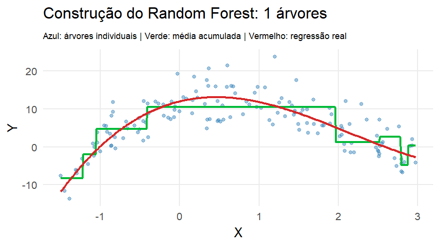

```{r}
#| include: false
library(ggplot2)
library(dplyr)
library(tidyr)
library(rpart)
library(patchwork)
library(gganimate)
library(gifski)

theme_set(theme_minimal(base_size = 18))
set.seed(335)
```

# Modelos baseados em árvores

## De funções suaves para regras

Até aqui, aproximamos $g(\mathbf{x})$ usando funções suaves:

- splines
- regressão local
- kernels

Árvores seguem outra lógica:

$$
\small
\boxed{
\text{dividir o espaço de } \mathbf{x}
\longrightarrow
\text{formar regiões homogêneas}
\longrightarrow
\text{predizer dentro de cada região}
}
$$

## De funções suaves para regras

A estrutura da árvore é praticamente a mesma em **regressão** e **classificação**.

O que muda é:

> **o que significa "região homogênea", o que guardamos nas folhas e como combinamos as árvores.**

<!-- --- -->

<!-- ## Antes de tudo: regressão ou classificação? -->

<!-- :::: {.columns} -->

<!-- ::: {.column width="48%"} -->

<!-- ### Regressão -->

<!-- A resposta é quantitativa: -->

<!-- $$ -->
<!-- Y\in\mathbb{R} -->
<!-- $$ -->

<!-- Exemplos: -->

<!-- - preço de uma casa -->
<!-- - consumo de energia -->
<!-- - tempo de internação -->

<!-- **Folha:** produz um valor numérico. -->

<!-- ::: -->

<!-- ::: {.column width="48%"} -->

<!-- ### Classificação -->

<!-- A resposta é categórica: -->

<!-- $$ -->
<!-- Y\in\{1,\ldots,K\} -->
<!-- $$ -->

<!-- Exemplos: -->

<!-- - inadimplente / não inadimplente -->
<!-- - espécie -->
<!-- - churn / não churn -->

<!-- **Folha:** produz classe e/ou probabilidades. -->

<!-- ::: -->

<!-- :::: -->


## Nós, ramos, folhas e regiões

<!-- {fig-align="center" width="88%"} -->


```{r}
#| echo: false
#| warning: false
#| message: false
#| fig-align: center
#| out-width: 90%

library(ggplot2)
library(dplyr)
library(patchwork)
library(gifski)
library(knitr)

# ============================================================
# 1. DIRETÓRIOS
# ============================================================

dir.create("images", showWarnings = FALSE, recursive = TRUE)

pasta_frames <- "frames_arvore"
dir.create(pasta_frames, showWarnings = FALSE, recursive = TRUE)

arquivo_gif <- "images/arvore_particionamento.gif"

# ============================================================
# 2. CONFIGURAÇÕES
# ============================================================

xmin <- 0
xmax <- 10
ymin <- 0
ymax <- 10

# Splits
corte_x1_1 <- 5
corte_x2   <- 6
corte_x1_2 <- 8

# Cores dos splits
cor_split1 <- "#0072B2"   # azul   : X1 <= 5
cor_split2 <- "#D55E00"   # laranja: X2 <= 6
cor_split3 <- "#009E73"   # verde  : X1 <= 8


# ============================================================
# 3. FUNÇÃO PARA DESENHAR A ÁRVORE
# ============================================================

grafico_arvore <- function(etapa) {

  # --------------------------
  # Ramos
  # --------------------------

  segmentos <- data.frame(
    x = numeric(),
    y = numeric(),
    xend = numeric(),
    yend = numeric(),
    split = character()
  )

  rotulos <- data.frame(
    x = numeric(),
    y = numeric(),
    label = character()
  )

  # ==========================================================
  # Primeiro split
  # ==========================================================

  nos <- data.frame(
    x = 0.50,
    y = 0.90,
    label = "X[1] <= 5",
    split = "split1"
  )

  # ==========================================================
  # Segundo split
  # ==========================================================

  if (etapa >= 2) {

    segmentos <- bind_rows(
      segmentos,
      data.frame(
        x     = c(0.50, 0.50),
        y     = c(0.84, 0.84),
        xend  = c(0.27, 0.73),
        yend  = c(0.66, 0.66),
        split = c("split1", "split1")
      )
    )

    rotulos <- bind_rows(
      rotulos,
      data.frame(
        x = c(0.35, 0.65),
        y = c(0.76, 0.76),
        label = c("Sim", "Não")
      )
    )

    nos <- bind_rows(
      nos,
      data.frame(
        x = c(0.27, 0.73),
        y = c(0.60, 0.60),
        label = c(
          "R[1]",
          "X[2] <= 6"
        ),
        split = c(
          "folha",
          "split2"
        )
      )
    )
  }

  # ==========================================================
  # Terceiro split
  # ==========================================================

  if (etapa >= 3) {

    segmentos <- bind_rows(
      segmentos,
      data.frame(
        x     = c(0.73, 0.73),
        y     = c(0.54, 0.54),
        xend  = c(0.57, 0.89),
        yend  = c(0.36, 0.36),
        split = c("split2", "split2")
      )
    )

    rotulos <- bind_rows(
      rotulos,
      data.frame(
        x = c(0.62, 0.84),
        y = c(0.45, 0.45),
        label = c("Sim", "Não")
      )
    )

    nos <- bind_rows(
      nos,
      data.frame(
        x = c(0.57, 0.89),
        y = c(0.30, 0.30),
        label = c(
          "X[1] <= 8",
          "R[2]"
        ),
        split = c(
          "split3",
          "folha"
        )
      )
    )
  }

  # ==========================================================
  # Folhas finais
  # ==========================================================

  if (etapa >= 4) {

    segmentos <- bind_rows(
      segmentos,
      data.frame(
        x     = c(0.57, 0.57),
        y     = c(0.24, 0.24),
        xend  = c(0.47, 0.67),
        yend  = c(0.08, 0.08),
        split = c("split3", "split3")
      )
    )

    rotulos <- bind_rows(
      rotulos,
      data.frame(
        x = c(0.50, 0.64),
        y = c(0.16, 0.16),
        label = c("Sim", "Não")
      )
    )

    nos <- bind_rows(
      nos,
      data.frame(
        x = c(0.47, 0.67),
        y = c(0.04, 0.04),
        label = c(
          "R[3]",
          "R[4]"
        ),
        split = c(
          "folha",
          "folha"
        )
      )
    )
  }

  # Cores dos nós
  cores_nos <- c(
    split1 = cor_split1,
    split2 = cor_split2,
    split3 = cor_split3,
    folha  = "#444444"
  )

  # Cores dos ramos
  cores_ramos <- c(
    split1 = cor_split1,
    split2 = cor_split2,
    split3 = cor_split3
  )

  ggplot() +

    geom_segment(
      data = segmentos,
      aes(
        x = x,
        y = y,
        xend = xend,
        yend = yend,
        color = split
      ),
      linewidth = 1.25,
      lineend = "round",
      show.legend = FALSE
    ) +

    geom_label(
      data = nos,
      aes(
        x = x,
        y = y,
        label = label,
        color = split
      ),
      parse = TRUE,
      size = 5,
      linewidth = 0.5,
      fill = "white",
      show.legend = FALSE
    ) +

    geom_text(
      data = rotulos,
      aes(
        x = x,
        y = y,
        label = label
      ),
      size = 4,
      fontface = "italic"
    ) +

    scale_color_manual(
      values = c(
        cores_nos,
        cores_ramos
      )
    ) +

    coord_cartesian(
      xlim = c(0.05, 1.03),
      ylim = c(-0.02, 1),
      clip = "off"
    ) +

    labs(title = "Árvore") +

    theme_void(base_size = 14) +

    theme(
      plot.title = element_text(
        hjust = 0.5,
        size = 18,
        face = "bold"
      )
    )
}


# ============================================================
# 4. FUNÇÃO PARA O ESPAÇO PREDITOR
# ============================================================

grafico_espaco <- function(etapa) {

  p <- ggplot() +

    coord_cartesian(
      xlim = c(xmin, xmax),
      ylim = c(ymin, ymax),
      expand = FALSE
    ) +

    scale_x_continuous(
      breaks = seq(0, 10, 2)
    ) +

    scale_y_continuous(
      breaks = seq(0, 10, 2)
    ) +

    labs(
      title = "Espaço preditor",
      x = expression(X[1]),
      y = expression(X[2])
    ) +

    theme_classic(base_size = 14) +

    theme(
      plot.title = element_text(
        hjust = 0.5,
        size = 18,
        face = "bold"
      ),
      axis.title = element_text(size = 15),
      axis.text  = element_text(size = 12)
    )

  # ==========================================================
  # SPLIT 1 — azul
  # ==========================================================

  if (etapa >= 1) {

    p <- p +

      geom_vline(
        xintercept = corte_x1_1,
        color = cor_split1,
        linewidth = 1.5
      ) +

      annotate(
        "text",
        x = 4.78,
        y = 9.55,
        label = "X[1] == 5",
        parse = TRUE,
        color = cor_split1,
        hjust = 1,
        size = 4.5
      )
  }

  # ==========================================================
  # SPLIT 2 — laranja
  # ==========================================================

  if (etapa >= 2) {

    p <- p +

      annotate(
        "segment",
        x = corte_x1_1,
        xend = xmax,
        y = corte_x2,
        yend = corte_x2,
        color = cor_split2,
        linewidth = 1.5
      ) +

      annotate(
        "text",
        x = 9.65,
        y = 6.30,
        label = "X[2] == 6",
        parse = TRUE,
        color = cor_split2,
        hjust = 1,
        size = 4.5
      )
  }

  # ==========================================================
  # SPLIT 3 — verde
  # ==========================================================

  if (etapa >= 3) {

    p <- p +

      annotate(
        "segment",
        x = corte_x1_2,
        xend = corte_x1_2,
        y = ymin,
        yend = corte_x2,
        color = cor_split3,
        linewidth = 1.5
      ) +

      annotate(
        "text",
        x = 8.15,
        y = 0.55,
        label = "X[1] == 8",
        parse = TRUE,
        color = cor_split3,
        hjust = 0,
        size = 4.5
      )
  }

  # ==========================================================
  # REGIÕES FINAIS
  # ==========================================================

  if (etapa >= 4) {

    p <- p +

      annotate(
        "label",
        x = 2.5,
        y = 5,
        label = "R[1]",
        parse = TRUE,
        size = 6,
        fill = "white"
      ) +

      annotate(
        "label",
        x = 7.5,
        y = 8,
        label = "R[2]",
        parse = TRUE,
        size = 6,
        fill = "white"
      ) +

      annotate(
        "label",
        x = 6.5,
        y = 3,
        label = "R[3]",
        parse = TRUE,
        size = 6,
        fill = "white"
      ) +

      annotate(
        "label",
        x = 9,
        y = 3,
        label = "R[4]",
        parse = TRUE,
        size = 6,
        fill = "white"
      )
  }

  p
}


# ============================================================
# 5. TÍTULOS
# ============================================================

titulos <- c(
  "1. Primeiro split: X₁ ≤ 5",
  "2. Segundo split: X₂ ≤ 6",
  "3. Terceiro split: X₁ ≤ 8",
  "4. Folhas da árvore ↔ regiões do espaço preditor"
)


# ============================================================
# 6. GERAR FRAMES
# ============================================================

arquivos <- character(4)

for (etapa in 1:4) {

  painel <- (
    grafico_arvore(etapa) +
    grafico_espaco(etapa) +
    plot_layout(widths = c(0.90, 1.50))
  ) +

    plot_annotation(
      title = titulos[etapa],
      theme = theme(
        plot.title = element_text(
          hjust = 0.5,
          size = 22,
          face = "bold",
          margin = margin(b = 15)
        )
      )
    )

  arquivo_frame <- file.path(
    pasta_frames,
    sprintf("frame_%02d.png", etapa)
  )

  ggsave(
    filename = arquivo_frame,
    plot = painel,
    width = 12,
    height = 6.5,
    dpi = 120,
    bg = "white"
  )

  arquivos[etapa] <- arquivo_frame
}


# ============================================================
# 7. VELOCIDADE DO GIF
# ============================================================
#
# Antes:
# 5 s + 5 s + 5 s + 8 s = 23 segundos
#
# Agora:
# 2 s + 2 s + 2 s + 3 s = 9 segundos
# ============================================================

fps <- 10

duracao <- c(
  2,
  2,
  2,
  3
)

frames_gif <- unlist(
  Map(
    function(arquivo, segundos) {
      rep(arquivo, segundos * fps)
    },
    arquivos,
    duracao
  )
)


# ============================================================
# 8. GERAR GIF
# ============================================================
#
# invisible() evita que o caminho do arquivo apareça no slide.
# ============================================================

invisible(
  gifski(
    png_files = frames_gif,
    gif_file = arquivo_gif,
    width = 1440,
    height = 780,
    delay = 1 / fps,
    loop = TRUE
  )
)


# ============================================================
# 9. EXIBIR NO SLIDE
# ============================================================

knitr::include_graphics(
  arquivo_gif
)
```


::: {.callout-note appearance="simple"}
Cada caminho da raiz até uma folha define uma região $\mathcal{R}_m$. Quatro folhas correspondem às regiões $\mathcal{R}_1,\ldots,\mathcal{R}_4$.
:::

---

## Nós, ramos, folhas e regiões

Da raiz até uma folha, fazemos uma sequência de perguntas do tipo

$$
X_j \leq s?
$$

Cada resposta escolhe um ramo. Ao final,

$$
\boxed{\text{folha }m \Longleftrightarrow \text{região }\mathcal{R}_m}
$$

A árvore é simultaneamente um conjunto de **regras**, uma **partição do espaço preditor** e um modelo que associa uma previsão a cada região.

---

## Nós, ramos, folhas e regiões

Uma árvore com $M$ folhas particiona o espaço em

$$
\mathcal{R}_1,\mathcal{R}_2,\ldots,\mathcal{R}_M.
$$

Para uma nova observação $\mathbf{x}$:

1. começamos no nó raiz;
2. seguimos as regras de divisão;
3. chegamos a uma única folha;
4. usamos a previsão associada àquela região.

$$
\boxed{
\mathbf{x}\in\mathcal{R}_m
\quad\Rightarrow\quad
\text{predição da folha }m
}
$$

---

## Nós, ramos, folhas e regiões

| | Regressão | Classificação |
|---|---|---|
| Resposta | quantitativa | categórica |
| Resumo da folha | média $\bar y_m$ | proporções $\hat p_{mk}$ |
| Predição | $\hat y=\bar y_m$ | classe de maior probabilidade |
| Região boa | valores de $y$ parecidos | predominância de uma classe |


## Nós, ramos, folhas e regiões


Para regressão:

$$
\hat g(\mathbf{x})
=
\sum_{m=1}^{M}\bar y_m\,I(\mathbf{x}\in\mathcal{R}_m)
$$

Para classificação:

$$
\hat p_k(\mathbf{x})
=
\hat p_{mk},
\qquad \mathbf{x}\in\mathcal{R}_m
$$


## A pergunta feita em cada nó

Para cada variável $X_j$ e ponto de corte $s$, testamos uma regra:

$$
X_j\leq s
\qquad\text{versus}\qquad
X_j>s.
$$

Ela cria duas regiões filhas.

A árvore procura a divisão que produz **filhos mais homogêneos que o pai**.

$$
\boxed{
\text{melhor split}
=
\text{maior ganho de homogeneidade}
}
$$

O significado de homogeneidade depende do problema.


## Regressão: reduzir o erro quadrático

Em uma região $\mathcal{R}_m$, a melhor constante sob perda quadrática é

$$
\bar y_m
=
\frac{1}{n_m}
\sum_{i:\mathbf{x}_i\in\mathcal{R}_m}y_i
$$

A impureza do nó pode ser medida por

$$
RSS_m
=
\sum_{i:\mathbf{x}_i\in\mathcal{R}_m}
(y_i-\bar y_m)^2
$$


## Regressão: reduzir o erro quadrático


Uma boa divisão produz:

$$
\boxed{
RSS_{\text{esq}}+RSS_{\text{dir}}
<
RSS_{\text{pai}}
}
$$

Quanto maior a redução, melhor o *split*.


## Classificação: reduzir a mistura de classes

Se $\hat p_{mk}$ é a proporção da classe $k$ no nó $m$, uma medida comum é o **índice de Gini**:

$$
G_m
=
1-\sum_{k=1}^{K}\hat p_{mk}^{\,2}
$$

- $G_m=0$: nó puro
- $G_m$ maior: classes mais misturadas


## Classificação: reduzir a mistura de classes

A árvore escolhe o *split* que reduz a impureza ponderada:


$$
\boxed{
G_{\text{pai}}
-
\left(
\frac{n_E}{n}G_E+
\frac{n_D}{n}G_D
\right)
}
$$

Uma alternativa ao índice de Gini é a **entropia**:

$$
\boxed{
H_m
=
-\sum_{k=1}^{K}
\hat p_{mk}\log_2(\hat p_{mk})
}
$$

onde $\hat p_{mk}$ é a proporção de observações da classe $k$ no nó $m$.


## Classificação: reduzir a mistura de classes


- **Entropia baixa** $\rightarrow$ nó mais puro
- **Entropia alta** $\rightarrow$ maior mistura entre as classes<br><br>

::: {.callout-note appearance="simple"}
Tanto **Gini** quanto **entropia** procuram a mesma coisa:
*divisões que produzam nós filhos mais puros que o nó pai*.
:::


## Mesma árvore, critérios diferentes

:::: {.columns}

::: {.column width="48%"}

### Regressão

**Pergunta**

> A divisão reduz a dispersão dos valores de $Y$?

Critério típico:

$$
RSS
$$

Folha:

$$
\bar y_m
$$

:::

::: {.column width="48%"}

### Classificação

**Pergunta**

> A divisão separa melhor as classes?

Critérios típicos:

$$
\text{Gini ou Entropia}
$$

Folha:

$$
(\hat p_{m1},\ldots,\hat p_{mK})
$$

:::

::::

---

## Exemplo: uma árvore de regressão

```{r}
#| fig-width: 11
#| fig-height: 6
# ============================================================
# ÁRVORE DE REGRESSÃO
# Regiões, folhas e previsão constante
# ============================================================

library(ggplot2)
library(rpart)
library(dplyr)

set.seed(123)

# ============================================================
# 1. FUNÇÃO DE REGRESSÃO VERDADEIRA
# ============================================================

f_real <- function(x, beta = c(12, 4, -6, 1)) {
  beta[1] +
    beta[2] * x +
    beta[3] * x^2 +
    beta[4] * x^3 +
    sin(x)
}


# ============================================================
# 2. SIMULAR OS DADOS
# ============================================================

n <- 150

x <- sort(
  runif(
    n,
    min = -1.5,
    max = 3
  )
)

f_true <- f_real(x)

y <- f_true + rnorm(
  n,
  mean = 0,
  sd = 3.5
)

df <- data.frame(
  x = x,
  y = y
)


# ============================================================
# 3. AJUSTAR UMA ÁRVORE DE REGRESSÃO
# ============================================================

arvore <- rpart(
  y ~ x,
  data = df,
  method = "anova",
  control = rpart.control(
    cp = 0.015,
    minsplit = 15,
    maxdepth = 4
  )
)


# ============================================================
# 4. GRADE PARA VISUALIZAR A FUNÇÃO ESTIMADA
# ============================================================

x_grid <- seq(
  min(df$x),
  max(df$x),
  length.out = 1000
)

grid <- data.frame(
  x = x_grid
)

grid$y_hat <- predict(
  arvore,
  newdata = grid
)

grid$f_true <- f_real(
  grid$x
)


# ============================================================
# 5. IDENTIFICAR AS REGIÕES CRIADAS PELA ÁRVORE
# ============================================================
#
# A predição é constante dentro de cada folha.
# Mudanças em y_hat indicam os pontos de corte.
# ============================================================

mudancas <- which(
  diff(grid$y_hat) != 0
)

splits <- (
  grid$x[mudancas] +
  grid$x[mudancas + 1]
) / 2


# ============================================================
# 6. LIMITES DAS REGIÕES
# ============================================================

limites <- c(
  min(df$x),
  splits,
  max(df$x)
)

M <- length(limites) - 1


# ============================================================
# 7. CRIAR TABELA DAS REGIÕES
# ============================================================

regioes <- data.frame(
  regiao = seq_len(M),
  xmin = limites[-length(limites)],
  xmax = limites[-1]
)

regioes$xmid <- (
  regioes$xmin +
  regioes$xmax
) / 2


# ============================================================
# 8. PREVISÃO EM CADA REGIÃO
# ============================================================

regioes$y_hat <- sapply(
  regioes$xmid,
  function(z) {
    predict(
      arvore,
      newdata = data.frame(x = z)
    )
  }
)


# ============================================================
# 9. ESCOLHER UMA REGIÃO PARA DESTACAR
# ============================================================
#
# Escolhemos uma região central para mostrar ao aluno que:
#
#   previsão da folha = média dos Y da região
#
# ============================================================

m_destaque <- ceiling(M / 2)

R_destaque <- regioes[
  m_destaque,
]


# ============================================================
# 10. OBSERVAÇÕES QUE PERTENCEM À REGIÃO DESTACADA
# ============================================================

dados_regiao <- df %>%
  filter(
    x > R_destaque$xmin,
    x <= R_destaque$xmax
  )


# ============================================================
# 11. MÉDIA DE Y NA REGIÃO DESTACADA
# ============================================================

media_regiao <- mean(
  dados_regiao$y
)


# ============================================================
# 12. POSIÇÃO DOS RÓTULOS DAS REGIÕES
# ============================================================

y_min <- min(
  df$y,
  grid$f_true,
  grid$y_hat
)

y_max <- max(
  df$y,
  grid$f_true,
  grid$y_hat
)

amplitude_y <- y_max - y_min

y_regioes <- y_min +
  0.06 * amplitude_y


# ============================================================
# 13. DATA FRAME DOS SPLITS
# ============================================================

df_splits <- data.frame(
  x = splits
)


# ============================================================
# 14. GRÁFICO
# ============================================================

p <- ggplot() +

  # ----------------------------------------------------------
  # Destacar uma folha/região
  # ----------------------------------------------------------

  annotate(
    "rect",
    xmin = R_destaque$xmin,
    xmax = R_destaque$xmax,
    ymin = -Inf,
    ymax = Inf,
    fill = "#F3E5AB",
    alpha = 0.22
  ) +

  # ----------------------------------------------------------
  # Splits da árvore
  # ----------------------------------------------------------

  geom_vline(
    data = df_splits,
    aes(xintercept = x),
    linetype = "dashed",
    linewidth = 0.55,
    alpha = 0.55
  ) +

  # ----------------------------------------------------------
  # Dados observados
  # ----------------------------------------------------------

  geom_point(
    data = df,
    aes(
      x = x,
      y = y
    ),
    size = 2.1,
    alpha = 0.65
  ) +

  # ----------------------------------------------------------
  # Função verdadeira
  # ----------------------------------------------------------

  geom_line(
    data = grid,
    aes(
      x = x,
      y = f_true
    ),
    linetype = "dashed",
    linewidth = 1.15
  ) +

  # ----------------------------------------------------------
  # Previsão da árvore
  # ----------------------------------------------------------

  geom_step(
    data = grid,
    aes(
      x = x,
      y = y_hat
    ),
    linewidth = 1.25,
    direction = "hv"
  ) +

  # ----------------------------------------------------------
  # Média da região destacada
  # ----------------------------------------------------------

  annotate(
    "segment",
    x = R_destaque$xmin,
    xend = R_destaque$xmax,
    y = media_regiao,
    yend = media_regiao,
    linewidth = 1.8
  ) +

  # ----------------------------------------------------------
  # Rótulo da média
  # ----------------------------------------------------------

  annotate(
    "label",
    x = R_destaque$xmid,
    y = media_regiao - 0.39 * amplitude_y,
    label = paste0(
      "hat(y)[R[",
      m_destaque,
      "]] == bar(y)[R[",
      m_destaque,
      "]]"
    ),
    parse = TRUE,
    size = 4.5,
    fill = "white"
  ) +

  # ----------------------------------------------------------
  # Identificação das regiões
  # ----------------------------------------------------------

  geom_text(
    data = regioes,
    aes(
      x = xmid,
      y = y_regioes,
      label = paste0(
        "R[",
        regiao,
        "]"
      )
    ),
    parse = TRUE,
    size = 4.5,
    fontface = "bold"
  ) +

  # ----------------------------------------------------------
  # Títulos
  # ----------------------------------------------------------

  labs(
    title = "A árvore aproxima uma curva por degraus",
    subtitle = paste0(
      "Os splits dividem X em regiões; ",
      "em cada folha, a previsão é constante"
    ),
    x = "X",
    y = "Y"
  ) +

  theme_minimal(
    base_size = 15
  ) +

  theme(
    plot.title = element_text(
      size = 20,
      face = "bold"
    ),

    plot.subtitle = element_text(
      size = 15
    ),

    panel.grid.minor = element_blank(),

    axis.title = element_text(
      size = 15
    ),

    axis.text = element_text(
      size = 12
    ),

    plot.margin = margin(
      15,
      20,
      15,
      15
    )
  )


# ============================================================
# 15. EXIBIR
# ============================================================

p
```

---

## Exemplo: uma árvore de classificação

```{r}
#| fig-width: 11
#| fig-height: 6
set.seed(336)
n <- 350
x1 <- rnorm(n)
x2 <- rnorm(n)
eta <- 1.4*x1 - 1.1*x2 + 1.3*x1*x2
p <- plogis(eta)
classe <- factor(ifelse(runif(n) < p, "Classe B", "Classe A"))
df_cls <- data.frame(x1, x2, classe)

fit_cls <- rpart(
  classe ~ x1 + x2, data = df_cls, method = "class",
  control = rpart.control(cp = .01, maxdepth = 4, minsplit = 20)
)

gx <- seq(min(x1), max(x1), length.out = 140)
gy <- seq(min(x2), max(x2), length.out = 140)
gr <- expand.grid(x1 = gx, x2 = gy)
gr$prob_B <- predict(fit_cls, gr, type = "prob")[, "Classe B"]

ggplot() +
  geom_raster(data = gr, aes(x1, x2, fill = prob_B), alpha = .32) +
  geom_contour(data = gr, aes(x1, x2, z = prob_B),
               breaks = .5, linewidth = 1.2) +
  geom_point(data = df_cls, aes(x1, x2, shape = classe),
             size = 2, alpha = .65) +
  labs(
    title = "Na classificação, as folhas definem regiões de probabilidade",
    subtitle = "A fronteira de decisão separa folhas classificadas como A de folhas classificadas como B.",
    x = expression(X[1]), y = expression(X[2]),
    fill = "P(Classe B)", shape = "Classe"
  ) +
  theme(panel.grid.minor = element_blank())
```


## Árvore profunda: baixo viés, alta variância

Uma árvore pode continuar dividindo os dados até criar folhas muito pequenas.

Isso reduz o erro de treinamento, mas pode produzir regras instáveis.

$$
\boxed{
\text{árvore muito profunda}
\Rightarrow
\text{maior flexibilidade}
\Rightarrow
\text{maior risco de overfitting}
}
$$

Pequenas mudanças na amostra podem gerar uma árvore bastante diferente.


## Poda (pruning)

Para regressão, uma forma de pensar na poda é:

$$
\boxed{
\text{erro da árvore}
+
\alpha\times\text{complexidade}
}
$$

ou, mais especificamente,

$$
\sum_{m=1}^{|T|}
\sum_{i:\mathbf{x}_i\in\mathcal{R}_m}
(y_i-\bar y_m)^2
+
\alpha|T|
$$

- $\alpha$ pequeno $\rightarrow$ árvore maior
- $\alpha$ grande $\rightarrow$ árvore menor
- $T:$ árvore
- $|T|:$ número de folhas (nós terminais) de $T$


## Poda (pruning)


Na classificação, a mesma lógica é usada com uma medida apropriada de erro/impureza.<br><br>

::: {.callout-tip appearance="simple"}
A poda regulariza **uma árvore**. Bagging, Random Forest e Boosting seguem outra estratégia: **combinar muitas árvores**.
:::


## O problema da árvore individual

Árvores são:

- interpretáveis
- capazes de capturar não linearidade
- capazes de capturar interações

Mas são também:

- instáveis
- sensíveis à amostra
- de alta variância


## Por que combinar árvores?

Imagine que treinamos duas árvores de regressão e, para uma mesma entrada $\mathbf{x}$, elas produzam, $g_1(\mathbf{x})$ e $g_2(\mathbf{x})$. Podemos combinar suas previsões pela média:

$$
\boxed{
g(\mathbf{x})
=
\frac{g_1(\mathbf{x})+g_2(\mathbf{x})}{2}
}
$$

Se ambas têm o mesmo valor esperado,

$$
\mathbb{E}[g_1(\mathbf{x})]
=
\mathbb{E}[g_2(\mathbf{x})]
=
\mu_g(\mathbf{x}),
$$

então

$$
\mathbb{E}[g(\mathbf{x})]
=
\frac{
\mathbb{E}[g_1(\mathbf{x})]
+
\mathbb{E}[g_2(\mathbf{x})]
}{2}
=
\mu_g(\mathbf{x})
$$

## Por que combinar árvores?


Portanto,

$$
\boxed{
\operatorname{Bias}[g(\mathbf{x})]
=
\mu_g(\mathbf{x})-f(\mathbf{x})
}
$$

::: {.callout-note appearance="simple"}
**A média não corrige um viés comum às árvores.**

Se $g_1$ e $g_2$ têm o mesmo viés, a combinação mantém esse viés, mas pode **reduzir a variância**.
:::


A variância da previsão combinada é

$$
\operatorname{Var}\!\left[g(\mathbf{x})\right]
=
\frac{1}{4}
\left[
\operatorname{Var}(g_1)
+
\operatorname{Var}(g_2)
+
2\operatorname{Cov}(g_1,g_2)
\right]
$$


## Por que combinar árvores?


Se as árvores têm a mesma variância $\sigma_g^2$ e correlação $\rho$,

$$
\boxed{
\operatorname{Var}\!\left[g(\mathbf{x})\right]
=
\frac{\sigma_g^2}{2}(1+\rho)
}
$$<br><br>

::: {.callout-important appearance="simple"}
**Ideia central:** fazer a média reduz a variância, mas o ganho é maior quando as árvores são **menos correlacionadas**.

$$
\rho \downarrow
\quad\Longrightarrow\quad
\operatorname{Var}[g(\mathbf{x})]\downarrow
$$
:::


## Por que combinar árvores?

Assim, combinar modelos:

-   mantém o viés\
-   reduz a variância


## Três maneiras de combinar árvores

Os métodos diferem na forma de **construir** e **combinar** as árvores:

$$
\boxed{\text{Bagging: construir em paralelo} \;\longrightarrow\; \text{agregar}}
$$

$$
\boxed{\text{Random Forest: construir em paralelo + descorrelacionar} \;\longrightarrow\; \text{agregar}}
$$

$$
\boxed{\text{Boosting: construir sequencialmente} \;\longrightarrow\; \text{acumular}}
$$

::: {.callout-important appearance="simple"}
**Qual é a ideia de cada estratégia?**

**Bagging:** reduzir a **variância** pela agregação de árvores

**Random Forest:** reduzir a **correlação entre as árvores**, potencializando a redução da variância

**Boosting:** melhorar **progressivamente o modelo**, adicionando novas árvores de forma sequencial
:::


# Bagging (Bootstrap Aggregating)

> Média de vários modelos instáveis → modelo mais estável

## Bagging = Bootstrap + Aggregating

Para $b=1,\ldots,B$:

1. sorteie uma amostra *bootstrap*;
2. ajuste uma árvore $T_b$;
3. repita muitas vezes;
4. combine as previsões.

$$
\boxed{
\text{Bagging}
=
\text{Bootstrap}
+
\text{Agregação}
}
$$

As árvores são ajustadas **em paralelo**: uma não depende da anterior.


---

{fig-align="center"}


## Como agregamos?

:::: {.columns}

::: {.column width="48%"}

### Regressão

Cada árvore fornece um número:

$$
\hat y_b(\mathbf{x})
$$

Agregamos pela média:

$$
\boxed{
\hat y_{\text{bag}}(\mathbf{x})
=
\frac1B\sum_{b=1}^{B}\hat y_b(\mathbf{x})
}
$$

:::

::: {.column width="48%"}

### Classificação

Cada árvore fornece classe ou probabilidades.

Podemos usar:

$$
\boxed{\text{voto majoritário}}
$$

ou, preferencialmente, promediar probabilidades:

$$
\boxed{
\hat p_k(\mathbf{x})
=
\frac1B\sum_{b=1}^{B}\hat p_{bk}(\mathbf{x})
}
$$

:::

::::


---

## Bagging em regressão: veja a estabilização

{fig-align="center" width="88%"}

::: {.callout-note appearance="simple"}
As árvores individuais variam bastante. A média acumulada se torna progressivamente mais estável.
:::

---

## Por que a média ajuda?

Se cada árvore tem variância aproximadamente $\sigma^2$ e correlação média $\rho$, então

$$
\boxed{
\operatorname{Var}(\bar T)
=
\rho\sigma^2+
\frac{1-\rho}{B}\sigma^2
}
$$

Duas mensagens:

1. aumentar $B$ reduz a segunda parcela;
2. a parcela $\rho\sigma^2$ permanece.

Logo:

$$
\boxed{
\text{não basta ter muitas árvores; é útil que elas sejam diferentes}
}
$$

---

## Bagging em classificação

O mecanismo é o mesmo:

$$
\text{bootstrap}
\rightarrow
\text{árvore de classificação}
\rightarrow
\text{probabilidade/voto}
\rightarrow
\text{agregação}
$$

O que muda em relação à regressão?

| Etapa | Regressão | Classificação |
|---|---|---|
| split | RSS/variância | Gini/entropia |
| folha | média | proporções/classes |
| agregação | média de $\hat y$ | média de probabilidades/voto |


# Random Forest

> Construir muitas árvores diferentes e combinar suas previsões


## O limite do Bagging

Mesmo com amostras *bootstrap* diferentes, árvores podem ficar muito parecidas.

Por quê?

Se uma variável é muito forte, ela tende a ser escolhida repetidamente perto da raiz.

Resultado:

$$
\text{árvores semelhantes}
\Rightarrow
\rho \text{ alto}
\Rightarrow
\text{menor redução de variância}.
$$

---

## Random Forest: descorrelacionar as árvores

O Random Forest adiciona uma segunda fonte de aleatoriedade.

Para cada árvore:

1. sorteamos uma amostra *bootstrap*;
2. em **cada nó**, sorteamos apenas $m_{\text{try}}$ das $p$ variáveis;
3. procuramos o melhor *split* somente entre essas candidatas;
4. repetimos até construir muitas árvores.

$$
\boxed{
\text{RF}
=
\text{Bagging}
+
\text{subamostragem de variáveis em cada split}
}
$$


---

## Onde Bagging e Random Forest se separam?

{fig-align="center" width="90%"}

No **Bagging**, todas as $p$ variáveis podem disputar cada split.

No **Random Forest**, apenas $m_{\text{try}}<p$ variáveis sorteadas podem disputar aquele split.

::: {.callout-important}
## Importante
O subconjunto de variáveis é sorteado **novamente em cada nó**. Essa aleatoriedade adicional ajuda a reduzir a correlação entre as árvores.
:::


---

{fig-align="center"}


## Bagging versus Random Forest

| | Bagging | Random Forest |
|---|---|---|
| Bootstrap de observações | sim | sim |
| Variáveis candidatas por split | todas | subconjunto aleatório |
| Objetivo adicional | estabilizar | estabilizar + descorrelacionar |
| Regressão | média | média |
| Classificação | voto/probabilidades | voto/probabilidades |


## Bagging versus Random Forest


Se

$$
m_{\text{try}}=p,
$$

o Random Forest se reduz, essencialmente, ao Bagging de árvores.<br><br>

::: {.callout-warning appearance="simple"}
Com **apenas uma variável preditora**, não é possível visualizar a diferença essencial entre Bagging e Random Forest: não há variáveis para sortear. Por isso, uma animação univariada de RF se comporta como Bagging.
:::

---

## O que $m_{\text{try}}$ controla?

$$
m_{\text{try}}
=
\text{número de variáveis candidatas em cada nó}.
$$

- valor grande $\rightarrow$ árvores mais parecidas
- valor pequeno $\rightarrow$ árvores mais diversas
- pequeno demais $\rightarrow$ splits individuais podem piorar

Portanto, existe um compromisso:

$$
\boxed{
\text{força de cada árvore}
\quad\text{versus}\quad
\text{correlação entre árvores}
}
$$

$m_{\text{try}}$ deve ser tratado como hiperparâmetro e pode ser ajustado por validação.

---


## OOB: validação "embutida" no bootstrap

Para cada árvore $T_b$, a amostra *bootstrap* deixa algumas observações de fora. 

Elas são chamadas de **out-of-bag (OOB)**:

$$
\boxed{
OOB_b
=
\{\text{observações não utilizadas no treinamento de }T_b\}
}
$$

Em média, aproximadamente **36,8%** das observações ficam OOB para cada árvore.


## OOB: validação "embutida" no bootstrap


Para avaliar uma observação $i$:

1. selecione apenas as árvores para as quais $i$ ficou **OOB**;
2. obtenha as previsões dessas árvores para $\mathbf{x}_i$;
3. **agregue** essas previsões, obtendo $\hat y_i^{OOB}$;
4. compare $\hat y_i^{OOB}$ com o valor observado $y_i$, usando, por exemplo,

$$
RMSE_{OOB}
=
\sqrt{
\frac{1}{n}
\sum_{i=1}^{n}
\left(y_i-\hat{y}_i^{OOB}\right)^2
}
$$


## OOB: validação "embutida" no bootstrap


:::: {.columns}

::: {.column width="48%"}
### Regressão

Agregamos pela **média**:

$$
\hat y_i^{OOB}
=
\frac{1}{|\mathcal B_i|}
\sum_{b\in\mathcal B_i}
T_b(\mathbf{x}_i)
$$
:::

::: {.column width="48%"}
### Classificação

Agregamos por **votação** ou pelas probabilidades estimadas:

$$
\hat y_i^{OOB}
=
\operatorname{classe}
\left(
\{T_b(\mathbf{x}_i):b\in\mathcal B_i\}
\right)
$$
:::

::::

::: {.callout-important appearance="simple"}
**Ideia central:** cada observação é avaliada somente pelas árvores que **não a utilizaram no treinamento**.

$\Rightarrow$ O próprio *bootstrap* fornece uma estimativa interna do desempenho preditivo.
:::


---


```{r}
library(ggplot2)
library(rpart)
library(dplyr)
library(tidyr)
library(gganimate)
library(gifski)

set.seed(123)

# -----------------------------
# Função de regressão real
# -----------------------------
f_real <- function(x, beta = c(12, 4, -6, 1)) {
  beta[1] + beta[2] * x + beta[3] * x^2 + beta[4] * x^3 + sin(x)
}

# -----------------------------
# Dados simulados
# -----------------------------
n <- 150
x <- sort(runif(n, -1.5, 3))

f_true <- f_real(x)
y <- f_true + rnorm(n, sd = 4.0)

df <- data.frame(x = x, y = y)

# -----------------------------
# Grade para previsão
# -----------------------------
xg <- seq(min(x), max(x), length.out = 300)
grid <- data.frame(x = xg)

# função verdadeira na grade
df_true <- data.frame(
  x = xg,
  y_true = f_real(xg)
)

# -----------------------------
# Gerar várias árvores bootstrap
# -----------------------------
B <- 100
pred_mat <- matrix(NA_real_, nrow = length(xg), ncol = B)

for (b in 1:B) {
  idx <- sample(1:n, n, replace = TRUE)
  df_boot <- df[idx, ]

  fit <- rpart(
    y ~ x,
    data = df_boot,
    method = "anova",
    control = rpart.control(maxdepth = 3, cp = 0.002, minsplit = 10)
  )

  pred_mat[, b] <- predict(fit, newdata = grid)
}

# -----------------------------
# Árvores individuais em formato longo
# -----------------------------
df_trees <- as.data.frame(pred_mat)
names(df_trees) <- paste0("tree_", 1:B)
df_trees$x <- xg

df_trees_long <- df_trees |>
  pivot_longer(
    cols = starts_with("tree_"),
    names_to = "tree",
    values_to = "y_hat"
  ) |>
  mutate(tree_id = as.integer(gsub("tree_", "", tree)))

# -----------------------------
# Média acumulada das árvores
# -----------------------------
cumavg_mat <- sapply(1:B, function(b) {
  rowMeans(pred_mat[, 1:b, drop = FALSE])
})

df_avg <- as.data.frame(cumavg_mat)
names(df_avg) <- paste0("avg_", 1:B)
df_avg$x <- xg

df_avg_long <- df_avg |>
  pivot_longer(
    cols = starts_with("avg_"),
    names_to = "avg",
    values_to = "y_avg"
  ) |>
  mutate(
    tree_id = as.integer(gsub("avg_", "", avg)),
    frame_id = tree_id
  )

# -----------------------------
# Replicar dados observados para cada frame
# -----------------------------
df_points <- bind_rows(
  lapply(1:B, function(b) {
    data.frame(
      x = df$x,
      y = df$y,
      frame_id = b
    )
  })
)

# -----------------------------
# Replicar função verdadeira para cada frame
# -----------------------------
df_true_anim <- bind_rows(
  lapply(1:B, function(b) {
    data.frame(
      x = df_true$x,
      y_true = df_true$y_true,
      frame_id = b
    )
  })
)

# -----------------------------
# Se quiser reativar as árvores individuais,
# basta usar este objeto:
# -----------------------------
df_trees_anim <- bind_rows(
  lapply(1:B, function(b) {
    subset(df_trees_long, tree_id <= b) |>
      mutate(frame_id = b)
  })
)

df_avg_anim <- df_avg_long |>
  transmute(
    x = x,
    y_avg = y_avg,
    frame_id = frame_id
  )

# -----------------------------
# Gráfico animado
# -----------------------------
anim_plot <- ggplot() +
  geom_point(
    data = df_points,
    aes(x, y),
    color = "#2C7FB8",
    alpha = 0.45,
    size = 1.8
  ) +
  # Para mostrar também as árvores individuais, descomente:
  geom_line(
    data = df_trees_anim,
    aes(x, y_hat, group = tree),
    color = "#1468f5",
    alpha = 0.08,
    linewidth = 0.8
  ) +
  geom_line(
    data = df_avg_anim,
    aes(x, y_avg),
    color = "#00BA38",
    linewidth = 1.3
  ) +
  geom_line(
    data = df_true_anim,
    aes(x, y_true),
    color = "#D62728",
    linewidth = 1.3
  ) +
  labs(
    title = "Construção do Random Forest: {current_frame} árvores",
    subtitle = "Azul: árvores individuais | Verde: média acumulada | Vermelho: regressão real",
    x = "X",
    y = "Y"
  ) +
  theme_minimal(base_size = 16) +
  theme(
    panel.grid.minor = element_blank(),
    plot.title = element_text(face = "bold"),
    plot.subtitle = element_text(size = 11)
  ) +
  transition_manual(frame_id)

# -----------------------------
# Renderizar e salvar gif
# -----------------------------
anim2 = animate(
  anim_plot,
  nframes = B,
  fps = 3,
  width = 7.5,
  height = 4.2,
  units = "in",
  res = 120,
  renderer = gifski_renderer("rf_animado.gif")
)

# -----------------------------
# PNG estático para PDF
# -----------------------------
frame_pdf <- 45

plot_pdf22 <- ggplot() +
  geom_point(
    data = subset(df_points, frame_id == frame_pdf),
    aes(x, y),
    color = "#2C7FB8",
    alpha = 0.45,
    size = 1.8
  ) +
  geom_line(
    data = subset(df_trees_anim, frame_id == frame_pdf),
    aes(x, y_hat, group = tree_id),
    color = "#619CFF",
    alpha = 0.12,
    linewidth = 1.0
  ) +
  geom_line(
    data = subset(df_avg_long, frame_id == frame_pdf),
    aes(x, y_avg),
    color = "#00BA38",
    linewidth = 1.3
  ) +
  geom_line(
    data = subset(df_true_anim, frame_id == frame_pdf),
    aes(x, y_true),
    color = "#D62728",
    linewidth = 1.3
  ) +
  labs(
    title = paste("Construção do Random Forest:", frame_pdf, "árvores"),
    subtitle = "Azul: Árvores individuais | Verde: Média acumulada | Vermelho: Regressão real",
    x = "X",
    y = "Y"
  ) +
  theme_minimal(base_size = 16) +
  theme(
    panel.grid.minor = element_blank(),
    plot.title = element_text(face = "bold"),
    plot.subtitle = element_text(size = 11)
  )
```


```{r}
#| echo: false
#| warning: false
#| message: false
#| out-width: "90%"
#| fig-align: "center"
#| results: 'asis'

if (knitr::is_html_output()) {
  
} else if (knitr::is_latex_output()) {
  
  # fecha dispositivos abertos
  while (!is.null(dev.list())) dev.off()
  
  png(
    filename = "rf_animado.png",
    width = 900,
    height = 500,
    res = 120
  )
  
  print(plot_pdf22)
  
  invisible(dev.off())
  
  knitr::include_graphics("rf_animado.png")
}
```


# Boosting

> Construir o modelo sequencialmente, fazendo cada nova árvore corrigir o modelo atual


## Boosting: árvores que aprendem sequencialmente

Bagging e Random Forest constroem árvores aproximadamente **em paralelo**.

No **boosting**, cada nova árvore depende do modelo que já foi construído:

$$
\hat h_1
\;\longrightarrow\;
\hat h_2
\;\longrightarrow\;
\hat h_3
\;\longrightarrow\;\cdots
$$

A ideia é simples:

::: {.callout-important appearance="simple"}
Cada nova árvore tenta aprender **uma correção** para os erros que ainda permanecem no modelo.
:::

Assim, em vez de combinar árvores independentes,

$$
\boxed{
\text{modelo atual}
\;\longrightarrow\;
\text{erro atual}
\;\longrightarrow\;
\text{nova árvore}
\;\longrightarrow\;
\text{modelo melhorado}
}
$$


## Boosting: modelo atual + uma correção

Na iteração $b$, já temos um modelo acumulado:

$$
\hat g^{(b-1)}(\mathbf{x})
$$

A nova árvore $\hat h_b(\mathbf{x})$ não precisa resolver todo o problema.

Ela aprende apenas uma **correção**.

O modelo é atualizado por

$$
\boxed{
\hat g^{(b)}(\mathbf{x})
=
\hat g^{(b-1)}(\mathbf{x})
+
\lambda \hat h_b(\mathbf{x})
}
$$


## Boosting: modelo atual + uma correção

em que:

- $\hat g^{(b-1)}(\mathbf{x})$: modelo atual;
- $\hat h_b(\mathbf{x})$: correção aprendida pela nova árvore;
- $\lambda$: *learning rate*.

::: {.callout-note appearance="simple"}
**Ideia central:** boosting constrói uma função complexa acumulando muitas correções simples.
:::


## Boosting em regressão: quanto ainda falta corrigir?

Considere a observação $i$.

O modelo atual prevê

$$
\hat g^{(b-1)}(\mathbf{x}_i),
$$

mas observamos $y_i$.


## Boosting em regressão: quanto ainda falta corrigir?


A diferença é

$$
\boxed{
r_i^{(b)}
=
y_i-\hat g^{(b-1)}(\mathbf{x}_i)
}
$$

:::: {.columns}

::: {.column width="48%"}
### $r_i^{(b)}>0$

O modelo previu **abaixo** do observado.

$$
y_i >
\hat g^{(b-1)}(\mathbf{x}_i)
$$

A previsão precisa **aumentar**.
:::

::: {.column width="48%"}
### $r_i^{(b)}<0$

O modelo previu **acima** do observado.

$$
y_i <
\hat g^{(b-1)}(\mathbf{x}_i)
$$

A previsão precisa **diminuir**.
:::

::::

::: {.callout-important appearance="simple"}
O resíduo informa simultaneamente **a direção** e **o tamanho** da correção necessária.
:::


## A nova árvore aprende o que ainda falta

Na iteração $b$, usamos os resíduos como nova resposta:

$$
(\mathbf{x}_i,r_i^{(b)}),
\qquad i=1,\ldots,n
$$

A nova árvore é ajustada para aproximar

$$
\boxed{
\hat h_b(\mathbf{x}_i)
\approx
r_i^{(b)}
}
$$

Portanto,

$$
\mathbf{x}_i
\longrightarrow
r_i^{(b)}
\longrightarrow
\hat h_b(\mathbf{x}_i)
$$


## A nova árvore aprende o que ainda falta


Depois incorporamos **uma fração** dessa correção:

$$
\boxed{
\hat g^{(b)}(\mathbf{x})
=
\hat g^{(b-1)}(\mathbf{x})
+
\lambda\hat h_b(\mathbf{x})
}
$$

::: {.callout-note appearance="simple"}
A nova árvore não prevê diretamente $Y$: ela aprende **como corrigir o modelo atual**.
:::


## Uma iteração do boosting

Na iteração $b$:

$$
\boxed{
\begin{array}{c}
\text{1. Modelo atual}\\[2mm]
\hat g^{(b-1)}(\mathbf{x})
\end{array}
}
\quad\longrightarrow\quad
\boxed{
\begin{array}{c}
\text{2. Calcular resíduos}\\[2mm]
r_i^{(b)}
=
y_i-\hat g^{(b-1)}(\mathbf{x}_i)
\end{array}
}
$$

$$
\Downarrow
$$

$$
\boxed{
\begin{array}{c}
\text{3. Aprender a correção}\\[2mm]
\hat h_b(\mathbf{x})
\end{array}
}
\quad\longrightarrow\quad
\boxed{
\begin{array}{c}
\text{4. Atualizar}\\[2mm]
\hat g^{(b)}
=
\hat g^{(b-1)}
+
\lambda\hat h_b
\end{array}
}
$$

::: {.callout-important appearance="simple"}
Depois da atualização, calculamos **novos erros** e repetimos o processo.
:::


## Boosting: construção sequencial do modelo

<!-- Inserir aqui a figura atual do slide 52 -->

{fig-align="center" width="100%"}


::: {.callout-note appearance="simple"}
Leia a figura da esquerda para a direita:

**modelo atual $\rightarrow$ erros restantes $\rightarrow$ nova árvore $\rightarrow$ pequena correção $\rightarrow$ novo modelo**
:::


## Boosting em regressão: veja o modelo aprender

<!-- Inserir aqui o GIF que já está sendo utilizado -->


{fig-align="center" width="88%"}

::: {.callout-important appearance="simple"}
A **nova árvore** não representa a previsão final.

Ela representa apenas a correção $\hat h_b(\mathbf{x})$.

A previsão é dada pelo **modelo acumulado** $\hat g^{(b)}(\mathbf{x})$.
:::


## Por que os resíduos aparecem?

Até agora usamos o resíduo

$$
r_i^{(b)}
=
y_i-\hat g^{(b-1)}(\mathbf{x}_i)
$$

Mas isso **não é uma escolha arbitrária**.

Considere a perda quadrática:

$$
L(y,g)=(y-g)^2
$$


## Por que os resíduos aparecem?


O **gradiente da perda em relação à previsão $g$** é

$$
\boxed{
\nabla_g L(y,g)
=
\frac{\partial L(y,g)}{\partial g}
=
-2(y-g)
}
$$

::: {.callout-note appearance="simple"}
Aqui, como derivamos em relação a uma única quantidade $g$, o gradiente é simplesmente a **derivada da perda em relação à previsão**.

O gradiente indica a direção de **aumento** da perda.
:::

## Por que os resíduos aparecem?


Logo, a direção oposta ao gradiente é

$$
-\frac{\partial L(y,g)}{\partial g}
=
2(y-g)
$$

Portanto,

$$
\boxed{
-\frac{\partial L}{\partial g}
\propto
y-g
=
r
}
$$

::: {.callout-important appearance="simple"}
Com **perda quadrática**, seguir o gradiente negativo equivale a aprender os **resíduos**.
:::


## Gradient Boosting: a ideia mais geral

Agora podemos generalizar.

Para uma função de perda $L(y,g)$, definimos o pseudo-resíduo:

$$
\boxed{
r_i^{(b)}
=
-
\left.
\frac{\partial L(y_i,g)}
{\partial g}
\right|_{
g=\hat g^{(b-1)}(\mathbf{x}_i)
}
}
$$

A nova árvore $\hat h_b$ tenta aprender esses pseudo-resíduos.

Depois,

$$
\hat g^{(b)}(\mathbf{x})
=
\hat g^{(b-1)}(\mathbf{x})
+
\lambda\hat h_b(\mathbf{x})
$$


## Gradient Boosting: a ideia mais geral


Assim,

$$
\boxed{
\text{Gradient Boosting}
=
\text{corrigir o modelo na direção que reduz a perda}
}
$$

::: {.callout-note appearance="simple"}
O **resíduo usual** é apenas um caso particular do **pseudo-resíduo**.
:::


## Regressão e classificação: o que muda?

A estrutura do algoritmo permanece a mesma:

$$
\boxed{
\text{modelo atual}
\rightarrow
\text{perda}
\rightarrow
\text{pseudo-resíduos}
\rightarrow
\text{nova árvore}
\rightarrow
\text{atualização}
}
$$

O que muda é principalmente a **função de perda**.

| | Regressão | Classificação binária |
|---|---|---|
| Resposta | $y\in\mathbb R$ | $y\in\{0,1\}$ |
| Exemplo de perda | quadrática | log-loss |
| Correção | relacionada a $y-\hat g$ | relacionada a $y-\hat p$ |
| Saída final | valor contínuo | probabilidade/classe |


## Regressão e classificação: o que muda?


::: {.callout-important appearance="simple"}
Boosting não é essencialmente um algoritmo de regressão ou classificação.

Ele é uma estratégia para **reduzir iterativamente uma função de perda**.
:::


## E na classificação?

Para $Y\in\{0,1\}$, não calculamos um resíduo entre a classe observada e uma **classe predita** como se fossem valores contínuos.

Em vez disso, trabalhamos com uma perda apropriada para classificação.

Para classificação binária, uma escolha comum é a **log-loss**:

$$
\boxed{
L(y,p)
=
-\left[
y\log(p)
+
(1-y)\log(1-p)
\right]
}
$$

em que

$$
p=P(Y=1\mid\mathbf{x})
$$


## E na classificação?


O princípio continua sendo o mesmo:


$$
\boxed{
\text{encontrar a direção que reduz a perda}
}
$$


## Classificação binária: score e probabilidade

No Gradient Boosting binário, é útil distinguir o **score acumulado**

$$
F^{(b)}(\mathbf{x})
$$

da probabilidade estimada.

A probabilidade é obtida pela função logística:

$$
\boxed{
\hat p^{(b)}(\mathbf{x})
=
\frac{1}
{1+\exp[-F^{(b)}(\mathbf{x})]}
}
$$


## Classificação binária: score e probabilidade


As árvores são acumuladas na escala do **score**:

$$
\boxed{
F^{(b)}(\mathbf{x})
=
F^{(b-1)}(\mathbf{x})
+
\lambda\hat h_b(\mathbf{x})
}
$$

e o score é então convertido em probabilidade.

::: {.callout-note appearance="simple"}
A soma das árvores não precisa estar limitada entre $0$ e $1$.

É a transformação logística que produz uma **probabilidade**.
:::


## Classificação binária: o que a nova árvore aprende?

Com log-loss e

$$
\hat p_i^{(b-1)}
=
P(Y_i=1\mid\mathbf{x}_i),
$$

o gradiente negativo leva ao pseudo-resíduo

$$
\boxed{
r_i^{(b)}
=
y_i-\hat p_i^{(b-1)}
}
$$


## Classificação binária: o que a nova árvore aprende?


Por exemplo:

| $y_i$ | $\hat p_i^{(b-1)}$ | $r_i^{(b)}$ | Interpretação |
|---:|---:|---:|---|
| 1 | 0,95 | 0,05 | quase nada a corrigir |
| 1 | 0,20 | 0,80 | aumentar evidência para classe 1 |
| 0 | 0,10 | -0,10 | pequena correção |
| 0 | 0,85 | -0,85 | reduzir evidência para classe 1 |

::: {.callout-important appearance="simple"}
Quanto mais **confiante e errada** estiver a previsão atual, maior será a magnitude da correção.
:::


## Boosting em classificação: veja a correção acontecer


{fig-align="center" width="100%"}

## Regressão e classificação: a mesma lógica

:::: {.columns}

::: {.column width="48%"}
### Regressão

Perda quadrática:

$$
L(y,g)=(y-g)^2
$$

Pseudo-resíduo:

$$
r_i^{(b)}
\propto
y_i-\hat g^{(b-1)}(\mathbf{x}_i)
$$

**Corrigir o valor previsto.**
:::

::: {.column width="48%"}
### Classificação

Log-loss:

$$
L(y,p)
=
-[y\log p+(1-y)\log(1-p)]
$$

Pseudo-resíduo:

$$
r_i^{(b)}
=
y_i-\hat p_i^{(b-1)}
$$

**Corrigir a evidência/probabilidade.**

:::

::::


## Regressão e classificação: a mesma lógica


::: {.callout-important appearance="simple"}
O que permanece:

**modelo atual + pequena correção**

O que muda:

**a perda e, consequentemente, o pseudo-resíduo**.
:::


## O papel do *learning rate* $\lambda$

Cada árvore sugere uma correção $\hat h_b(\mathbf{x})$.

O *learning rate* determina **quanto dessa correção será incorporado**:

$$
\small
\boxed{
\hat g^{(b)}(\mathbf{x})
=
\hat g^{(b-1)}(\mathbf{x})
+
\lambda\hat h_b(\mathbf{x})
}
$$

:::: {.columns}

::: {.column width="48%"}
#### $\lambda$ pequeno

- correções menores;
- aprendizado mais gradual;
- normalmente exige mais árvores;
- maior controle sobre o processo.
:::

::: {.column width="48%"}
#### $\lambda$ grande

- correções maiores;
- aprendizado mais rápido;
- pode exigir menos árvores;
- pode sobreajustar mais cedo.
:::

::::

::: {.callout-note appearance="simple"}
$\lambda$ controla o **tamanho do passo**, não a direção da correção.
:::


## $\lambda$ e $B$ trabalham juntos

```{r}
#| echo: false
#| warning: false
#| message: false
#| fig-width: 12
#| fig-height: 7
#| fig-align: center
#| out-width: 82%

library(ggplot2)
library(rpart)
library(dplyr)

set.seed(123)

# ============================================================
# 1. Função de regressão verdadeira
# ============================================================

g_real <- function(x, beta = c(12, 4, -6, 1)) {
  
  beta[1] +
    beta[2] * x +
    beta[3] * x^2 +
    beta[4] * x^3 +
    sin(x)
}


# ============================================================
# 2. Dados simulados
# ============================================================

n <- 150

x <- sort(
  runif(
    n,
    min = -1.2,
    max = 2.8
  )
)

# Função verdadeira
g_true <- g_real(x)

# Resposta observada
y <- g_true + rnorm(
  n,
  mean = 0,
  sd = 2.5
)

df <- data.frame(
  x = x,
  y = y
)


# ============================================================
# 3. Função de Boosting com árvores rasas
# ============================================================
#
# Notação utilizada na disciplina:
#
#   g_hat^(b)(x)
#   =
#   g_hat^(b-1)(x) + lambda * h_hat_b(x)
#
# Para perda quadrática:
#
#   r_i^(b)
#   =
#   y_i - g_hat^(b-1)(x_i)
#
# ============================================================

boost_stumps <- function(
    x,
    y,
    x_grid,
    B = 100,
    lambda = 0.1,
    minsplit = 10
) {
  
  # ----------------------------------------------------------
  # Modelo inicial
  #
  # g_hat^(0)(x) = média de Y
  # ----------------------------------------------------------
  
  g0 <- mean(y)
  
  g_train <- rep(
    g0,
    length(x)
  )
  
  g_grid <- rep(
    g0,
    length(x_grid)
  )
  
  
  # ----------------------------------------------------------
  # Iterações do Boosting
  # ----------------------------------------------------------
  
  for (b in seq_len(B)) {
    
    # --------------------------------------------------------
    # Resíduos atuais
    #
    # r_i^(b)
    # =
    # y_i - g_hat^(b-1)(x_i)
    # --------------------------------------------------------
    
    r_b <- y - g_train
    
    
    # --------------------------------------------------------
    # Ajuste da nova árvore aos resíduos
    #
    # h_hat_b(x)
    # --------------------------------------------------------
    
    dados_b <- data.frame(
      x = x,
      r_b = r_b
    )
    
    fit_b <- rpart(
      r_b ~ x,
      data = dados_b,
      method = "anova",
      control = rpart.control(
        maxdepth = 1,
        cp = 0,
        minsplit = minsplit
      )
    )
    
    
    # --------------------------------------------------------
    # Predições da árvore h_hat_b
    # --------------------------------------------------------
    
    h_train_b <- predict(
      fit_b,
      newdata = data.frame(x = x)
    )
    
    h_grid_b <- predict(
      fit_b,
      newdata = data.frame(x = x_grid)
    )
    
    
    # --------------------------------------------------------
    # Atualização do modelo
    #
    # g_hat^(b)(x)
    # =
    # g_hat^(b-1)(x)
    # +
    # lambda * h_hat_b(x)
    # --------------------------------------------------------
    
    g_train <- g_train +
      lambda * h_train_b
    
    g_grid <- g_grid +
      lambda * h_grid_b
  }
  
  
  # ----------------------------------------------------------
  # Retorna o modelo acumulado após B árvores
  # ----------------------------------------------------------
  
  return(g_grid)
}


# ============================================================
# 4. Grade para visualização
# ============================================================

x_grid <- seq(
  min(x),
  max(x),
  length.out = 500
)


# ============================================================
# 5. Número de árvores
# ============================================================

B <- 100


# ============================================================
# 6. Valores do learning rate
# ============================================================

lambda_vals <- c(
  0.001,
  0.01,
  0.1,
  0.2,
  0.5,
  1
)


# ============================================================
# 7. Rótulos matemáticos para os painéis
# ============================================================
#
# Esses rótulos serão interpretados pelo label_parsed
# ============================================================

lambda_labels <- c(
  "lambda == 0.001",
  "lambda == 0.01",
  "lambda == 0.1",
  "lambda == 0.2",
  "lambda == 0.5",
  "lambda == 1"
)


# ============================================================
# 8. Ajuste do Boosting para cada valor de lambda
# ============================================================

pred_list <- lapply(
  seq_along(lambda_vals),
  function(j) {
    
    lam <- lambda_vals[j]
    
    g_hat_B <- boost_stumps(
      x = x,
      y = y,
      x_grid = x_grid,
      B = B,
      lambda = lam
    )
    
    data.frame(
      x = x_grid,
      g_hat = g_hat_B,
      lambda = lambda_labels[j]
    )
  }
)

pred_df <- bind_rows(pred_list)


# Definir ordem dos painéis
pred_df$lambda <- factor(
  pred_df$lambda,
  levels = lambda_labels
)


# ============================================================
# 9. Replicar os pontos observados em todos os painéis
# ============================================================

points_list <- lapply(
  seq_along(lambda_vals),
  function(j) {
    
    data.frame(
      x = x,
      y = y,
      lambda = lambda_labels[j]
    )
  }
)

points_df <- bind_rows(points_list)


points_df$lambda <- factor(
  points_df$lambda,
  levels = lambda_labels
)


# ============================================================
# 10. Gráfico
# ============================================================

p_lambda <- ggplot() +
  
  # ----------------------------------------------------------
  # Dados observados
  # ----------------------------------------------------------
  
  geom_point(
    data = points_df,
    aes(
      x = x,
      y = y
    ),
    color = "#2C7FB8",
    alpha = 0.70,
    size = 1.6
  ) +
  
  
  # ----------------------------------------------------------
  # Modelo acumulado após B árvores
  #
  # g_hat^(B)(x)
  # ----------------------------------------------------------
  
  geom_step(
    data = pred_df,
    aes(
      x = x,
      y = g_hat
    ),
    color = "#D62728",
    linewidth = 1.15
  ) +
  
  
  # ----------------------------------------------------------
  # Painéis para cada lambda
  # ----------------------------------------------------------
  
  facet_wrap(
    ~ lambda,
    ncol = 3,
    labeller = label_parsed
  ) +
  
  
  # ----------------------------------------------------------
  # Títulos e eixos
  # ----------------------------------------------------------
  
  labs(
    title = NULL,
    
    subtitle = paste0(
      "Mesmo número de árvores em todos os ajustes: B = ",
      B
    ),
    
    x = "X",
    y = "Y",
    
    caption = "Pontos: dados observados | Linha vermelha: modelo acumulado"
  ) +
  
  
  # ----------------------------------------------------------
  # Tema
  # ----------------------------------------------------------
  
  theme_minimal(
    base_size = 14
  ) +
  
  theme(
    
    plot.title = element_text(
      face = "bold",
      size = 18
    ),
    
    plot.subtitle = element_text(
      size = 13,
      margin = margin(
        b = 12
      )
    ),
    
    strip.text = element_text(
      face = "bold",
      size = 13
    ),
    
    panel.grid.minor = element_blank(),
    
    panel.grid.major = element_line(
      linewidth = 0.35
    ),
    
    axis.title = element_text(
      size = 14
    ),
    
    plot.caption = element_text(
      hjust = 0,
      size = 10,
      margin = margin(
        t = 10
      )
    ),
    
    legend.position = "none"
  )


# ============================================================
# 11. Exibir gráfico
# ============================================================

p_lambda
```


## $\lambda$ e $B$ trabalham juntos

Na figura, todos os modelos possuem o mesmo número de árvores:

$$
B=100
$$

Quando $\lambda$ aumenta, cada árvore exerce maior influência sobre o modelo acumulado.

::: {.callout-important appearance="simple"}
Não faz sentido escolher $\lambda$ isoladamente.

$$
\boxed{
\lambda\;\text{e}\;B
\quad\text{devem ser analisados conjuntamente}
}
$$
:::


## Por que usar árvores simples?

Cada árvore do boosting precisa aprender apenas **uma parte da correção**.

Por isso, normalmente utilizamos árvores relativamente rasas como modelos base.

Uma árvore simples:

- captura uma estrutura que ainda falta ao modelo;
- evita correções excessivamente complexas em uma única etapa;
- permite que o padrão seja construído gradualmente.


## Por que usar árvores simples?


Um caso extremo é o **stump**:

$$
\boxed{\text{stump}=\text{árvore com apenas um split}}
$$

::: {.callout-note appearance="simple"}
Um modelo base não precisa ser excelente sozinho.

Ele precisa fornecer uma **correção útil** quando combinado com as demais árvores.
:::


## Profundidade da árvore: complexidade da correção


```{r}
library(ggplot2)
library(rpart)
library(patchwork)

set.seed(123)

# -----------------------------
# Função de regressão real
# -----------------------------
f_real <- function(x, beta = c(12, 4, -6, 1)) {
  beta[1] + beta[2] * x + beta[3] * x^2 + beta[4] * x^3 + sin(x)
}

# -----------------------------
# Dados simulados
# -----------------------------
n <- 150
x <- sort(runif(n, -1.2, 2.8))

f_true <- f_real(x)
y <- f_true + rnorm(n, sd = 2.5)

df <- data.frame(x = x, y = y)

# -----------------------------
# Grid
# -----------------------------
xg <- seq(min(x), max(x), length.out = 500)

df_true <- data.frame(
  x = xg,
  y_true = f_real(xg)
)

# -----------------------------
# Função Boosting genérica
# -----------------------------
boost_fit <- function(x, y, xg, B = 100, lambda = 0.1, depth = 1) {

  g_train <- rep(0, length(x))
  g_grid  <- rep(0, length(xg))

  for (b in 1:B) {

    r <- y - g_train

    fit <- rpart(
      r ~ x,
      data = data.frame(x = x, r = r),
      method = "anova",
      control = rpart.control(
        maxdepth = depth,
        cp = 0,
        minsplit = 10
      )
    )

    pred_train <- predict(fit, newdata = data.frame(x = x))
    pred_grid  <- predict(fit, newdata = data.frame(x = xg))

    g_train <- g_train + lambda * pred_train
    g_grid  <- g_grid  + lambda * pred_grid
  }

  g_grid
}

# -----------------------------
# Ajustes
# -----------------------------
B <- 80
lambda <- 0.1

# stump
pred_stump <- boost_fit(x, y, xg, B, lambda, depth = 1)

# árvore profunda
pred_deep <- boost_fit(x, y, xg, B, lambda, depth = 5)

df_stump <- data.frame(x = xg, y_hat = pred_stump)
df_deep  <- data.frame(x = xg, y_hat = pred_deep)

# -----------------------------
# Gráficos
# -----------------------------
p1 <- ggplot(df, aes(x, y)) +
  geom_point(color = "#2C7FB8", alpha = 0.5) +
  geom_line(data = df_true, aes(x, y_true),
            color = "#D62728", linewidth = 1.2) +
  geom_line(data = df_stump, aes(x, y_hat),
            color = "#00BA38", linewidth = 1.3) +
  theme_minimal() +
  labs(
    title = "a) Boosting com stumps",
    subtitle = "Aprendizado gradual",
    x = "X", y = "Y"
  ) +
  theme(panel.grid.minor = element_blank())

p2 <- ggplot(df, aes(x, y)) +
  geom_point(color = "#2C7FB8", alpha = 0.5) +
  geom_line(data = df_true, aes(x, y_true),
            color = "#D62728", linewidth = 1.2) +
  geom_line(data = df_deep, aes(x, y_hat),
            color = "#00BA38", linewidth = 1.3) +
  theme_minimal() +
  labs(
    title = "b) Boosting com árvores profundas",
    subtitle = "Aprendizado agressivo",
    x = "X", y = "Y"
  ) +
  theme(panel.grid.minor = element_blank())

p1 + p2
```


## Profundidade da árvore: complexidade da correção


:::: {.columns}

::: {.column width="48%"}
### Árvores rasas

Correções mais simples e graduais.

$$
\text{menor complexidade por etapa}
$$
:::

::: {.column width="48%"}
### Árvores profundas

Cada árvore consegue aprender correções muito mais complexas.

$$
\text{maior risco de aprender ruído}
$$
:::

::::

::: {.callout-important appearance="simple"}
A complexidade do boosting depende conjuntamente de:

$$
\boxed{
\lambda,\qquad B,\qquad
\text{complexidade das árvores}
}
$$
:::


## Boosting: a ideia que deve ficar

Boosting constrói o modelo **sequencialmente**:

$$
\boxed{
\text{modelo atual}
\rightarrow
\text{avaliar a perda}
\rightarrow
\text{aprender uma correção}
\rightarrow
\text{atualizar}
\rightarrow
\text{repetir}
}
$$

No **Gradient Boosting**, a correção é guiada por

$$
\boxed{
r_i^{(b)}
=
-
\left.
\frac{\partial L(y_i,g)}
{\partial g}
\right|_{g=\hat g^{(b-1)}(\mathbf{x}_i)}
}
$$

## Boosting: a ideia que deve ficar


- perda quadrática $\Rightarrow$ resíduos;
- log-loss $\Rightarrow$ pseudo-resíduos de classificação;
- $\lambda$ controla o tamanho de cada passo;
- $B$ controla quantas correções são acumuladas;
- a profundidade controla a complexidade de cada correção.

::: {.callout-important appearance="simple"}
**Bagging/RF:** construir várias árvores e depois agregá-las.

**Boosting:** construir cada nova árvore para melhorar o que já foi aprendido.
:::


# Três ensembles, três mecanismos

## Bagging, Random Forest e Boosting

| | Bagging | Random Forest | Boosting |
|---|---|---|---|
| Construção | paralela | paralela | sequencial |
| Reamostragem | bootstrap | bootstrap | depende do algoritmo |
| Variáveis por split | todas | subconjunto | geralmente todas |
| Principal ideia | média reduz variância | reduzir variância e correlação | corrigir erros/gradiente |
| Árvores | usualmente profundas | usualmente profundas | usualmente rasas |
| Regressão | média | média | soma aditiva |
| Classificação | voto/prob. | voto/prob. | escore/prob. aditivos |

---

## O que permanece igual entre regressão e classificação?

A estrutura geral:

$$
\boxed{
\text{regras recursivas}
\rightarrow
\text{regiões}
\rightarrow
\text{folhas}
}
$$

e as ideias dos ensembles:

- Bagging: **agregar**
- Random Forest: **agregar árvores menos correlacionadas**
- Boosting: **somar correções sequenciais**

---

## O que muda entre regressão e classificação?

| Componente | Regressão | Classificação |
|---|---|---|
| alvo | número | classe |
| split de árvore | RSS/variância | Gini/entropia |
| folha | média | probabilidade/classe |
| perda típica | quadrática | log-loss, erro etc. |
| bagging/RF | média | probabilidade média/voto |
| boosting | resíduos sob MSE | pseudo-resíduos da perda |<br><br>

::: {.callout-important appearance="simple"}
A mudança não está na ideia de "árvore". Está na **função de perda**, no **critério de split** e na **forma de produzir/agregar a previsão**.
:::


# Como escolher na prática?

## Uma leitura estatística

**Árvore individual**

- máxima interpretabilidade
- regras explícitas
- maior instabilidade

**Bagging**

- reduz variância
- perde parte da interpretabilidade da árvore única


## Uma leitura estatística

**Random Forest**

- reduz variância e correlação entre árvores
- forte baseline para dados tabulares

**Boosting**

- constrói modelo aditivo de forma sequencial
- frequentemente alto desempenho
- maior sensibilidade à escolha dos hiperparâmetros

---

## Fluxo de modelagem

$$
\boxed{
\text{treino}
\rightarrow
\text{reamostragem/validação}
\rightarrow
\text{ajuste de hiperparâmetros}
\rightarrow
\text{modelo final}
\rightarrow
\text{teste}
}
$$

Exemplos de hiperparâmetros:

- árvore: profundidade, tamanho mínimo do nó, poda
- Random Forest: $m_{\text{try}}$, tamanho mínimo do nó, número de árvores
- Boosting: $B$, $\lambda$, profundidade

O conjunto de teste permanece reservado para a **avaliação final**.

