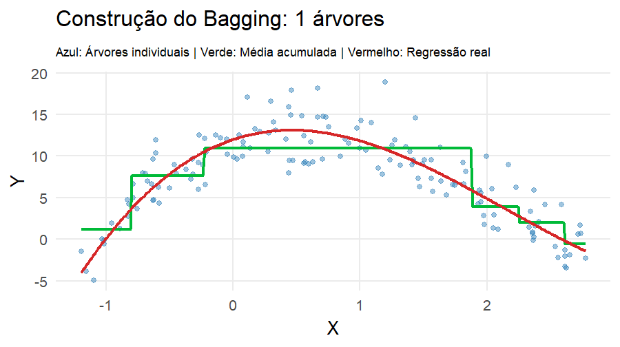
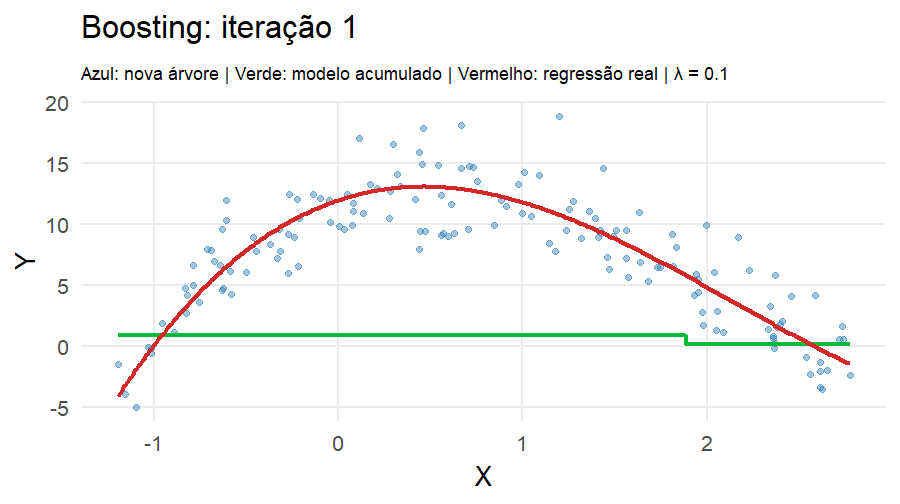

```{r}
#| include: false
library(ggplot2)
library(dplyr)
library(tidyr)
library(patchwork)
```

# Árvores de regressão

## Uma estratégia diferente

Até agora, modelamos $g(\mathbf{x})$ como uma função suave:

-   splines\
-   kernels\
-   regressão local

Agora adotamos uma abordagem diferente:

> modelar $g(\mathbf{x})$ por partições do espaço das covariáveis.


## Ideia central

Uma árvore de regressão divide o espaço de entrada em regiões:

$$
\mathcal{R}_1, \mathcal{R}_2, \ldots, \mathcal{R}_M
$$

e define:

$$
\hat{g}(\mathbf{x}) = \sum_{m=1}^M c_m \mathbf{I}(\mathbf{x} \in \mathcal{R}_m)
$$

Para cada região $\mathcal{R}_m$, usamos:

$$
c_m = \frac{1}{|\mathcal{R}_m|} \sum_{i:x_i \in \mathcal{R}_m} y_i
$$


---

{fig-align="center"}


## Problema de estimação

Queremos encontrar a melhor partição:

$$
\{\mathcal{R}_1, \ldots, \mathcal{R}_M\}
$$

------------------------------------------------------------------------

### Critério de qualidade

A qualidade da árvore é medida por:

$$
\mathcal{P}(T) =
\sum_{m=1}^M \sum_{i:x_i \in \mathcal{R}_m}
(y_i - c_m)^2
$$ <br>

### Interpretação do critério

-   mede a variabilidade dentro das regiões\
-   regiões boas → valores de $y$ homogêneos\
-   objetivo → minimizar a variância intra-região

------------------------------------------------------------------------

### Dificuldade do problema

Minimizar $\mathcal{P}(T)$ globalmente é:

-   computacionalmente inviável\
-   envolve todas as possíveis partições

<br>

### Solução prática

Utilizamos uma abordagem gulosa:

-   escolhemos a melhor divisão local\
-   repetimos recursivamente

------------------------------------------------------------------------

### Divisão em um nó

Para cada variável $X_j$ e ponto $s$:

$$
\mathcal{R}_1 = \{x: x_j \leq s\}, \quad
\mathcal{R}_2 = \{x: x_j > s\}
$$

<br>

### Melhor divisão

Escolhemos $(j,s)$ que minimiza:

$$
\sum_{i \in \mathcal{R}_1} (y_i - c_{m_1})^2 +
\sum_{i \in \mathcal{R}_2} (y_i - c_{m_2})^2
$$

------------------------------------------------------------------------

### Construção completa

1.  Começa com todos os dados\
2.  Escolhe melhor split\
3.  Divide\
4.  Repete

<br>

### Overfitting

A árvore completa tende a:

-   ajustar demais os dados\
-   ter alta variância

------------------------------------------------------------------------

### Poda (pruning)

Árvores completas tendem a sobreajustar os dados.

A poda consiste em escolher uma subárvore que minimize:

$$
\sum_{m=1}^{|T|} \sum_{i:x_i \in \mathcal{R}_m} (y_i - c_m)^2 + \alpha |T|
$$

-   $|T|$ = número de folhas (complexidade da árvore)\
-   $\alpha$ controla o trade-off entre ajuste e simplicidade

Valores grandes de $\alpha$ produzem árvores menores e mais estáveis.

------------------------------------------------------------------------

```{r}
library(ggplot2)
library(rpart)

set.seed(123)

# -----------------------------
# Função de regressão real
# -----------------------------
f_real <- function(x, beta = c(12, 4, -6, 1)) {
  beta[1] + beta[2] * x + beta[3] * x^2 + beta[4] * x^3 + sin(x)
}

# -----------------------------
# Dados simulados
# -----------------------------
n <- 150
x <- sort(runif(n, -1.5, 3))

f_true <- f_real(x)
y <- f_true + rnorm(n, sd = 4.0)

df <- data.frame(x = x, y = y, f_true = f_true)

# -----------------------------
# Árvore de regressão
# -----------------------------
fit_tree <- rpart(
  y ~ x,
  data = df,
  method = "anova",
  control = rpart.control(cp = 0.002, minsplit = 10, maxdepth = 3)
)

# -----------------------------
# Grade para predição
# -----------------------------
xg <- seq(min(x), max(x), length.out = 1000)

pred_df <- data.frame(x = xg)
pred_df$y_hat <- predict(fit_tree, newdata = pred_df)
pred_df$f_true <- f_real(xg)

# -----------------------------
# Gráfico
# -----------------------------
ggplot(df, aes(x, y)) +
  geom_point(color = "#2C7FB8", alpha = 0.55, size = 2) +
  geom_line(
    data = pred_df,
    aes(x, f_true),
    color = "#D62728",
    linewidth = 1.3
  ) +
  geom_step(
    data = pred_df,
    aes(x, y_hat),
    color = "#00BA38",
    linewidth = 1.3
  ) +
  theme_minimal(base_size = 16) +
  labs(
    title = "Árvore de regressão",
    subtitle = "Pontos: dados observados | Linha vermelha: regressão real | Degraus: árvore ajustada",
    x = "X",
    y = "Y"
  ) +
  theme(
    panel.grid.minor = element_blank(),
    axis.title = element_text(size = 14),
    axis.text = element_text(size = 11)
  )
```

------------------------------------------------------------------------

### Interpretação da árvore de regressão

A linha tracejada representa a função verdadeira que gerou os dados.

A curva em degraus representa a árvore ajustada, que aproxima a função de regressão por regiões nas quais a predição é constante.

Isso evidencia que árvores de regressão constroem estimadores do tipo **piecewise** constante.

------------------------------------------------------------------------

### Vantagens das Árvores de Regressão

Além de serem facilmente interpretáveis, árvores apresentam propriedades importantes:

<br>

#### Variáveis categóricas

Árvores lidam naturalmente com variáveis discretas:

$$
X_1 \in \{\text{verde}, \text{vermelho}\}
$$

-   não é necessário criar variáveis dummy
-   as divisões são feitas diretamente nas categorias

------------------------------------------------------------------------

#### Seleção automática de variáveis

-   variáveis irrelevantes tendem a não ser utilizadas\
-   o modelo realiza seleção de variáveis de forma implícita

<br>

#### Interações entre variáveis

-   árvores capturam interações automaticamente\
-   não é necessário especificar termos de interação

------------------------------------------------------------------------

### Limitação importante

Apesar dessas vantagens:

-   árvores individuais têm alta variância\
-   pequenas mudanças nos dados podem gerar árvores muito diferentes

Para melhorar o desempenho preditivo:

> combinamos várias árvores em um único modelo

## Por que combinar árvores?

Considere dois estimadores $g_1(\mathbf{x})$ e $g_2(\mathbf{x})$.

Definimos o estimador combinado:

$$
g(\mathbf{x}) = \frac{g_1(\mathbf{x}) + g_2(\mathbf{x})}{2}
$$

O erro esperado é:

$$
\mathbb{E}\big[(\boldsymbol{y} - g(\mathbf{x}))^2 \mid \mathbf{x}\big]
=
\mathbb{V}(\boldsymbol{y} \mid \mathbf{x})
+ \frac{1}{4}\mathbb{V}(g_1(\mathbf{x}) + g_2(\mathbf{x}))
+ \text{bias}^2
$$

------------------------------------------------------------------------

Se $g_1(\mathbf{x})$ e $g_2(\mathbf{x})$ são:

-   não viesados\
-   com mesma variância\
-   não correlacionados

então:

$$
\mathbb{E}\big[(\boldsymbol{y} - g(\mathbf{x}))^2 \mid \mathbf{x}\big]
=
\mathbb{V}(\boldsymbol{y} \mid \mathbf{x})
+ \frac{1}{2}\mathbb{V}(g_i(\mathbf{x}))
$$

#### Conclusão

$$
\mathbb{E}\big[(\boldsymbol{y} - g(\mathbf{x}))^2 \mid \mathbf{x}x\big]
\le
\mathbb{E}\big[(\boldsymbol{y} - g_i(\mathbf{x}))^2 \mid \mathbf{x}\big]
$$

------------------------------------------------------------------------

Assim, combinar modelos:

-   mantém o viés\
-   reduz a variância

<br>

#### Ideia central do Bagging

> Média de vários modelos instáveis → modelo mais estável

## Bagging (Bootstrap Aggregating)

A ideia central é combinar vários estimadores:

$$
g(\mathbf{x}) = \frac{1}{B} \sum_{b=1}^B g_b(\mathbf{x})
$$

onde $g_b(\mathbf{x})$ é a predição da $b$-ésima árvore.

Para cada $b = 1, \ldots, B$:

-   amostramos com reposição (bootstrap)\
-   ajustamos uma árvore aos dados


---

{fig-align="center"}

------------------------------------------------------------------------

### Propriedade fundamental

Se os estimadores são aproximadamente não viesados:

-   o viés permanece semelhante\
-   a variância é reduzida

Assim,

$$
\mathbb{E}[(\boldsymbol{y} - g(\mathbf{x}))^2 \mid \mathbf{x}]
\le
\mathbb{E}[(\boldsymbol{y} - g_b(\mathbf{x}))^2 \mid \mathbf{x}]
$$

------------------------------------------------------------------------

### Importância de Variáveis em Árvores

Bagging permite medir a relevância de cada variável:

-   baseada na redução do erro (RSS)\
-   cada divisão reduz a variabilidade

A qualidade de uma divisão é medida pela redução do erro quadrático (RSS).

Considere um nó pai dividido em dois nós:

-   esquerda ($\mathcal{R}_{esq}$)\
-   direita ($\mathcal{R}_{dir}$)

------------------------------------------------------------------------

### Redução do erro

A redução no RSS é dada por:

$$
\text{RSS}_{pai}
-
\text{RSS}_{esq}
-
\text{RSS}_{dir}
$$

Ou, explicitamente:

$$
\sum_{i \in \mathcal{R}_{pai}} (y_i - \bar{y}_{pai})^2
-
\sum_{i \in \mathcal{R}_{esq}} (y_i - \bar{y}_{esq})^2
-
\sum_{i \in \mathcal{R}_{dir}} (y_i - \bar{y}_{dir})^2
$$

------------------------------------------------------------------------

### Interpretação

-   quanto maior a redução → melhor a divisão\
-   boas variáveis geram partições mais homogêneas

> Variáveis importantes são aquelas que mais reduzem a variabilidade da resposta.

---


```{r}
#| echo: false
#| include: false
#| warning: false
#| message: false

library(ggplot2)
library(rpart)
library(dplyr)
library(tidyr)
library(gganimate)
library(gifski)

set.seed(123)

# -----------------------------
# Função real
# -----------------------------
f_real <- function(x, beta = c(12, 4, -6, 1)) {
  beta[1] + beta[2] * x + beta[3] * x^2 + beta[4] * x^3 + sin(x)
}

# -----------------------------
# Dados
# -----------------------------
n <- 150
x <- sort(runif(n, -1.2, 2.8))
y <- f_real(x) + rnorm(n, sd = 2.5)

df <- data.frame(x, y)

# -----------------------------
# Grid
# -----------------------------
xg <- seq(min(x), max(x), length.out = 300)
grid <- data.frame(x = xg)

df_true <- data.frame(
  x = xg,
  y_true = f_real(xg)
)

# -----------------------------
# Bagging
# -----------------------------
B <- 50
pred_mat <- matrix(NA_real_, nrow = length(xg), ncol = B)

for (b in 1:B) {
  idx <- sample(1:n, n, replace = TRUE)
  df_boot <- df[idx, ]
  
  fit <- rpart(
    y ~ x,
    data = df_boot,
    method = "anova",
    control = rpart.control(
      maxdepth = 3,
      cp = 0.001
    )
  )
  
  pred_mat[, b] <- predict(fit, newdata = grid)
}

# -----------------------------
# Árvores em formato longo
# -----------------------------
df_trees_long <- data.frame(
  x = rep(xg, B),
  y_hat = as.vector(pred_mat),
  tree_id = rep(1:B, each = length(xg))
)

# para cada frame b, mostrar apenas árvores 1,...,b
df_trees_anim <- bind_rows(
  lapply(1:B, function(b) {
    df_trees_long |>
      filter(tree_id <= b) |>
      mutate(frame_id = b)
  })
)

# -----------------------------
# Média acumulada
# -----------------------------
cumavg_mat <- sapply(1:B, function(b) {
  rowMeans(pred_mat[, 1:b, drop = FALSE])
})

df_avg_long <- data.frame(
  x = rep(xg, B),
  y_avg = as.vector(cumavg_mat),
  frame_id = rep(1:B, each = length(xg))
)

# -----------------------------
# Dados observados e função real por frame
# -----------------------------
df_points <- bind_rows(
  lapply(1:B, function(b) {
    data.frame(
      x = df$x,
      y = df$y,
      frame_id = b
    )
  })
)

df_true_anim <- bind_rows(
  lapply(1:B, function(b) {
    data.frame(
      x = df_true$x,
      y_true = df_true$y_true,
      frame_id = b
    )
  })
)

# -----------------------------
# Gráfico animado
# -----------------------------
anim_plot <- ggplot() +
  geom_point(
    data = df_points,
    aes(x, y),
    color = "#2C7FB8",
    alpha = 0.45,
    size = 1.8
  ) +
  geom_line(
    data = df_trees_anim,
    aes(x, y_hat, group = tree_id),
    color = "#619CFF",
    alpha = 0.12,
    linewidth = 1.0
  ) +
  geom_line(
    data = df_avg_long,
    aes(x, y_avg),
    color = "#00BA38",
    linewidth = 1.3
  ) +
  geom_line(
    data = df_true_anim,
    aes(x, y_true),
    color = "#D62728",
    linewidth = 1.3
  ) +
  labs(
    title = "Construção do Bagging: {current_frame} árvores",
    subtitle = "Azul: Árvores individuais | Verde: Média acumulada | Vermelho: Regressão real",
    x = "X",
    y = "Y"
  ) +
  theme_minimal(base_size = 16) +
  theme(
    panel.grid.minor = element_blank(),
    plot.title = element_text(face = "bold"),
    plot.subtitle = element_text(size = 11)
  ) +
  transition_manual(frame_id)

# -----------------------------
# Salvar GIF
# -----------------------------

anim = animate(
    anim_plot,
    nframes = B,
    fps = 2,
    width = 7.5,
    height = 4.2,
    units = "in",
    res = 120,
    renderer = gifski_renderer("bagging_animado.gif")
  )


# -----------------------------
# PNG estático para PDF
# -----------------------------
frame_pdf <- 45

plot_pdf2 <- ggplot() +
  geom_point(
    data = subset(df_points, frame_id == frame_pdf),
    aes(x, y),
    color = "#2C7FB8",
    alpha = 0.45,
    size = 1.8
  ) +
  geom_line(
    data = subset(df_trees_anim, frame_id == frame_pdf),
    aes(x, y_hat, group = tree_id),
    color = "#619CFF",
    alpha = 0.12,
    linewidth = 1.0
  ) +
  geom_line(
    data = subset(df_avg_long, frame_id == frame_pdf),
    aes(x, y_avg),
    color = "#00BA38",
    linewidth = 1.3
  ) +
  geom_line(
    data = subset(df_true_anim, frame_id == frame_pdf),
    aes(x, y_true),
    color = "#D62728",
    linewidth = 1.3
  ) +
  labs(
    title = paste("Construção do Bagging:", frame_pdf, "árvores"),
    subtitle = "Azul: Árvores individuais | Verde: Média acumulada | Vermelho: Regressão real",
    x = "X",
    y = "Y"
  ) +
  theme_minimal(base_size = 16) +
  theme(
    panel.grid.minor = element_blank(),
    plot.title = element_text(face = "bold"),
    plot.subtitle = element_text(size = 11)
  )
```


```{r}
#| echo: false
#| warning: false
#| message: false
#| out-width: "90%"
#| fig-align: "center"
#| results: 'asis'

if (knitr::is_html_output()) {
  
} else if (knitr::is_latex_output()) {
  
  # fecha dispositivos abertos
  while (!is.null(dev.list())) dev.off()
  
  png(
    filename = "bagging_animado.png",
    width = 900,
    height = 500,
    res = 120
  )
  
  print(plot_pdf2)
  
  invisible(dev.off())
  
  knitr::include_graphics("bagging_animado.png")
}
```


## Florestas Aleatórias (Random Forest)

No Bagging, combinamos várias árvores:

$$
g(\mathbf{x}) = \frac{1}{B} \sum_{b=1}^B g_b(\mathbf{x})
$$

Como as amostras *bootstrap* não são *i.i.d*,


- Cada árvore é diferente, mas nasce do mesmo mecanismo, então têm variâncias semelhantes, ou seja, 

$$
\mathrm{Var}(g_b(\mathbf{x})) = \sigma^2
\quad \text{para todo } b
$$

---


- As árvores não são independentes, mas podemos resumir essa dependência por uma correlação média. Assim, a correlação entre quaisquer duas árvores é

$$
\mathrm{Cor}(g_b(\mathbf{x}),g_{b'}(\mathbf{x})) = \rho
\quad (b \neq b')
$$

Logo,

$$
\mathrm{Cov}(g_b(\mathbf{x}),g_{b'}(\mathbf{x})) = \rho \sigma^2
$$


Então,

$$
\mathrm{Var}\!\big(g(\mathbf{x}) \big)
=
\mathrm{Var}\!\left(\frac{1}{B}\sum_{b=1}^{B} g_b(\mathbf{x})\right)
=
\frac{1}{B^2}\mathrm{Var}\!\left(\sum_{b=1}^{B} g_b(\mathbf{x})\right)
$$

---

Expandindo a variância da soma:

$$
\mathrm{Var}\!\left(\sum_{b=1}^{B} g_b(\mathbf{x})\right)
=
\sum_{b=1}^{B}\mathrm{Var}(g_b\big(\mathbf{x})\big)
+
\sum_{b \neq b'}\mathrm{Cov}\big(g_b(\mathbf{x}),g_{b'}(\mathbf{x})\big)
$$


Substituindo as hipóteses:

$$
\sum_{b=1}^{B}\mathrm{Var}\big(g_b(\mathbf{x})\big)=B\sigma^2
$$

e

$$
\sum_{b \neq b'}\mathrm{Cov}\big(g_b(\mathbf{x}),g_{b'}(\mathbf{x})\big)
=
B(B-1)\rho\sigma^2
$$

---

Portanto,

$$
\mathrm{Var}\!\left(\sum_{b=1}^{B} g_b(\mathbf{x})\right)
=
B\sigma^2 + B(B-1)\rho\sigma^2
$$

e, assim,

$$
\mathrm{Var}\!\left(g(\mathbf{x})\right)
=
\frac{1}{B^2}
\left[
B\sigma^2 + B(B-1)\rho\sigma^2
\right]
$$

---

Simplificando,

$$
\mathrm{Var}\!\big(g(\mathbf{x})\big)
=
\frac{\sigma^2}{B}
+
\frac{B-1}{B}\rho\sigma^2
$$

ou, equivalentemente,

$$
\boxed{
\mathrm{Var}\!\big(g(\mathbf{x})\big)
=
\rho\sigma^2 + \frac{1-\rho}{B}\sigma^2
}
$$


Note que,

- $\rho\sigma^2$ é a parte da variância que **não desaparece** com o aumento de $B$
- $\dfrac{1-\rho}{B}\sigma^2$ é a parte que **cai com o número de árvores**

---

### Consequência importante

- se $\rho$ é pequeno, o bagging reduz bastante a variância
- se $\rho$ é grande, o ganho é limitado


Além disso, 

-   mesmas variáveis dominantes\
-   divisões semelhantes\
-   predições parecidas

------------------------------------------------------------------------

### Problema

A redução de variância depende da correlação:

> árvores muito parecidas → pouco ganho ao combinar

<br>

### Ideia do Random Forest

Introduzir aleatoriedade adicional:

> em cada nó, escolhemos um subconjunto aleatório de variáveis

------------------------------------------------------------------------

### Construção


Para cada árvore:

- amostra bootstrap dos dados
- em cada divisão:
  - seleciona-se aleatoriamente $m$ variáveis
  - escolhe-se o melhor *split* entre elas

### Parâmetro chave

:::: {.columns}

::: {.column width="60%"}

$m$ = número de variáveis candidatas por *split*

- $m = d \rightarrow$ Bagging
- $m < d \rightarrow$ Random Forest

:::

::: {.column width="40%"}

\vspace{2.5cm}


$$
m \approx \frac{d}{3}
$$

:::

::::


---

{fig-align="center"}

---

```{r}
library(ggplot2)
library(rpart)
library(patchwork)

set.seed(123)

# -----------------------------
# Função de regressão real
# -----------------------------
f_real <- function(x, beta = c(12, 4, -6, 1)) {
  beta[1] + beta[2] * x + beta[3] * x^2 + beta[4] * x^3 + sin(x)
}

# -----------------------------
# Dados simulados
# -----------------------------
n <- 150
x <- sort(runif(n, -1.5, 3))

f_true <- f_real(x)
y <- f_true + rnorm(n, sd = 4.0)

df <- data.frame(x, y)

# grade
xg <- seq(min(x), max(x), length.out = 500)
grid <- data.frame(x = xg)

# função verdadeira na grade
df_true <- data.frame(
  x = xg,
  f_true = f_real(xg)
)

# -----------------------------
# (a) Árvore única
# -----------------------------
fit_tree <- rpart(
  y ~ x,
  data = df,
  method = "anova",
  control = rpart.control(maxdepth = 3, cp = 0.002, minsplit = 10)
)

pred_tree <- predict(fit_tree, newdata = grid)

df_tree <- data.frame(
  x = xg,
  y_hat = pred_tree,
  f_true = f_real(xg)
)

# -----------------------------
# (b) Agregação de árvores bootstrap
# -----------------------------
B <- 50
pred_mat <- matrix(NA_real_, nrow = length(xg), ncol = B)

for (b in 1:B) {
  idx <- sample(1:n, n, replace = TRUE)
  df_boot <- df[idx, ]

  fit_b <- rpart(
    y ~ x,
    data = df_boot,
    method = "anova",
    control = rpart.control(maxdepth = 3, cp = 0.002, minsplit = 10)
  )

  pred_mat[, b] <- predict(fit_b, newdata = grid)
}

# média das árvores
pred_bag <- rowMeans(pred_mat)

# dados longos para plot
df_bag_lines <- data.frame(
  x = rep(xg, B),
  y = as.vector(pred_mat),
  tree = factor(rep(1:B, each = length(xg)))
)

df_bag_mean <- data.frame(
  x = xg,
  y_hat = pred_bag,
  f_true = f_real(xg)
)

# -----------------------------
# Gráfico (a): árvore única
# -----------------------------
p1 <- ggplot(df, aes(x, y)) +
  geom_point(color = "#2C7FB8", alpha = 0.5, size = 1.8) +
  geom_step(
    data = df_tree,
    aes(x, y_hat),
    color = "#00BA38",
    linewidth = 1.2
  ) +
  geom_line(
    data = df_tree,
    aes(x, f_true),
    color = "#D62728",
    linewidth = 1.2
  ) +
  theme_minimal(base_size = 14) +
  labs(
    title = "a) Árvore de regressão",
    x = "X",
    y = "Y"
  ) +
  theme(
    panel.grid.minor = element_blank()
  )

# -----------------------------
# Gráfico (b): bagging / floresta
# -----------------------------
p2 <- ggplot(df, aes(x, y)) +
  geom_point(color = "#2C7FB8", alpha = 0.5, size = 1.8) +
  geom_line(
    data = df_bag_lines,
    aes(x, y, group = tree),
    color = "#619CFF",
    alpha = 0.12,
    linewidth = 0.7
  ) +
  geom_line(
    data = df_bag_mean,
    aes(x, y_hat),
    color = "#00BA38",
    linewidth = 1.3
  ) +
  geom_line(
    data = df_bag_mean,
    aes(x, f_true),
    color = "#D62728",
    linewidth = 1.2
  ) +
  theme_minimal(base_size = 14) +
  labs(
    title = "b) Random Forest",
    x = "X",
    y = "Y"
  ) +
  theme(
    panel.grid.minor = element_blank()
  )

# -----------------------------
# Plot lado a lado
# -----------------------------
p1 + p2
```


---


```{r}
library(ggplot2)
library(rpart)
library(dplyr)
library(tidyr)
library(gganimate)
library(gifski)

set.seed(123)

# -----------------------------
# Função de regressão real
# -----------------------------
f_real <- function(x, beta = c(12, 4, -6, 1)) {
  beta[1] + beta[2] * x + beta[3] * x^2 + beta[4] * x^3 + sin(x)
}

# -----------------------------
# Dados simulados
# -----------------------------
n <- 150
x <- sort(runif(n, -1.5, 3))

f_true <- f_real(x)
y <- f_true + rnorm(n, sd = 4.0)

df <- data.frame(x = x, y = y)

# -----------------------------
# Grade para previsão
# -----------------------------
xg <- seq(min(x), max(x), length.out = 300)
grid <- data.frame(x = xg)

# função verdadeira na grade
df_true <- data.frame(
  x = xg,
  y_true = f_real(xg)
)

# -----------------------------
# Gerar várias árvores bootstrap
# -----------------------------
B <- 100
pred_mat <- matrix(NA_real_, nrow = length(xg), ncol = B)

for (b in 1:B) {
  idx <- sample(1:n, n, replace = TRUE)
  df_boot <- df[idx, ]

  fit <- rpart(
    y ~ x,
    data = df_boot,
    method = "anova",
    control = rpart.control(maxdepth = 3, cp = 0.002, minsplit = 10)
  )

  pred_mat[, b] <- predict(fit, newdata = grid)
}

# -----------------------------
# Árvores individuais em formato longo
# -----------------------------
df_trees <- as.data.frame(pred_mat)
names(df_trees) <- paste0("tree_", 1:B)
df_trees$x <- xg

df_trees_long <- df_trees |>
  pivot_longer(
    cols = starts_with("tree_"),
    names_to = "tree",
    values_to = "y_hat"
  ) |>
  mutate(tree_id = as.integer(gsub("tree_", "", tree)))

# -----------------------------
# Média acumulada das árvores
# -----------------------------
cumavg_mat <- sapply(1:B, function(b) {
  rowMeans(pred_mat[, 1:b, drop = FALSE])
})

df_avg <- as.data.frame(cumavg_mat)
names(df_avg) <- paste0("avg_", 1:B)
df_avg$x <- xg

df_avg_long <- df_avg |>
  pivot_longer(
    cols = starts_with("avg_"),
    names_to = "avg",
    values_to = "y_avg"
  ) |>
  mutate(
    tree_id = as.integer(gsub("avg_", "", avg)),
    frame_id = tree_id
  )

# -----------------------------
# Replicar dados observados para cada frame
# -----------------------------
df_points <- bind_rows(
  lapply(1:B, function(b) {
    data.frame(
      x = df$x,
      y = df$y,
      frame_id = b
    )
  })
)

# -----------------------------
# Replicar função verdadeira para cada frame
# -----------------------------
df_true_anim <- bind_rows(
  lapply(1:B, function(b) {
    data.frame(
      x = df_true$x,
      y_true = df_true$y_true,
      frame_id = b
    )
  })
)

# -----------------------------
# Se quiser reativar as árvores individuais,
# basta usar este objeto:
# -----------------------------
df_trees_anim <- bind_rows(
  lapply(1:B, function(b) {
    subset(df_trees_long, tree_id <= b) |>
      mutate(frame_id = b)
  })
)

df_avg_anim <- df_avg_long |>
  transmute(
    x = x,
    y_avg = y_avg,
    frame_id = frame_id
  )

# -----------------------------
# Gráfico animado
# -----------------------------
anim_plot <- ggplot() +
  geom_point(
    data = df_points,
    aes(x, y),
    color = "#2C7FB8",
    alpha = 0.45,
    size = 1.8
  ) +
  # Para mostrar também as árvores individuais, descomente:
  geom_line(
    data = df_trees_anim,
    aes(x, y_hat, group = tree),
    color = "#1468f5",
    alpha = 0.08,
    linewidth = 0.8
  ) +
  geom_line(
    data = df_avg_anim,
    aes(x, y_avg),
    color = "#00BA38",
    linewidth = 1.3
  ) +
  geom_line(
    data = df_true_anim,
    aes(x, y_true),
    color = "#D62728",
    linewidth = 1.3
  ) +
  labs(
    title = "Construção do Random Forest: {current_frame} árvores",
    subtitle = "Azul: árvores individuais | Verde: média acumulada | Vermelho: regressão real",
    x = "X",
    y = "Y"
  ) +
  theme_minimal(base_size = 16) +
  theme(
    panel.grid.minor = element_blank(),
    plot.title = element_text(face = "bold"),
    plot.subtitle = element_text(size = 11)
  ) +
  transition_manual(frame_id)

# -----------------------------
# Renderizar e salvar gif
# -----------------------------
anim2 = animate(
  anim_plot,
  nframes = B,
  fps = 3,
  width = 7.5,
  height = 4.2,
  units = "in",
  res = 120,
  renderer = gifski_renderer("rf_animado.gif")
)

# -----------------------------
# PNG estático para PDF
# -----------------------------
frame_pdf <- 45

plot_pdf22 <- ggplot() +
  geom_point(
    data = subset(df_points, frame_id == frame_pdf),
    aes(x, y),
    color = "#2C7FB8",
    alpha = 0.45,
    size = 1.8
  ) +
  geom_line(
    data = subset(df_trees_anim, frame_id == frame_pdf),
    aes(x, y_hat, group = tree_id),
    color = "#619CFF",
    alpha = 0.12,
    linewidth = 1.0
  ) +
  geom_line(
    data = subset(df_avg_long, frame_id == frame_pdf),
    aes(x, y_avg),
    color = "#00BA38",
    linewidth = 1.3
  ) +
  geom_line(
    data = subset(df_true_anim, frame_id == frame_pdf),
    aes(x, y_true),
    color = "#D62728",
    linewidth = 1.3
  ) +
  labs(
    title = paste("Construção do Random Forest:", frame_pdf, "árvores"),
    subtitle = "Azul: Árvores individuais | Verde: Média acumulada | Vermelho: Regressão real",
    x = "X",
    y = "Y"
  ) +
  theme_minimal(base_size = 16) +
  theme(
    panel.grid.minor = element_blank(),
    plot.title = element_text(face = "bold"),
    plot.subtitle = element_text(size = 11)
  )
```


```{r}
#| echo: false
#| warning: false
#| message: false
#| out-width: "90%"
#| fig-align: "center"
#| results: 'asis'

if (knitr::is_html_output()) {
  knitr::include_graphics("rf_animado.gif")
} else if (knitr::is_latex_output()) {
  
  # fecha dispositivos abertos
  while (!is.null(dev.list())) dev.off()
  
  png(
    filename = "rf_animado.png",
    width = 900,
    height = 500,
    res = 120
  )
  
  print(plot_pdf22)
  
  invisible(dev.off())
  
  knitr::include_graphics("rf_animado.png")
}
```


---

## Boosting

O *boosting* constrói o estimador de forma **sequencial**, corrigindo erros do modelo anterior.

<br>

### Ideia central

Começamos com um modelo simples e vamos **ajustando os resíduos**:

$$
r_i = y_i - g(x_i)
$$

---

### Algoritmo

1. Inicialize:

$$
g(\mathbf{x}) = 0
$$

2. Para $b = 1, \dots, B$:

- Ajuste um modelo simples (ex: árvore rasa) aos resíduos:

$$
r_i = y_i - g(x_i)
$$

- Atualize:

$$
g(\mathbf{x}) \leftarrow g(\mathbf{x}) + \lambda g^{(b)}(\mathbf{x})
$$

---

### Parâmetros importantes

- $B$ → número de iterações ($B \approx 1000$)
- $\lambda$ → *learning rate*, tipicamente pequeno ($\lambda \approx 0,01$)
    - $\lambda$ grande → aprendizado rápido → risco de overfitting
    - $\lambda$ pequeno → aprendizado lento → mais estável
- $p$ → complexidade da árvore  ($p = 2$ ou $p = 4$)


<br>

### Observação

- cada modelo aprende **o que o anterior errou**
- reduz **viés** (diferente do bagging)


## {background-image="/images/regressao/boosting.png" background-size="contain" background-position="center" background-repeat="no-repeat"}


<!-- {fig-align="center"} -->

---

```{r}
library(ggplot2)
library(rpart)
library(dplyr)

set.seed(123)

# -----------------------------
# Função de regressão real
# -----------------------------
f_real <- function(x, beta = c(12, 4, -6, 1)) {
  beta[1] + beta[2] * x + beta[3] * x^2 + beta[4] * x^3 + sin(x)
}

# -----------------------------
# Dados simulados
# -----------------------------
n <- 150
x <- sort(runif(n, -1.2, 2.8))

f_true <- f_real(x)
y <- f_true + rnorm(n, sd = 2.5)

df <- data.frame(x = x, y = y)

# -----------------------------
# Função para boosting com stumps
# -----------------------------
boost_stumps <- function(x, y, x_grid, B = 100, lambda = 0.1,
                         minsplit = 10) {

  g_train <- rep(0, length(x))
  g_grid  <- rep(0, length(x_grid))

  for (b in 1:B) {
    r <- y - g_train

    fit_b <- rpart(
      r ~ x,
      data = data.frame(x = x, r = r),
      method = "anova",
      control = rpart.control(
        maxdepth = 1,
        cp = 0,
        minsplit = minsplit
      )
    )

    pred_train_b <- predict(fit_b, newdata = data.frame(x = x))
    pred_grid_b  <- predict(fit_b, newdata = data.frame(x = x_grid))

    g_train <- g_train + lambda * pred_train_b
    g_grid  <- g_grid  + lambda * pred_grid_b
  }

  g_grid
}

# -----------------------------
# Grade para predição
# -----------------------------
xg <- seq(min(x), max(x), length.out = 500)

# -----------------------------
# Valores de lambda
# -----------------------------
lambda_vals <- c(0.001, 0.01, 0.1, 0.2, 0.5, 1)

# -----------------------------
# Ajustes para cada lambda
# -----------------------------
pred_list <- lapply(lambda_vals, function(lam) {
  data.frame(
    x = xg,
    y_hat = boost_stumps(x, y, xg, B = 100, lambda = lam),
    lambda = paste0("lambda = ", lam)
  )
})

pred_df <- bind_rows(pred_list)

pred_df$lambda <- factor(
  pred_df$lambda,
  levels = paste0("lambda = ", lambda_vals)
)

# replicar pontos em todos os painéis
points_df <- bind_rows(
  lapply(lambda_vals, function(lam) {
    data.frame(
      x = x,
      y = y,
      lambda = paste0("lambda = ", lam)
    )
  })
)

points_df$lambda <- factor(
  points_df$lambda,
  levels = paste0("lambda = ", lambda_vals)
)

# -----------------------------
# Gráfico
# -----------------------------
ggplot() +
  geom_point(
    data = points_df,
    aes(x, y),
    color = "#2C7FB8",
    alpha = 0.75,
    size = 1.5
  ) +
  geom_step(
    data = pred_df,
    aes(x, y_hat),
    color = "#D62728",
    linewidth = 1
  ) +
  facet_wrap(~lambda, ncol = 3) +
  theme_minimal(base_size = 13) +
  labs(
    x = "X",
    y = "Y"
  ) +
  theme(
    strip.text = element_text(face = "bold"),
    panel.grid.minor = element_blank(),
    legend.position = "none"
  )
```


---

```{r}
library(ggplot2)
library(rpart)
library(dplyr)
library(tidyr)
library(gganimate)
library(gifski)

set.seed(123)

# -------------------------------------------------
# Função de regressão real
# -------------------------------------------------
f_real <- function(x, beta = c(12, 4, -6, 1)) {
  beta[1] + beta[2] * x + beta[3] * x^2 + beta[4] * x^3 + sin(x)
}

# -------------------------------------------------
# Dados simulados
# -------------------------------------------------
n <- 150
x <- sort(runif(n, -1.2, 2.8))

f_true <- f_real(x)
y <- f_true + rnorm(n, sd = 2.5)

df <- data.frame(x = x, y = y)

# -------------------------------------------------
# Grade para previsão
# -------------------------------------------------
xg <- seq(min(x), max(x), length.out = 400)
grid <- data.frame(x = xg)

df_true <- data.frame(
  x = xg,
  y_true = f_real(xg)
)

# -------------------------------------------------
# Boosting com árvores rasas (stumps)
# -------------------------------------------------
B <- 100              # número de iterações
lambda <- 0.1        # learning rate

# matriz para guardar o modelo acumulado em cada passo
pred_cum_mat <- matrix(0, nrow = length(xg), ncol = B)

# para guardar a árvore nova em cada iteração
pred_new_mat <- matrix(0, nrow = length(xg), ncol = B)

# inicialização
g_train <- rep(0, n)
g_grid  <- rep(0, length(xg))

for (b in 1:B) {

  # resíduos atuais
  r <- y - g_train

  # stump: árvore com uma divisão
  fit_b <- rpart(
    r ~ x,
    data = data.frame(x = x, r = r),
    method = "anova",
    control = rpart.control(maxdepth = 1, cp = 0, minsplit = 10)
  )

  # predição da nova árvore
  pred_train_b <- predict(fit_b, newdata = data.frame(x = x))
  pred_grid_b  <- predict(fit_b, newdata = grid)

  # atualizar modelo acumulado
  g_train <- g_train + lambda * pred_train_b
  g_grid  <- g_grid  + lambda * pred_grid_b

  # guardar
  pred_new_mat[, b] <- lambda * pred_grid_b
  pred_cum_mat[, b] <- g_grid
}

# -------------------------------------------------
# Formato longo: modelo acumulado
# -------------------------------------------------
df_cum <- as.data.frame(pred_cum_mat)
names(df_cum) <- paste0("iter_", 1:B)
df_cum$x <- xg

df_cum_long <- df_cum |>
  pivot_longer(
    cols = starts_with("iter_"),
    names_to = "iter",
    values_to = "y_hat"
  ) |>
  mutate(
    iter_id = as.integer(gsub("iter_", "", iter)),
    frame_id = iter_id
  )

# -------------------------------------------------
# Formato longo: nova árvore adicionada
# -------------------------------------------------
df_new <- as.data.frame(pred_new_mat)
names(df_new) <- paste0("tree_", 1:B)
df_new$x <- xg

df_new_long <- df_new |>
  pivot_longer(
    cols = starts_with("tree_"),
    names_to = "tree",
    values_to = "y_new"
  ) |>
  mutate(
    tree_id = as.integer(gsub("tree_", "", tree)),
    frame_id = tree_id
  )

# -------------------------------------------------
# Dados observados e função verdadeira por frame
# -------------------------------------------------
df_points <- bind_rows(
  lapply(1:B, function(b) {
    data.frame(
      x = df$x,
      y = df$y,
      frame_id = b
    )
  })
)

df_true_anim <- bind_rows(
  lapply(1:B, function(b) {
    data.frame(
      x = df_true$x,
      y_true = df_true$y_true,
      frame_id = b
    )
  })
)

# -------------------------------------------------
# Gráfico animado
# -------------------------------------------------
anim_plot_boost <- ggplot() +
  geom_point(
    data = df_points,
    aes(x, y),
    color = "#2C7FB8",
    alpha = 0.45,
    size = 1.6
  ) +
  geom_step(
    data = df_new_long,
    aes(x, y_new),
    color = "#1F78B4",
    linewidth = 0.9
  ) +
  geom_line(
    data = df_cum_long,
    aes(x, y_hat),
    color = "#00BA38",
    linewidth = 1.3
  ) +
  geom_line(
    data = df_true_anim,
    aes(x, y_true),
    color = "#D62728",
    linewidth = 1.3
  ) +
  labs(
    title = "Boosting: iteração {current_frame}",
    subtitle = paste0(
      "Azul: nova árvore | Verde: modelo acumulado | Vermelho: regressão real | λ = ",
      lambda
    ),
    x = "X",
    y = "Y"
  ) +
  theme_minimal(base_size = 16) +
  theme(
    panel.grid.minor = element_blank(),
    plot.title = element_text(face = "bold"),
    plot.subtitle = element_text(size = 11)
  ) +
  transition_manual(frame_id)

# -------------------------------------------------
# Renderizar e salvar gif
# -------------------------------------------------
anim3=animate(
  anim_plot_boost,
  nframes = B,
  fps = 2,
  width = 7.5,
  height = 4.2,
  units = "in",
  res = 120,
  renderer = gifski_renderer("boosting_animado.gif")
)

# -----------------------------
# PNG estático para PDF
# -----------------------------
frame_pdf <- 100

plot_pdf4 <- ggplot() +
  geom_point(
    data = subset(df_points, frame_id == frame_pdf),
    aes(x, y),
    color = "#2C7FB8",
    alpha = 0.45,
    size = 1.6
  ) +
  geom_step(
    data = subset(df_new_long, frame_id == frame_pdf),
    aes(x, y_new),
    color = "#1F78B4",
    linewidth = 0.9
  ) +
  geom_line(
    data = subset(df_cum_long, frame_id == frame_pdf),
    aes(x, y_hat),
    color = "#00BA38",
    linewidth = 1.3
  ) +
  geom_line(
    data = subset(df_true_anim, frame_id == frame_pdf),
    aes(x, y_true),
    color = "#D62728",
    linewidth = 1.3
  ) +
  labs(
    title = paste("Boosting: iteração", frame_pdf),
    subtitle = paste0(
      "Azul: nova árvore | Verde: modelo acumulado | Vermelho: regressão real | λ = ",
      lambda
    ),
    x = "X",
    y = "Y"
  ) +
  theme_minimal(base_size = 16) +
  theme(
    panel.grid.minor = element_blank(),
    plot.title = element_text(face = "bold")
  )
```


```{r}
#| echo: false
#| warning: false
#| message: false
#| out-width: "90%"
#| fig-align: "center"
#| results: 'asis'

if (knitr::is_html_output()) {
  
} else if (knitr::is_latex_output()) {
  
  # fecha dispositivos abertos
  while (!is.null(dev.list())) dev.off()
  
  png(
    filename = "boosting_animado.png",
    width = 900,
    height = 500,
    res = 120
  )
  
  print(plot_pdf4)
  
  invisible(dev.off())
  
  knitr::include_graphics("boosting_animado.png")
}
```


---


### Boosting e Estimadores Fracos

O *boosting* não é restrito ao uso de árvores.


Podemos usar qualquer modelo como base, desde que seja um **estimador fraco**.


<br>

#### O que é um estimador fraco?

- modelo simples
- baixo poder preditivo individual
- pequeno viés de ajuste

**Exemplos:** árvores rasas (*stumps*), regressão linear simples, modelos com poucos parâmetros

---

### Por que usar modelos fracos?

- evitam overfitting em cada etapa
- permitem correções graduais
- tornam o aprendizado mais estável


Se você usar modelos muito complexos (ex: árvores profundas):

👉 boosting pode superajustar rapidamente


---

```{r}
library(ggplot2)
library(rpart)
library(patchwork)

set.seed(123)

# -----------------------------
# Função de regressão real
# -----------------------------
f_real <- function(x, beta = c(12, 4, -6, 1)) {
  beta[1] + beta[2] * x + beta[3] * x^2 + beta[4] * x^3 + sin(x)
}

# -----------------------------
# Dados simulados
# -----------------------------
n <- 150
x <- sort(runif(n, -1.2, 2.8))

f_true <- f_real(x)
y <- f_true + rnorm(n, sd = 2.5)

df <- data.frame(x = x, y = y)

# -----------------------------
# Grid
# -----------------------------
xg <- seq(min(x), max(x), length.out = 500)

df_true <- data.frame(
  x = xg,
  y_true = f_real(xg)
)

# -----------------------------
# Função Boosting genérica
# -----------------------------
boost_fit <- function(x, y, xg, B = 100, lambda = 0.1, depth = 1) {

  g_train <- rep(0, length(x))
  g_grid  <- rep(0, length(xg))

  for (b in 1:B) {

    r <- y - g_train

    fit <- rpart(
      r ~ x,
      data = data.frame(x = x, r = r),
      method = "anova",
      control = rpart.control(
        maxdepth = depth,
        cp = 0,
        minsplit = 10
      )
    )

    pred_train <- predict(fit, newdata = data.frame(x = x))
    pred_grid  <- predict(fit, newdata = data.frame(x = xg))

    g_train <- g_train + lambda * pred_train
    g_grid  <- g_grid  + lambda * pred_grid
  }

  g_grid
}

# -----------------------------
# Ajustes
# -----------------------------
B <- 80
lambda <- 0.1

# stump
pred_stump <- boost_fit(x, y, xg, B, lambda, depth = 1)

# árvore profunda
pred_deep <- boost_fit(x, y, xg, B, lambda, depth = 5)

df_stump <- data.frame(x = xg, y_hat = pred_stump)
df_deep  <- data.frame(x = xg, y_hat = pred_deep)

# -----------------------------
# Gráficos
# -----------------------------
p1 <- ggplot(df, aes(x, y)) +
  geom_point(color = "#2C7FB8", alpha = 0.5) +
  geom_line(data = df_true, aes(x, y_true),
            color = "#D62728", linewidth = 1.2) +
  geom_line(data = df_stump, aes(x, y_hat),
            color = "#00BA38", linewidth = 1.3) +
  theme_minimal() +
  labs(
    title = "a) Boosting com stumps",
    subtitle = "Aprendizado gradual",
    x = "X", y = "Y"
  ) +
  theme(panel.grid.minor = element_blank())

p2 <- ggplot(df, aes(x, y)) +
  geom_point(color = "#2C7FB8", alpha = 0.5) +
  geom_line(data = df_true, aes(x, y_true),
            color = "#D62728", linewidth = 1.2) +
  geom_line(data = df_deep, aes(x, y_hat),
            color = "#00BA38", linewidth = 1.3) +
  theme_minimal() +
  labs(
    title = "b) Boosting com árvores profundas",
    subtitle = "Aprendizado agressivo",
    x = "X", y = "Y"
  ) +
  theme(panel.grid.minor = element_blank())

p1 + p2
```
